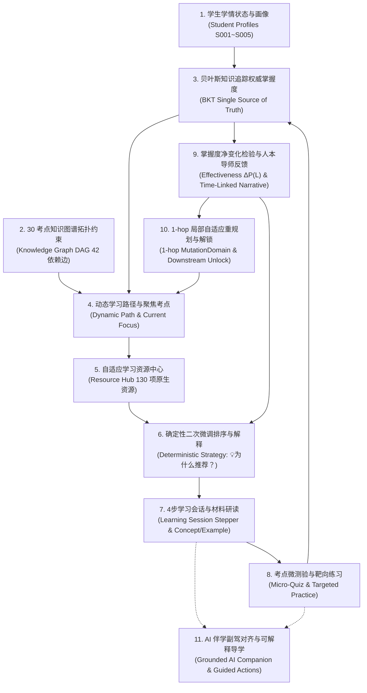

# 学海智导 (Xuehai Zhidao) V2

> **面向大学生的个性化自适应智能导学平台**  
> **当前版本**：Sprint 10-D Phase 5.1 最终交接封版 (`Final Handoff Freeze`)<br/>
> **架构基线**：`FROZEN` (务实分层模块化单体 + 安全网关层，app/、tests/、data/seeds/ 严格 0 diff)<br/>
> **产品状态**：**功能冻结 (Feature Frozen) + 质量加固 (QA Hardening) + 最终交接 (Handoff Freeze)**<br/>
> **测试基线**：后端网关 606 测试通过 (2 项跳过) + 核心领域 143 测试通过 = 749 项通过；前端 469 自动化测试全通 (104 Suites, 100% PASS)<br/>
> **交接指引**：详见 [HANDOFF.md](HANDOFF.md)、[TESTING.md](TESTING.md) 与 [BUG_REPORT_TEMPLATE.md](BUG_REPORT_TEMPLATE.md)

---

## 1. 项目简介 (Project Overview)

**学海智导** 是一个面向大学生的个性化自适应学习指导系统，以高校经济学基础课《微观经济学》（涵盖 30 个考点图谱、130 项内部原生学习材料）为教学试验载体。

平台旨在解决大学生在专业课学习中**“前置概念断层未可知、静态材料路径千人一面、课后练习缺乏真实闭环反馈、自适应推荐缺乏透明人本解释”**等核心痛点。

系统将**知识图谱拓扑依赖 (DAG)**、**经典贝叶斯知识追踪模型 (BKT)**、**自适应学习资源中心 (Resource Hub)**、**学习成效验证闭环 ($\Delta P(L)$)** 以及**确定性二次微调排序策略 (Deterministic Adaptation Strategy)** 有机结合，实现了从“学情诊断 $\to$ 路径规划 $\to$ 资源研读 $\to$ 靶向微练 $\to$ 权威掌握度演进 $\to$ 效果验证 $\to$ 推荐演进 $\to$ AI 伴学副驾”的完整产品级闭环。

---

## 2. 核心产品闭环 (Core Product Closed Loop)



---

## 3. 当前系统核心能力全景 (Core Capabilities)

| 核心领域 | 功能模块 | 当前成熟度 | 说明与能力边界 |
| :--- | :--- | :---: | :--- |
| **学生学情** | **多维学生画像** | **COMPLETE** | 支持 S001~S005 五名学生完整画像切换与雷达图评测 |
| **学生学情** | **双端学情看板** | **COMPLETE** | 学生端移动优先与教师端管理视图双端隔离展示 |
| **知识图谱** | **30考点拓扑图谱** | **COMPLETE** | 30 个微观经济学考点、42 条依赖边，React Flow 拓扑交互与掌握度着色 |
| **动态路径** | **动态路径规划** | **COMPLETE** | 基于 DAG 拓扑与掌握度动态排期，支持 1-hop 节点解锁与焦点移转 |
| **自适应评测**| **知识点微测验** | **COMPLETE** | 题库脱敏、权威判题、防重复提交互斥锁、解析反馈与时长记录 |
| **认知追踪** | **BKT 掌握度追踪** | **COMPLETE** | 四参数闭式方程计算，单调落盘事实，提供唯一客观掌握概率 $P(L)$ |
| **学习资源** | **资源中心 (Resource Hub)** | **COMPLETE** | 覆盖 30 考点共 130 项原生内部资源（概念微卡、典型例题、靶向微练） |
| **学习闭环** | **4步学习会话 (Session)** | **COMPLETE** | 考点精要 ➔ 典型例题 ➔ 靶向微练 ➔ 掌握度检验，服务端原子快照隔离 |
| **成效反馈** | **效果验证 ($\Delta P(L)$)** | **COMPLETE** | 服务端重读 BKT 计算掌握度净增量，4 档分级，人本时间关联叙事反馈 |
| **推荐进化** | **策略自适应 Lite** | **COMPLETE** | 基于历史成效确定性 +2/+1/0/-1 微调重排，展示「💡为什么推荐？」与温和换方式建议 |
| **智能导学** | **AI 伴学副驾** | **COMPLETE** | 白名单投影上下文、零决策权、引导式快捷追问 (Guided Actions) 与即时自测 (Quick Check) |
| **教师决策** | **教师端管理决策看板** | **COMPLETE** | 班级宏观掌握度分析、高危薄弱考点预警、学生个体风险雷达与一键干预建议 |

---

## 4. 技术栈概览 (Tech Stack)

### 后端网关与服务 (Backend)
- **运行环境**：Python 3.10+ (已在 3.13 严格验证)
- **统一服务网关**：FastAPI $\ge$ 0.115.0 (`gateway/api.py`，默认端口 **8011**)
- **核心模块单体**：`app/` (分层模块化架构：Domain / Services / Presentation / Infrastructure，**架构严格冻结**)
- **数据验证**：Pydantic v2
- **自动化测试**：pytest $\ge$ 8.0.0 (网关测试 606 项全通，2 项跳过 + 核心领域测试 143 项全通 = **749 项后端测试 100% 通过**)
- **并发与持久化**：`threading.RLock` 线程安全锁，`os.replace` 原子文件替换写入

### 前端应用 (Frontend)
- **框架**：React 19 (`^19.2.8`) + TypeScript
- **构建工具**：Vite 8 (`^8.2.2`)
- **样式方案**：Tailwind CSS v4 (`^4.3.3`) + Lucide React 图标库
- **图谱与可视化**：`@xyflow/react` (`^12.11.6`, React Flow 拓扑画布) + Recharts (`^3.10.1` 学情雷达图)
- **自动化契约测试**：Node Test Runner (`node --test`)，104 Test Suites，**469 项测试 100% 通过**，执行时间 <2.0s
- **代码规范**：Oxlint 0 errors，严格遵守 React Rules of Hooks

### 数据分层架构 (Data Architecture)
- **原始数据 (Raw)**：`data/raw/economics_learning_demo.xlsx`（离线原始源）
- **基准种子 (Seeds)**：`data/seeds/*.json`（知识图谱 30 点 42 边、初始题库、画像基准，**Git 跟踪，严格只读冻结**）
- **正式状态 (State)**：`data/bkt_states.json`（权威 BKT 掌握度状态，**严禁伪造修改**）
- **业务遥测数据**：`data/resource_effectiveness_events.jsonl`、`data/resource_events.jsonl`、`data/learning_sessions.json`

---

## 5. 快速上手指南 (Quick Start)

### 步骤 1：克隆仓库与环境准备
```bash
git clone <你的 GitHub 仓库地址>
cd xuehai-zhidao-poc
```
确保本地已安装：
- **Python 3.10+**
- **Node.js 18+** 与 npm

---

### 步骤 2：启动后端服务网关 (Port 8011)

后端主服务入口为安全网关 `gateway.api:app`，在端口 **8011** 运行（已挂载底层核心服务）：

```bash
# 1. (推荐) 创建并激活 Python 虚拟环境
python -m venv venv
# Windows:
.\venv\Scripts\Activate.ps1
# macOS/Linux:
source venv/bin/activate

# 2. 安装已锁定的 Python 核心依赖与测试依赖
python -m pip install -r requirements.txt

# 依赖维护者仅在 pyproject.toml 中修改版本范围，然后重新生成锁文件
python -m pip install "pip-tools>=7,<8"
python -m piptools compile pyproject.toml --extra pipeline --extra dev --output-file requirements.txt --strip-extras

# 3. 启动后端网关服务 (监听 8011 端口)
python -m uvicorn gateway.api:app --host 127.0.0.1 --port 8011
```
- 后端健康检查：`http://127.0.0.1:8011/api/health`
- 网关 Swagger 接口文档：`http://127.0.0.1:8011/docs`

---

### 步骤 3：启动前端开发服务器 (Port 5173)

前端 Vite 开发服务器会自动将 `/api` 请求反向代理至后端的 `http://127.0.0.1:8011`：

```bash
# 1. 进入 frontend 目录
cd frontend

# 2. 安装前端依赖
npm install

# 3. 启动前端 Vite 本地开发服务器
npm run dev
```
启动成功后，在浏览器中打开控制台输出的地址（默认为 `http://127.0.0.1:5173` 或 `http://localhost:5173`）。

---

## 6. 前端 UI/UX 优化协作指南 (Guide for UI/UX Teammates)

> **致协作同学**：欢迎加入前端界面与交互体验的优化工作！本项目所有核心业务算法与自适应链路已全部调通并由自动化测试严密守护。你可以放心地优化页面视觉、动效、色彩与排版，只需遵守以下简单的红线守则：

### 6.1 前端核心组件位置导引

前端源码位于 `frontend/src/`：

```text
frontend/src/
├── components/
│   ├── student/
│   │   ├── StudentHome.tsx            # ⭐ 学生端主页与核心学习入口 (TodayActionCard, CurrentFocusCard, TasksQuickNav)
│   │   ├── ResourceHub.tsx            # ⭐ 学习材料中心 (自适应推荐材料、4步学习看板、成效反馈、为什么推荐)
│   │   ├── CurrentFocusCard.tsx       # ⭐ 今日任务核心聚焦卡片、下一步行动引导
│   │   ├── TodayActionCard.tsx        # 今日首选行动卡片 (Hero CTA)
│   │   ├── ExampleReaderModal.tsx     # ⭐ 典型例题深度剖析弹窗
│   │   ├── ConceptCardModal.tsx       # 概念微卡弹窗 (核心机制、生活直觉、避坑指南)
│   │   ├── ExternalRedirectModal.tsx  # 中国大学 MOOC 外部安全跳转免责弹窗
│   │   ├── KnowledgePointQuiz.tsx     # 考点微测验交互组件与作答状态机
│   │   ├── WrongAnswerReview.tsx      # 错题集与靶向复习视图
│   │   ├── ResourceCard.tsx           # 单项学习资源卡片组件
│   │   ├── BottomNav.tsx              # 移动端底部自适应导航栏
│   │   └── MobileContainer.tsx        # 移动优先窄屏容器
│   ├── teacher/
│   │   ├── TeacherOverviewTab.tsx     # 教师端班级宏观总览 (平均掌握度、Top-5 薄弱点、预警统计)
│   │   ├── TeacherKnowledgeTab.tsx    # 教师端 30 考点全景分析与掌握度分布
│   │   ├── TeacherStudentsTab.tsx     # 教师端学生花名册与学情画像下钻
│   │   ├── TeacherKnowledgeDiagnosisDrawer.tsx # 考点错因诊断抽屉
│   │   ├── TeacherStudentDetailModal.tsx       # 学生全维档案弹窗
│   │   ├── TeacherActionModal.tsx     # 教学干预建议发起弹窗
│   │   └── TeacherActionHistory.tsx   # 教师干预历史记录
│   ├── KnowledgeGraph.tsx             # ⭐ React Flow 30 考点拓扑网络画布主视图
│   ├── KnowledgeGraphDetailDrawer.tsx # 知识图谱节点详情抽屉
│   ├── LearningPath.tsx               # 动态自适应学习路径全景视图
│   ├── LearningProfile.tsx            # 学情档案与能力雷达图
│   ├── AIAssistant.tsx                # ⭐ AI 伴学对话抽屉、引导式操作快捷按钮与自测
│   ├── Header.tsx                     # 顶部导航栏、考点快速选择器与学生切换器
│   └── RoleSwitcher.tsx               # 学生端 / 教师端身份切换浮窗
├── layouts/
│   ├── StudentLayout.tsx              # 学生端主布局框架
│   └── TeacherLayout.tsx              # 教师端主布局框架
├── api.ts                             # 前后端 API 契约调用封装 (请勿删除已有接口)
└── types.ts                           # TypeScript 类型定义契约 (请勿删除已有字段)
```

### 6.2 UI 优化核心设计原则与红线守则

1. **绝对保留 `data-testid` 属性**：
   - 自动化契约测试与 Playwright 浏览器端到端测试依赖这些标识定位元素（例如 `recommended-resource-card`、`start-session-btn`、`complete-session-btn` 等）。
   - 在调整 JSX 标签、外层包装或添加 Tailwind class 时，**请务必原样保留现有的 `data-testid` 属性**。
2. **遵守人本导师叙事与零技术黑话 (No Jargon)**：
   - 面向学生的界面上**严禁出现任何技术底层黑话**（如 `BKT`、`Bayesian`、`mastery_probability`、`PathState`、`Decision Core`、`MutationDomain`、`Vector`、`Score` 等）。
   - 掌握度统一以自然百分比或四级定性（如 `薄弱`、`巩固中`、`已掌握`）表达；
   - 推荐原因保持人本鼓励口吻（如 `💡 为什么推荐？`、`成效优选 (+2)`、`🔄 这次换一种方式试试`）。
3. **保持移动端 375px 窄视口完美自适应**：
   - 页面必须在宽度 **375px** 窄屏设备上排版规整，**严禁产生全局横向滚动条** (`scrollWidth <= clientWidth`)。
   - 所有按钮与可点击靶点尺寸建议保持 $\ge 44 \times 44\text{ px}$，方便触控操作。
4. **安全保护核心业务逻辑**：
   - 严禁修改 `app/`、`tests/`、`data/seeds/` 目录；
   - 严禁直接修改底层 `data/bkt_states.json` 或伪造掌握度数值。

### 6.3 每次修改 UI 后的本地自检三步法

在优化完组件样式后，只需在 `frontend` 目录执行以下命令，确认没有破坏既有业务逻辑：

```bash
cd frontend

# 1. 静态类型检查 (确认 TS 无语法与类型错误)
npm run typecheck

# 2. 运行全量前端契约测试 (秒级完成，确认 469 项测试全绿)
npm test

# 3. 生产打包验证 (确认 Vite 打包成功)
npm run build
```

---

## 7. 自动化测试与质量门禁大满贯验证 (Verification & Quality Gates)

系统具备极为完善严密的质量守护网络：

```bash
# 1. 运行端到端产品门禁 (25/25 checks PASS)
python scripts/sprint10c_final_integration_gate.py

# 2. 运行全局五大核心质量门禁
python scripts/quality_gate.py
# -> 5/5 GATES PASSED (100%)

# 3. 运行后端全量测试套件 (749 项通过，2 项跳过)
pytest tests/ -q           # 143 passed
pytest gateway/tests/ -q   # 606 passed, 2 skipped

# 4. 运行前端全量契约测试套件 (469 项测试，104 Suites)
npm test --prefix frontend
```

---

## 8. GitHub 推送与协同工作流 (Git Collaboration Workflow)

如果你是仓库所有者，准备初次将本项目推送到 GitHub：

```bash
# 1. 添加你的远程仓库地址 (请将 URL 替换为你创建的 GitHub 仓库地址)
git remote add origin https://github.com/<your-username>/xuehai-zhidao-poc.git

# 2. 确认当前分支为 master
git branch -M master

# 3. 推送代码至 GitHub
git push -u origin master
```

协作同学拉取代码并开始优化的推荐工作流：

```bash
# 1. 克隆项目
git clone https://github.com/<your-username>/xuehai-zhidao-poc.git
cd xuehai-zhidao-poc

# 2. 创建自己的 UI 优化功能分支
git checkout -b feat/ui-enhancement

# 3. 进行 UI 视觉与体验优化，期间运行 npm test 与 npm run build 校验
# 4. 提交更改并推送到远端
git add frontend/
git commit -m "style(ui): polish resource hub and companion mobile experience"
git push -u origin feat/ui-enhancement

# 5. 在 GitHub 上发起 Pull Request 供小组 Review 合并
```

---

## 9. 核心工程与演进文档导航 (Documentation Index)

- **项目交接与全量测试总指南 (Core Handoff & Testing Guides)**：
  - [交接封版说明书 (HANDOFF.md)](HANDOFF.md) ⭐ **【当前交接核心入口】**
  - [自动化与人工验收测试指南 (TESTING.md)](TESTING.md) ⭐ **【当前全量测试入口】**
  - [缺陷工单模板 (BUG_REPORT_TEMPLATE.md)](BUG_REPORT_TEMPLATE.md)
- **历史 Sprint 封版交付演练指南归档 (Historical Walkthroughs)**：
  - [Sprint 10-C Phase 5: 学生端 UX/UI 可用性打磨](walkthrough.md)
  - [Sprint 9-G: 今日行动与自适应下一步](docs/PHASE5_SPRINT9G_WALKTHROUGH.md)
  - [Sprint 9-F: 学习留存检验 Lite](docs/PHASE5_SPRINT9F_WALKTHROUGH.md)
  - [Sprint 9-E: 学习保持度验证与资源策略自适应 Lite](docs/PHASE5_SPRINT9E_WALKTHROUGH.md)
  - [Sprint 9-D: 学习效果验证与资源自适应反馈](docs/PHASE5_SPRINT9D_WALKTHROUGH.md)
  - [Sprint 9-C: 30 考点资源中心与自适应推荐](docs/PHASE5_SPRINT9C_WALKTHROUGH.md)
  - [Sprint 9-B: 引导式学习动作与快速自测](docs/PHASE5_SPRINT9B_WALKTHROUGH.md)
  - [Sprint 9-A: AI 伴学副驾与事实对齐基线](docs/PHASE5_SPRINT9A_WALKTHROUGH.md)
  - [Sprint 8-D: AI 评测网关与 AI Judge 影子验证](docs/PHASE4_SPRINT8D_WALKTHROUGH.md)
  - [Sprint 8-C: 多学生动态路径隔离与 BKT 校准](docs/PHASE4_SPRINT8C_WALKTHROUGH.md)
- **架构规范与宪章**：
  - [架构宪章 (Architecture Constitution)](docs/architecture/ARCHITECTURE-CONSTITUTION.md)
  - [架构适应度函数规范 (Architecture Fitness)](docs/architecture/ARCHITECTURE-FITNESS.md)
  - [目标架构设计规范 (Phase 2 Target Architecture)](docs/architecture/PHASE-2-TARGET-ARCHITECTURE.md)
- **产品规划与功能基线**：
  - [产品功能基线盘点 (Feature Baseline)](docs/product/FEATURE-BASELINE.md)
  - [产品演进路线图 (Roadmap)](docs/product/ROADMAP.md)
  - [学生端核心体验契约 (Student Experience Contract)](docs/product/STUDENT-EXPERIENCE-CONTRACT.md)

---

## 10. 项目免责声明 (Disclaimer)

- **系统定位**：本项目属于高校大学生创新创业训练计划（国家级创新训练项目）教育科技自适应学习系统研发原型（POC / Prototype），严谨探索认知模型、知识图谱与智能推荐在高等教育专业课中的有机落地。
- **开源协作**：欢迎小组同学与教育科技研究者交流探讨！
