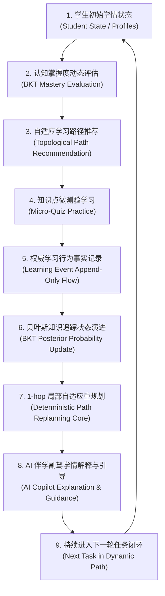

# 学海智导 (Xuehai Zhidao) V2

> **面向大学生的个性化自适应智能导学平台**  
> **Architecture Baseline**：`FROZEN` (Phase 2.1 Modular Monolith)  
> **Product Stage**：`Phase 2.2 Productization (IN PROGRESS)`

---

## 1. 项目简介 (Project Overview)

**学海智导** 是一个面向大学生的个性化自适应学习指导系统，以高校专业基础课《微观经济学》为教学试验载体。

平台旨在解决大学生在专业课程学习中**“先修前置断层未可知、静态教材路径千人一面、课后微练习缺乏闭环反馈、自适应推荐缺乏透明解释”**等核心痛点。

通过将**知识图谱拓扑依赖 (Knowledge Graph DAG)**、**经典贝叶斯知识追踪模型 (Bayesian Knowledge Tracing, BKT)** 以及**确定性局部自适应路径重规划引擎 (Path Replanning Decision Core)** 进行有机融合，平台实现了“状态评估 $\to$ 路径规划 $\to$ 伴随微测验 $\to$ 掌握度动态演进 $\to$ 拓扑重规划 $\to$ AI 导学解释”的完整产品闭环。

---

## 2. 核心问题 (The Problem)

在传统的高校专业课程学习中，现存学习辅助工具普遍存在以下结构性局限：

1. **学情脱节**：静态教材与录播课按固定章节推进，无法动态识别学生在先修知识点上的认知欠账（如：未掌握“需求价格弹性”直接修读高阶的“弹性与税收归宿”）。
2. **路径僵化**：学习推荐往往等同于简单的待办清单，缺乏严格的前置图谱拓扑约束，难以做到因材施教。
3. **反馈割裂**：课后练习停留在单次答题得分，练习行为无法持续回馈并沉淀为可量化、可追溯的潜在认知掌握概率。
4. **黑盒焦虑**：自适应系统即使给出了建议，学生也难以理解“为什么下一步应该学这个”，缺乏透明可解释的教学引导。

**学海智导的核心思路**：基于客观认知数学模型与确定性规则核心构建全链路反馈闭环，让学习路径随着每一次真实答题行为自适应演进，并由 AI 导学副驾为学生清晰说理。

---

## 3. 核心产品闭环 (Core Product Loop)

学海智导系统的核心运转完全由以下端到端闭环驱动：



---

## 4. 当前核心能力盘点 (Core Capabilities)

本系统如实盘点各项功能在**后端能力 (Backend Capability)**、**前端体验 (Frontend Experience)** 以及**端到端闭环 (End-to-End)** 的实际落地成熟度：

| 核心领域 | 功能模块 | 后端成熟度 | 前端交互成熟度 | 端到端成熟度 | 说明与体验边界 |
| :--- | :--- | :--- | :--- | :--- | :--- |
| **学生学情** | **多维学生画像** | 完整 | 完整 | **COMPLETE** | 支持 S001~S005 五名学生完整画像切换与雷达图评测 |
| **学生学情** | **学情看板 (Dashboard)** | 完整 | 完整 | **COMPLETE** | 学生端移动优先与教师端管理视图双端隔离展示 |
| **学情诊断** | **综合学情报告** | 完整 | 完整 | **COMPLETE** | 优势与薄弱考点分析、历史成绩与能力维度量化 |
| **知识图谱** | **拓扑知识图谱** | 完整 | 完整 | **COMPLETE** | 30 个微观经济学考点、42 条前置依赖边、React Flow 交互节点 |
| **路径规划** | **推荐学习路径** | 完整 | 完整 | **COMPLETE** | 基于 DAG 拓扑排序的基准推荐修读序列与优先级展示 |
| **自适应评测** | **知识点微测验** | 完整 | 完整 | **COMPLETE** | 8 核心考点 13 道题，防作弊脱敏、防连击状态机与权威解析反馈 |
| **行为追溯** | **行为事件日志** | 完整 | 隐式集成 | **BACKEND READY** | 追加写 JSONL 流水记录；前端测验提交自动沉淀，暂无独立事件日志界面 |
| **认知追踪** | **BKT 掌握度演进** | 完整 | 部分 | **FRONTEND PARTIAL** | 四参数闭式方程计算；前端节点与卡片展示数值，暂缺动态历史折线演化图 |
| **路径重规划** | **自适应局部重规划** | 完整 | 部分 | **E2E PARTIAL** | 1-hop 决策核心与确定性哈希已落盘；前端正在对接即时解锁动效 (Phase 2.2-C) |
| **智能导学** | **AI 伴学助手** | 完整 | 完整 | **COMPLETE** | 专属学情问候语、上下文感知答疑与离线本地规则保底兜底 |

---

## 5. 当前项目状态 (Project Status)

- **Phase 2.1 Architecture Baseline: `FROZEN`**  
  务实分层模块化单体架构重构、单向分层依赖硬化、12 大架构不变量与 17 个 AST 适应度测试已全部完成并通过独立验收。
- **Phase 2.2 Productization: `IN PROGRESS`**  
  当前正处于 Phase 2.2 产品化推进阶段，工作重心聚焦于核心自适应学习闭环的体验打磨，严禁破坏已冻结的架构基线。

---

## 6. 系统架构全景 (Architecture Overview)

学海智导采用**务实分层模块化单体 (Pragmatic Layered Modular Monolith)** 架构：

```
[ Frontend: React 19 + TypeScript + Vite + Tailwind CSS v4 ]
                          │
                   HTTP REST API (18 + 1 冻结端点)
                          ▼
[ Presentation Layer: app/api/ ] (Routers + Schemas, 纯协议网关, 零文件IO)
                          │
                          ▼
[ Application Services: app/services/ ] (用例编排, 零 Web 框架依赖)
             │                              │
             ▼                              ▼
[ Pure Domain: app/domain/ ]       [ Infrastructure: app/infrastructure/ ]
(BKT 纯数学 + 重规划决策核心, 零IO)    (JSON/JSONL 线程安全锁与原子持久化)
                                            │
                                            ▼
                               [ Data Layers: data/seeds/ + data/runtime/ ]
```

- **架构宪章**：详见 [`docs/architecture/ARCHITECTURE-CONSTITUTION.md`](docs/architecture/ARCHITECTURE-CONSTITUTION.md)
- **架构适应度函数**：详见 [`docs/architecture/ARCHITECTURE-FITNESS.md`](docs/architecture/ARCHITECTURE-FITNESS.md)

---

## 7. 技术栈 (Tech Stack)

### 后端 (Backend)
- **运行环境**：Python 3.10+ (已在 3.13 验证)
- **Web 框架**：FastAPI $\ge$ 0.115.0
- **数据验证**：Pydantic v2
- **自动化测试**：pytest $\ge$ 8.0.0
- **并发与存储**：Python 内置 `threading.RLock`，`os.replace` 原子文件替换

### 前端 (Frontend)
- **视图框架**：React 19 (`^19.2.8`) + TypeScript
- **构建工具**：Vite 8 (`^8.2.2`)
- **样式与组件**：Tailwind CSS v4 (`^4.3.3`)，Lucide React (`^1.41.0`)
- **拓扑与图表**：`@xyflow/react` (`^12.11.6`, React Flow)，Recharts (`^3.10.1`)

### 数据与管线 (Data & Pipeline)
- **原始数据 (Raw)**：`data/raw/economics_learning_demo.xlsx`（离线原始参考源，Git 跟踪）
- **基准种子 (Seeds)**：`data/seeds/*.json`（知识图谱、题库、画像基准，Git 跟踪）
- **运行态数据 (Runtime)**：`data/runtime/*.json|jsonl`（在线动态日志与状态，`.gitignore` 排除，零 Git 污染）

### 人工智能 (AI Integration)
- **服务适配器**：`app/infrastructure/external/llm_client.py`（OpenAI 规范兼容的多模型接入）
- **高可用保底**：当无外网 API Key 时，自动启用内建的启发式教学规则库，100% 确保服务零崩溃。

---

## 8. 代码仓目录结构 (Repository Structure)

```
xuehai-zhidao-poc/
├── app/                        # 后端模块化单体主包
│   ├── api/                    # 表现层 (Routers + Schemas)
│   ├── core/                   # 核心配置、系统常量与异常定义
│   ├── domain/                 # 纯领域层 (BKT 数学模型 + 路径决策核心 + 事件实体, 零IO)
│   ├── infrastructure/         # 基础设施层 (文件持久化仓储与 LLM 客户端)
│   ├── services/               # 应用服务层 (业务编排, 零 FastAPI 依赖)
│   └── main.py                 # FastAPI 入口配置与路由装配
├── data/                       # 数据生命周期三层物理隔离
│   ├── raw/                    # 离线原始 Excel 数据源
│   ├── seeds/                  # 5 份冷启动只读基准 JSON 种子
│   └── runtime/                # 运行时动态持久化 (.gitignore 排除, 0 Git 追踪)
├── frontend/                   # 前端工程 (React 19 + TypeScript + Vite)
│   ├── src/                    # 源码 (api.ts, components, layouts, context)
│   ├── test/                   # 前端自动化测试套件
│   └── package.json            # 前端依赖配置
├── scripts/                    # 离线数据清洗管线与独立验证脚本
│   ├── data_pipeline/          # 离线 Excel 解析与图谱种子导出脚本
│   └── verify/                 # 独立调试脚本
├── tests/                      # 自动化测试套件
│   ├── architecture/           # 17 个架构适应度函数测试 (AST 结构强约束)
│   ├── unit/                   # 纯单元测试
│   └── test_*.py               # 核心业务、DAG 与端到端 Golden 序列测试
├── docs/                       # 项目架构与产品规范文档库
│   ├── architecture/           # 架构宪章与适应度函数规范
│   └── product/                # 产品愿景、功能基线与演进路线图
└── pyproject.toml              # Python 项目依赖与 pytest 隔离配置
```

---

## 9. 快速上手指南 (Quick Start)

### 1. 环境准备
- Python 3.10 及以上版本
- Node.js 18 及以上版本

### 2. 后端服务启动
在项目根目录下：
```powershell
# 1. 安装 Python 依赖
pip install -e .

# 2. 启动 FastAPI 本地开发服务器 (默认端口 8000)
uvicorn app.main:app --reload --host 127.0.0.1 --port 8000
```
- 后端健康检查：`http://127.0.0.1:8000/api/health`
- Swagger API 文档：`http://127.0.0.1:8000/docs`

### 3. 前端服务启动
进入 `frontend` 目录：
```powershell
cd frontend

# 1. 安装前端 npm 依赖
npm install

# 2. 启动前端 Vite 开发服务器
npm run dev
```
- 访问前端系统：控制台输出的本地地址（通常为 `http://localhost:5173`）

### 4. Windows 环境注意事项
- **编码支持**：本项目源码统一采用 UTF-8 编码。在 Windows PowerShell 下若遇到中文乱码输出，可先执行 `[Console]::OutputEncoding = [System.Text.Encoding]::UTF8`。
- **文件路径**：代码中统一使用 `pathlib.Path` 解析系统绝对路径，避免在 Windows 与 Linux 环境出现斜杠不兼容。

---

## 10. 验证与测试运行 (Verification & Testing)

本项目具备高度严谨的自动化测试与架构守卫体系：

```powershell
# 1. 执行架构适应度测试套件 (17 passed)
pytest tests/architecture/ -v

# 2. 执行后端全量回归测试套件 (143 passed in ~4s)
pytest -q

# 3. 执行前端自动化测试套件 (37 passed in ~250ms)
node --experimental-strip-types --test frontend/test/*.test.ts

# 4. 执行前端生产构建打包 (PASS in ~600ms)
cd frontend && npm run build
```

---

## 11. 架构治理与冻结说明 (Architecture Governance)

本项目 Phase 2.1 架构已被正式宣布为 **`FROZEN`**。

任何后续新功能开发必须在现有分层与仓储契约下进行，**严禁破坏以下核心架构护栏**：
- **Domain 零 I/O 纯内存计算**（通过 AST 自动测试防护）；
- **Service 层绝不依赖 FastAPI**（统一使用 `app.core.exceptions`）；
- **Router 严禁直接依赖 Repository 或直接操作磁盘**；
- **运行时应用严禁依赖 openpyxl**；
- **全系统单向分层依赖流动，严禁跨层与反向依赖**。

---

## 12. 产品路线图 (Phase 2.2 Roadmap)

- **Phase 2.2-A: Product Baseline & Governance** 【当前完成】
  - 建立产品基线、功能盘点与官方 README 规范。
- **Phase 2.2-B: Core Student Experience Consolidation**
  - 打磨学生端 Mobile-First 4-Tab 核心体验，打通任务与图谱数据一致性。
- **Phase 2.2-C: Closed-Loop Adaptive Learning & Path Replanning**
  - 全面闭合作答至 1-hop 节点状态解锁动效的端到端视觉流转。
- **Phase 2.2-D: AI Learning Copilot & Explainable Tutoring**
  - 引入导学副驾的可解释性教学说理与启发式错题点拨。
- **Phase 2.2-E: End-to-End Golden Journey & Product Acceptance**
  - 交付全链路黄金用户旅程演示与最终产品化验收。

---

## 13. 文档导航 (Documentation Index)

- **架构宪章**：[`docs/architecture/ARCHITECTURE-CONSTITUTION.md`](docs/architecture/ARCHITECTURE-CONSTITUTION.md)
- **架构适应度函数规范**：[`docs/architecture/ARCHITECTURE-FITNESS.md`](docs/architecture/ARCHITECTURE-FITNESS.md)
- **目标架构设计规范**：[`docs/architecture/PHASE-2-TARGET-ARCHITECTURE.md`](docs/architecture/PHASE-2-TARGET-ARCHITECTURE.md)
- **产品愿景与定位规范**：[`docs/product/PRODUCT-VISION.md`](docs/product/PRODUCT-VISION.md)
- **核心功能基线盘点**：[`docs/product/FEATURE-BASELINE.md`](docs/product/FEATURE-BASELINE.md)
- **Phase 2.2 演进路线图**：[`docs/product/ROADMAP.md`](docs/product/ROADMAP.md)

---

## 14. 项目性质与边界声明 (Project Disclaimer)

- **系统定位**：本项目属于高校大学生创新创业训练计划（国创）教育科技前瞻原型研究系统（POC / Prototype），非商业级多租户 SaaS 系统。
- **质量标准**：代码库在架构规范、测试覆盖度与状态机确定性上具备高工程严谨度，欢迎学术探讨与自适应学习算法试验交流。
