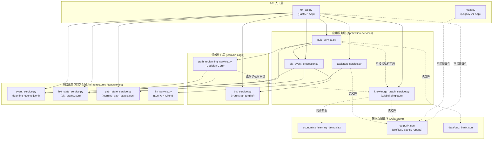

# 学海智导（Xuehai Zhidao）V2
# Architecture Audit · Phase 1: Current-State Architecture Discovery

**审计时间**：2026-09-05  
**审计范围**：学海智导（Xuehai Zhidao）V2 全栈代码库与数据基础设施  
**审计原则**：只读体检、现状映射、不修改业务代码、不顺手优化、不提前重构  

---

## 1. Executive Summary (执行摘要)

学海智导（Xuehai Zhidao）V2 目前处于从 **POC 原型向工业级工程化过渡** 的关键架构节点。经过前期 P0-1 至 P0-8 各阶段迭代，系统已成功构建了具备贝叶斯知识追踪（BKT）数学纯净度、1-hop 局部自适应路径重规划、测验答题流式闭环以及 React 19 现代化客户端的核心能力。

### 核心健康指标
- **后端测试套件**：12 个测试文件，98 个测试用例，**100% PASS**（执行耗时约 3.5 秒），回归覆盖率坚固。
- **前端状态**：Vite 8 + React 19 + TypeScript + Tailwind v4，37 项单元/状态测试全部通过，生产构建无告警（516ms）。
- **模块依赖拓扑**：**零循环依赖**（0 Circular Dependencies），所有内部模块形成严格的有向无环图（DAG）。

### 主要架构瓶颈与风险
1. **扁平化根目录与包命名空间缺失**：17 个 Python 脚本与业务模块堆叠于项目根目录，数字前缀历史脚本（`01~04`）与核心服务（`bkt_service`、`path_replanning_service`）混杂，缺乏 `src/` 或标准 Python package 隔离。
2. **多入口并存与职责重叠**：`main.py`（早期静态原型入口，315行）与 `04_api.py`（当前权威生产 API 入口，733行）并存，造成新人上手与服务部署歧义。
3. **API 控制器过载（God Controller）**：`04_api.py` 单文件集成了路由定义、跨域配置、底层文件读写、业务数据聚合（如 `/api/students/{id}/dashboard` 跨 3 个 JSON 文件的手动拼接）以及异常拦截，职责未解耦。
4. **内部私有状态越权访问**：`quiz_service.py` 与 `path_replanning_service.py` 均直接读取 `knowledge_graph_service._raw_knowledge_points` 私有变量，突破了服务契约边界。
5. **双轨数据持久化机制**：系统同时存在基于 `output/*.json` 的离线批处理数据和基于 `data/*.json/jsonl` 的实时在线运行时状态，中间夹杂根目录 Excel 依赖。

---

## 2. Current Directory Tree (当前真实目录树)

```
xuehai-zhidao-poc/
├── .env.example                                # 环境变量配置示例 (LLM 配置)
├── .gitignore                                  # Git 忽略配置
├── requirements.txt                            # Python 依赖清单
├── economics_learning_demo.xlsx                # 核心知识图谱与学生原始作答明细 Excel (原始数据)
│
├── 01_prepare_data.py                          # [批处理脚本] 从 Excel 生成 student_profiles.json
├── 02_recommend_path.py                        # [批处理脚本] 从 Excel+Profiles 生成 learning_paths.json
├── 03_generate_report.py                       # [批处理脚本] 从 Excel+Profiles+Paths 生成 student_reports.json
├── 04_api.py                                   # [核心 API 入口] 权威 FastAPI 应用 (733行，17个端点)
├── main.py                                     # [历史遗留入口] 早期 V1 FastAPI 原型应用 (315行，已过时)
│
├── bkt_service.py                              # [领域核心] BKT 贝叶斯知识追踪纯数学模型 (零 IO / 零依赖)
├── bkt_state_service.py                        # [基础设施] BKT 认知状态持久化与已处理事件幂等索引 (Lock + 原子替换)
├── bkt_event_processor.py                      # [应用服务] 学习行为事件驱动的 BKT 消费与历史重放重建
├── event_service.py                            # [基础设施] 学习行为事件日志记录器 (append-only JSONL)
├── path_replanning_service.py                  # [领域/应用服务] P0-8 局部动态路径重规划引擎 (1-hop 决策核心)
├── path_state_service.py                       # [基础设施] 学习路径执行状态持久化 (RLock + 原子替换)
├── quiz_service.py                             # [应用服务] 分知识点微测验加载、服务端判题与事件/BKT/路径闭环
├── knowledge_graph_service.py                  # [应用服务] 从 Excel 构建内存知识拓扑与 React Flow 坐标网格
├── assistant_service.py                        # [AI 应用服务] 基于静态学生上下文构建 Prompt 与结构化诊断问答
├── llm_service.py                              # [AI 基础设施] OpenAI 兼容的多厂商 LLM 客户端抽象 (带 Fallback)
│
├── verify_assistant_v2.py                      # [验证脚本] AI 助手 8 个典型场景离线自测脚本
├── verify_knowledge_graph.py                   # [验证脚本] 知识图谱 HTTP 接口在线回归测试脚本 (需先启服务)
│
├── data/                                       # [运行时数据与持久化目录]
│   └── quiz_bank.json                          # 30 个考点权威微测验题库 (Git 跟踪)
│   # (运行时自动生成，由 .gitignore 或测试隔离):
│   # - learning_events.jsonl (行为事件追加流)
│   # - bkt_states.json (BKT 认知状态)
│   # - bkt_processed_events.json (事件幂等索引)
│   # - learning_path_states.json (路径执行状态)
│
├── output/                                     # [离线批处理生成数据]
│   ├── student_profiles.json                   # 01 脚本产出：学生多维能力画像
│   ├── learning_paths.json                     # 02 脚本产出：静态推荐路径规划
│   └── student_reports.json                    # 03 脚本产出：学生综合诊断报告
│
├── docs/                                       # [技术规范与架构文档]
│   ├── api_contract.md                         # V2 API 契约规范与数据模型
│   ├── BKT.md                                  # BKT 动力学方程与数学模型契约
│   ├── state_machine_contract.md               # 状态机与算法契约 (注：参数需同步更新)
│   └── superpowers/plans/                      # Superpowers 实施计划归档
│       └── 2026-09-05-p0-8-local-adaptive-path-replanning.md
│
├── tests/                                      # [自动化测试套件 - 98 Tests, 100% PASS]
│   ├── __init__.py
│   ├── test_bkt_service.py                     # BKT 纯数学模型单元测试 (10 tests)
│   ├── test_bkt_state.py                       # BKT 状态持久化与并发测试 (6 tests)
│   ├── test_bkt_processor.py                   # BKT 事件消费与重放测试 (10 tests)
│   ├── test_event_logger.py                    # 学习事件记录器日志测试 (8 tests)
│   ├── test_path_state.py                      # 路径状态独立持久化测试 (7 tests)
│   ├── test_path_replanning_core.py            # 决策核心契约与 SHA-256 确定性测试 (17 tests)
│   ├── test_path_replanning_dag.py             # DAG 只读探针与 1-hop 隔离测试 (7 tests)
│   ├── test_path_replanning_golden_e2e.py      # Golden 3步序列与字节等价测试 (3 tests)
│   ├── test_quiz_api.py                        # 测验接口与题库防泄密测试 (10 tests)
│   ├── test_bkt_api.py                         # BKT 接口与状态机路由测试 (8 tests)
│   ├── test_quiz_bkt_integration.py           # 答题->事件->BKT 闭环集成测试 (10 tests)
│   └── test_quiz_replanning_integration.py     # 答题驱动重规划端到端集成测试 (4 tests)
│
├── frontend/                                   # [前端客户端 - Vite + React 19 + TypeScript]
│   ├── package.json                            # 前端依赖配置
│   ├── vite.config.ts                          # Vite 配置文件 (配置 /api 反向代理至 8000)
│   ├── src/
│   │   ├── api.ts                              # 统一前端 API 数据交互层
│   │   ├── types.ts                            # 统一 TypeScript 类型契约
│   │   ├── router.ts                           # 纯函数路由状态机 (Student / Teacher 双角色)
│   │   ├── layouts/                            # 布局容器 (StudentLayout, TeacherLayout)
│   │   ├── components/                         # 业务与通用组件 (React Flow 图谱, 测验抽屉等)
│   │   └── context/                            # 全局上下文 (AppContext, useApp)
│   └── test/                                   # 前端 Node 原生测试 (37 tests)
│       ├── router.test.ts
│       ├── mobile_nav.test.ts
│       └── quiz_session.test.ts
│
└── external_reference/                         # [外部参考开源项目 - 严格隔离，非系统自身源码]
    ├── OATutor-main/
    └── OpenTutor-main/
```

### 文件角色定位判定
| 类别 | 代表文件 | 判定结论 |
| :--- | :--- | :--- |
| **A. 真正属于学海智导 V2 的核心文件** | `04_api.py`, `bkt_service.py`, `bkt_state_service.py`, `bkt_event_processor.py`, `event_service.py`, `path_replanning_service.py`, `path_state_service.py`, `quiz_service.py`, `knowledge_graph_service.py`, `assistant_service.py`, `llm_service.py`, `frontend/src/*`, `tests/*` | 系统的核心血脉，需完整保留并纳入分层架构重构。 |
| **B. 历史遗留文件 (Legacy)** | `main.py` | 早期原型遗留，功能已被 `04_api.py` 完整覆盖，当前无任何模块引用，属于待淘汰死代码。 |
| **C. 一次性/离线数据准备脚本** | `01_prepare_data.py`, `02_recommend_path.py`, `03_generate_report.py` | 离线批处理脚本，非常驻服务，未来应移入 `scripts/`。 |
| **D. 离线手工验证脚本** | `verify_assistant_v2.py`, `verify_knowledge_graph.py` | 早期用于快速验证的脚本，非自动化测试套件组成部分，应迁移至 `scripts/verify/` 或转化为标准 pytest。 |

---

## 3. Backend Module Inventory (后端模块全量资产清单)

| Module | Actual Responsibility (实际职责) | Imported By (被谁导入) | Imports (导入项) | State/Data Access (读写存储) | Category | Risk |
| :--- | :--- | :--- | :--- | :--- | :--- | :---: |
| `01_prepare_data.py` | 从 Excel 解析学生答题明细，计算宏观多维指标并落盘 | *None (CLI)* | `openpyxl`, `json`, `collections` | 读 `economics_learning_demo.xlsx`<br>写 `output/student_profiles.json` | Data Processing / Script | Medium |
| `02_recommend_path.py` | 基于静态学情画像与知识点依赖进行拓扑排序，生成静态学习路径 | *None (CLI)* | `openpyxl`, `json`, `collections` | 读 `economics_learning_demo.xlsx`<br>读 `output/student_profiles.json`<br>写 `output/learning_paths.json` | Data Processing / Script | Medium |
| `03_generate_report.py` | 汇总画像与路径数据，基于规则生成诊断报告与指导建议 | *None (CLI)* | `openpyxl`, `json` | 读 `economics_learning_demo.xlsx`<br>读 `output/*.json`<br>写 `output/student_reports.json` | Data Processing / Script | Medium |
| `04_api.py` | 核心 REST API 服务，暴露 17 个 HTTP 端点，聚合静态学情与动态认知链路 | `tests/test_bkt_api.py`<br>`tests/test_quiz_api.py`<br>`tests/test_quiz_bkt_integration.py`<br>`tests/test_quiz_replanning_integration.py` | `fastapi`, `pydantic`, `assistant_service`, `bkt_event_processor`, `bkt_service`, `bkt_state_service`, `event_service`, `knowledge_graph_service`, `path_state_service`, `quiz_service` | 读 `output/*.json`<br>代理调用各底层 Service | API / Entry Point | **High** |
| `main.py` | 早期 V1 静态只读 API 原型，仅读取 `output/*.json`，不支持任何 V2 动态功能 | *None* | `fastapi`, `json` | 读 `output/*.json` | Legacy / Entry Point | Medium |
| `bkt_service.py` | BKT 经典贝叶斯四参数状态演进纯数学模型，四舍五入防溢出，纯内存计算 | `04_api.py`<br>`bkt_event_processor.py`<br>`bkt_state_service.py`<br>`tests/test_bkt_service.py`<br>`tests/test_path_replanning_golden_e2e.py` | `pydantic` | *无外部 IO（纯函数式）* | Domain / Business Logic | **Low** |
| `bkt_state_service.py` | BKT 状态持久化仓储与已处理事件去重索引，线程锁并发保护与原子替换 | `04_api.py`<br>`bkt_event_processor.py`<br>`path_replanning_service.py`<br>`tests/test_bkt_state.py` | `bkt_service`, `json`, `threading`, `os` | 读写 `data/bkt_states.json`<br>读写 `data/bkt_processed_events.json` | Infrastructure / Persistence | Medium |
| `bkt_event_processor.py` | 学习事件流式消费者，执行幂等校验、事件类型过滤、驱动 BKT 数学更新与状态回放 | `04_api.py`<br>`quiz_service.py`<br>`tests/test_bkt_processor.py` | `bkt_service`, `bkt_state_service`, `event_service`, `pydantic` | 读 `data/learning_events.jsonl`<br>调用 state_service 落盘 | Application Service | **Low** |
| `event_service.py` | 学习行为事件采集与持久化服务，生成权威服务端时间戳，追加写入 JSONL | `04_api.py`<br>`bkt_event_processor.py`<br>`quiz_service.py`<br>`tests/test_event_logger.py` | `pydantic`, `threading`, `json`, `datetime` | 追加写 `data/learning_events.jsonl` | Infrastructure / Event Logging | **Low** |
| `path_replanning_service.py` | P0-8 局部动态路径重规划核心引擎，单入口裁决优先级、1-hop 隔离、确定性规范序列化 | `quiz_service.py`<br>`tests/test_path_replanning_core.py`<br>`tests/test_path_replanning_dag.py`<br>`tests/test_path_replanning_golden_e2e.py` | `bkt_state_service`, `knowledge_graph_service`, `path_state_service`, `pydantic`, `decimal` | 读 BKT 状态<br>读知识图谱前置/后继<br>写路径状态 | Domain / Application Service | Medium |
| `path_state_service.py` | 路径执行状态 (`PathState`) 独立持久化仓储，RLock 保护，原子替换 | `04_api.py`<br>`path_replanning_service.py`<br>`tests/test_path_state.py` | `pydantic`, `threading`, `os`, `tempfile` | 读写 `data/learning_path_states.json` | Infrastructure / Persistence | **Low** |
| `quiz_service.py` | 微测验加载与题库防泄密查询、服务端判题、联动事件/BKT/路径重规划流式闭环 | `04_api.py`<br>`tests/test_quiz_api.py`<br>`tests/test_quiz_bkt_integration.py`<br>`tests/test_quiz_replanning_integration.py` | `bkt_event_processor`, `event_service`, `knowledge_graph_service`, `path_replanning_service`, `fastapi`, `pydantic` | 读 `data/quiz_bank.json`<br>读取知识图谱考点校验 | Application Service | Medium |
| `knowledge_graph_service.py` | 启动时同步解析 Excel 知识网络，融合静态学生画像，计算 8 章节坐标并导出全局单例 | `04_api.py`<br>`quiz_service.py`<br>`path_replanning_service.py` | `openpyxl`, `json`, `pathlib` | 读 `economics_learning_demo.xlsx`<br>读 `output/*.json` | Domain / Application Service | **High** |
| `assistant_service.py` | AI 伴学助手问答与动态问候服务，抽取静态学生画像上下文，校验事实并实现规则降级 | `04_api.py`<br>`verify_assistant_v2.py` | `llm_service`, `json`, `pathlib` | 读 `output/*.json` | AI / Application Service | Medium |
| `llm_service.py` | LLM 服务商统一抽象层，支持 DeepSeek/Qwen/OpenAI/Mock，提供超时与优雅降级 | `assistant_service.py`<br>`verify_assistant_v2.py` | `requests`, `python-dotenv`, `os`, `json` | 读环境变量 / `.env` | Infrastructure / AI Client | **Low** |
| `verify_assistant_v2.py` | 伴学助手 8 个场景离线验证脚本（覆盖 Mock、事实校验、无 Key 降级） | *None (CLI)* | `assistant_service`, `llm_service` | 委托服务间接读取 `output/*.json` | Verification / Script | **Low** |
| `verify_knowledge_graph.py` | 知识图谱 5 个学生典型场景在线验证脚本（依赖外部启动 8000 端口） | *None (CLI)* | `requests`, `json` | 网络请求 `http://127.0.0.1:8000` | Verification / Script | Medium |

---

## 4. Backend Dependency Graph (后端依赖拓扑图)



### 依赖关系深度体检结论
1. **拓扑无环性（No Circular Dependencies）**：整个 Python 后端完全满足 DAG 结构，没有出现 `A -> B -> A` 的恶性循环引用。
2. **全局单例隐蔽耦合（Global Singleton Leakage）**：
   - `knowledge_graph_service.py` 内部创建了全局单例 `knowledge_graph_service = KnowledgeGraphService()`，在模块导入时即同步触发 openpyxl 解析 Excel。
   - `llm_service.py` 同样在导入时创建了 `llm_service = LLMService()` 单例。
3. **私有状态越权违规穿透（Internal State Violation）**：
   - `quiz_service.py` (Line 152) 与 `path_replanning_service.py` (Line 217, Line 223) 均直接访问 `knowledge_graph_service.knowledge_graph_service._raw_knowledge_points` 私有字典，而非通过公开的方法契约查询前置与后继。
4. **API 控制器跨层越权读盘**：
   - `04_api.py` 没有完全通过 Service 获取数据，其在 `/api/students/{id}/dashboard` 等路由中直接调用 `load_json(PROFILE_FILE)` 读取 `output/` 目录中的文件并进行数据字段拼装。

---

## 5. Runtime Entry Points (运行入口深度分析)

### 现状盘点
当前根目录下存在多个包含 `if __name__ == "__main__":` 的执行入口：

1. **`04_api.py`**：
   - **性质**：**当前系统的实际唯一合法后端 API 入口**。
   - **启动命令**：`uvicorn 04_api:app --reload --port 8000` 或 `python 04_api.py`。
   - **现状**：提供完整的 17 个 REST 端点，被所有 API/闭环集成测试所引入。
2. **`main.py`**：
   - **性质**：**历史早期 V1 静态原型入口**。
   - **现状**：仅包含 6 个最基础的只读端点，完全不感知 V2 的 BKT 状态机、学习事件、测验闭环与路径重规划。
   - **风险**：对新开发者产生极大误导，常被误认为是系统主入口。
3. **`01_prepare_data.py` ~ `03_generate_report.py`**：
   - **性质**：**离线顺序数据批处理流水线（Offline Batch Pipeline）**。
   - **现状**：顺序执行 `01 -> 02 -> 03`，将根目录 `economics_learning_demo.xlsx` 转化为 `output/*.json`。
   - **架构歧义**：虽带有序号前缀，但它们不是 Web 服务的一部分，也不是常驻进程，而是离线种子数据生成工具。
4. **`verify_assistant_v2.py` & `verify_knowledge_graph.py`**：
   - **性质**：**离线/在线脚本式验证工具**。
   - **现状**：独立运行，未纳入标准 pytest 执行体系。
5. **`frontend/`**：
   - **性质**：**前端单页应用入口**。
   - **启动命令**：`cd frontend && npm run dev`（监听 5173 端口，通过 Vite proxy 反向代理 `/api` 至 8000 端口）。

---

## 6. Data & Persistence Map (数据与持久化边界映射)

| Data File | Producer (生产者) | Consumer (消费者) | Format | Purpose (业务用途) | Source of Truth? | Lifecycle / Nature |
| :--- | :--- | :--- | :---: | :--- | :---: | :---: |
| `economics_learning_demo.xlsx` | 人工录入 / 离线收集 | `01`, `02`, `03`, `knowledge_graph_service.py` | Excel (.xlsx) | 30 个知识点元数据、42 条拓扑关系及 5 名学生初始答题记录 | **YES (图谱拓扑事实来源)** | 原始静态种子数据 |
| `data/quiz_bank.json` | 教研配置 / 离线题库生成 | `quiz_service.py` | JSON Array | 30 个考点对应的微测验题目、选项、答案与解析 | **YES (题库事实来源)** | 静态参考数据 (Git 跟踪) |
| `data/learning_events.jsonl` | `event_service.py` | `bkt_event_processor.py` | JSON Lines (Append-only) | 完整记录每一次答题、查阅等学习行为事件及权威时间戳 | **YES (行为流水事实来源)** | 动态运行时数据 (必须防丢失) |
| `data/bkt_states.json` | `bkt_state_service.py` | `bkt_state_service.py`, `04_api.py`, `path_replanning_service.py` | JSON Object (KV) | 学生各考点最新的 BKT 认知掌握概率 $P(L)$ 及作答计数统计 | NO (派生自事件流) | 动态运行时状态快照 (可重放重建) |
| `data/bkt_processed_events.json` | `bkt_state_service.py` | `bkt_event_processor.py` | JSON Object (Set) | 记录已消费的 `event_id` 集合与处理时间戳，保障消费幂等 | NO (辅助索引) | 运行时幂等索引 |
| `data/learning_path_states.json` | `path_state_service.py` | `path_state_service.py`, `path_replanning_service.py`, `04_api.py` | JSON Object (Nested KV) | 学生各考点的路径执行状态 (`LOCKED`, `AVAILABLE`, `IN_PROGRESS`, `COMPLETED`) | **YES (路径执行状态唯一物理来源)** | 动态运行时状态 |
| `output/student_profiles.json` | `01_prepare_data.py` | `02`, `03`, `04_api.py`, `assistant_service.py`, `knowledge_graph_service.py` | JSON Object | 学生多维静态能力画像与历史做题正确率统计 | NO (离线派生) | 离线计算产物 (静态快照) |
| `output/learning_paths.json` | `02_recommend_path.py` | `03`, `04_api.py`, `assistant_service.py`, `knowledge_graph_service.py` | JSON Object | 静态拓扑规划路径阶段与推荐顺序 | NO (离线派生) | 离线计算产物 (静态快照) |
| `output/student_reports.json` | `03_generate_report.py` | `04_api.py`, `assistant_service.py` | JSON Object | 包含阶段建议、学习策略的综合学情诊断报告 | NO (离线派生) | 离线计算产物 (静态快照) |

### 数据层架构矛盾诊断
- **`data/` 与 `output/` 职责割裂**：`output/` 本质上是原型阶段的离线产物目录，而 `data/` 是 V2 阶段引入的在线运行时与题库目录。当前 `04_api.py` 和 `assistant_service.py` 仍然强依赖 `output/` 中的文件，导致系统处于“半在线、半离线”的混合状态。
- **Excel 的运行时直读问题**：`economics_learning_demo.xlsx` 作为原始数据，本应仅作为种子数据导入，但目前 `knowledge_graph_service.py` 在运行时直接用 `openpyxl` 加载它，造成性能开销与文件锁定隐患。

---

## 7. Frontend Architecture Map (前端架构全景)

### 架构全景与技术栈
- **核心框架**：React 19.2.8 + TypeScript 6.0.2 + Vite 8.2.2。
- **样式与图表**：Tailwind CSS v4.3.3 + `@xyflow/react` 12.11.6 (React Flow) + Recharts 3.10.1 + Lucide React 1.41.0。
- **代码规范**：oxlint 1.79.0。

### 模块结构与分工
- **API 数据层 (`frontend/src/api.ts`)**：集中封装了全部与后端的 HTTP 交互（`fetchOverview`, `getStudentDashboard`, `submitQuizAnswer` 等），具备统一的网络异常与 404/500 友好报错拦截。
- **类型契约层 (`frontend/src/types.ts`)**：集中维护了 300+ 行强类型接口定义，严格对照后端 Pydantic 模型。
- **路由与状态机 (`frontend/src/router.ts`)**：零外部路由库依赖，采用纯函数式状态迁移，完美支持“学生端视图”与“教师驾驶舱”平滑切换，并在角色切换中严格保持当前选中的学生上下文（`studentId`）。
- **布局分层 (`frontend/src/layouts/`)**：`StudentLayout.tsx`（集成移动端底部导航与抽屉）与 `TeacherLayout.tsx`（桌面端工作台）。

### 前端组件健康度与成熟度诊断
1. **组件粒度分化严重（出现多个巨型组件）**：
   - `KnowledgePointQuiz.tsx` (20.5 KB)：兼具测验题目状态流转、答题倒计时、选项选择、解析展开、BKT 掌握度动画更新等大量复杂逻辑。
   - `KnowledgeGraphDetailDrawer.tsx` (18.0 KB)：知识图谱节点详情抽屉，内含错题分布图表、AI 问答入口与联动按钮。
   - `KnowledgeGraph.tsx` (17.8 KB)：React Flow 知识拓扑核心渲染。
   - `AIAssistant.tsx` (16.9 KB)：问答交互气泡、动态打字效果与快捷问题卡片。
2. **前后端解耦良好**：前端完全基于标准 REST API 与后端交互，没有将任何 Python 逻辑硬编码在前端，成熟度较高。**本轮后端重构无需对前端进行同步重构**，仅需保持 API 契约向后兼容即可。

---

## 8. Test Architecture Map (测试金字塔与健康度)

| Test File | Tests | Layer (测试层级) | Dependencies (主要依赖) | Purpose & Invariants (测试目的与不变量) |
| :--- | :---: | :--- | :--- | :--- |
| `test_bkt_service.py` | 10 | **Unit** | `bkt_service.py` | 验证 BKT 四参数模型、极限边界、纯数学概率计算与可识别性约束 |
| `test_path_state.py` | 7 | **Unit / State** | `path_state_service.py` | 验证路径状态枚举、默认 LOCKED、原子替换与并发文件安全 |
| `test_path_replanning_core.py` | 17 | **Contract / Unit** | `path_replanning_service.py` | 验证 5 组合法决策矩阵闭包、Decimal HALF_UP 四位定点规范化、SHA-256 确定性 |
| `test_event_logger.py` | 8 | **Unit / IO** | `event_service.py` | 验证学习事件格式校验、服务端权威时间戳生成、JSONL 追加写入与学生过滤 |
| `test_bkt_state.py` | 6 | **Unit / State** | `bkt_state_service.py` | 验证状态自动初始化、持久化重载一致性、并发安全与已处理事件索引 |
| `test_bkt_processor.py` | 10 | **Component** | `bkt_event_processor.py` | 验证 QUESTION_ATTEMPT 事件过滤、消费幂等防重放、全量历史事件状态重建 |
| `test_path_replanning_dag.py` | 7 | **Component / DAG** | `path_replanning_service.py` | 验证 DAG 探针、1-hop 局部隔离、K11 双前置未满足保持锁定、认知回退触发 |
| `test_path_replanning_golden_e2e.py`| 3 | **Golden E2E** | `path_replanning_service.py`, `bkt_service.py` | 验证 Golden 3 步连续作答时序闭环与 50 次重复执行字节级严格相等 |
| `test_bkt_api.py` | 8 | **API** | `04_api.py`, `TestClient` | 验证 BKT 状态查询端点、事件触发更新端点与 404/422 异常处理 |
| `test_quiz_api.py` | 10 | **API** | `04_api.py`, `TestClient` | 验证微测验题目获取（脱敏防泄露）、权威判题、学习事件自动生成 |
| `test_quiz_bkt_integration.py` | 10 | **Integration** | `04_api.py`, `TestClient` | 验证答题提交 -> 记录事件 -> BKT 状态流式演进的原子闭环与幂等性 |
| `test_quiz_replanning_integration.py`| 4 | **Integration** | `04_api.py`, `quiz_service.py`, `TestClient` | 验证答题成功联动触发局部动态重规划并注入 replanning 审计信封与 path-states API |

### 测试架构特征与缺陷
- **测试金字塔扎实**：48 个 Unit 测试 + 17 个 Component 测试 + 3 个 Golden 确定性测试 + 30 个 API/Integration 测试，覆盖率与回归保障力极强。
- **环境隔离遗留问题**：早期的 `test_quiz_bkt_integration.py` 在执行时未重定向 `path_state_service.DEFAULT_PATH_STATES_FILE`，导致运行全量测试时会在 `data/` 下无意生成临时的 `learning_path_states.json`。后续应引入统一的 `conftest.py` 全局 fixture 治理临时文件。

---

## 9. Documentation Map (文档层次与有效性)

| Document | Category | Current Status (有效性) | Conflict / Obsolete Issues (冲突与过时分析) |
| :--- | :--- | :---: | :--- |
| `docs/BKT.md` | Architecture / Math Spec | **权威有效** | 准确定义了 BKT 四参数 ($P(L_0)=0.20, P(T)=0.10, P(G)=0.20, P(S)=0.10$) 与转移方程，是当前代码的事实依据。 |
| `docs/api_contract.md` | Interface Contract | **基本有效** (局部滞后) | 准确定义了 Event、BKT、Quiz 的接口契约，但**尚未补齐 P0-8 新增的 `GET /api/students/{id}/path-states` 与 `QuizSubmitResponse.replanning` 信封契约**。 |
| `docs/state_machine_contract.md` | State Machine Spec | **部分过时** | 内部记载的超参数仍为早期旧值 ($T=0.15, G=0.25$)，且仍使用旧的“三态”表述，未包含 P0-8 冻结的 `NEEDS_REVIEW` 与 `PathState` 严格正交性。 |
| `docs/superpowers/plans/...` | Implementation Plan | **已归档** | P0-8 实施全流程计划，已完成验收。 |

---

## 10. Legacy & Script Analysis (历史遗留与脚本处置评估)

| File | Still Called by System? (当前是否被系统调用) | Belong to Core Product? (是否属于核心产品) | Recommendation (处置建议) | Safe to Delete? (可否安全删除) |
| :--- | :---: | :---: | :--- | :---: |
| `main.py` | 否 | 否 | **待废弃**：其功能已被 `04_api.py` 完整取代，未来重构时可归档或移除。 | 可安全删除（需确认无外部快捷方式指向） |
| `01_prepare_data.py` | 否（仅离线 CLI） | 辅助数据管道 | **移入 `scripts/data_pipeline/`**：保留作为离线构建或重置演示数据的工具。 | 不可删除 |
| `02_recommend_path.py` | 否（仅离线 CLI） | 辅助数据管道 | **移入 `scripts/data_pipeline/`**：保留，但未来算法逻辑应收敛至 `path_replanning_service`。 | 不可删除 |
| `03_generate_report.py` | 否（仅离线 CLI） | 辅助数据管道 | **移入 `scripts/data_pipeline/`**：保留作为生成综合报告文本的批处理工具。 | 不可删除 |
| `verify_assistant_v2.py` | 否（仅离线验证） | 测试工具 | **移入 `scripts/verify/` 或改造为 pytest**：保留用于独立验证 LLM 与 Fallback。 | 不可删除 |
| `verify_knowledge_graph.py` | 否（依赖外部环境） | 测试工具 | **移入 `scripts/verify/` 或接入 TestClient**：消除其对外部在线服务的强依赖。 | 不可删除 |

---

## 11. Current Layering Diagnosis (当前系统分层诊断)

### 架构形态定性
学海智导 V2 当前的系统架构形态判定为：  
**带有批处理脚本遗留的、正在演进中的单体分层架构（Evolving Layered Monolith with Script Roots）**。

它绝非松散的脚本集合（Script Collection），因为其 BKT 状态机、事件流处理和路径重规划决策核心已经展现出极强的领域建模能力与分层意识；但它也尚未达到标准的模块化单体（Modular Monolith），因为物理文件全部平铺在根目录下，缺乏明确的包层级与命名空间隔离。

### 概念分层映射现状

```
[Presentation Layer]      frontend/ (React 19 SPA)
                                  ↓ (HTTP REST /api)
[API / Interface Layer]   04_api.py (FastAPI App, Controllers, Schemas)
                                  ↓
[Application Services]    quiz_service.py, assistant_service.py,
                          bkt_event_processor.py, knowledge_graph_service.py
                                  ↓
[Domain Layer]            bkt_service.py, path_replanning_service.py
                                  ↓
[Infrastructure Layer]    event_service.py, bkt_state_service.py,
                          path_state_service.py, llm_service.py
                                  ↓
[Persistence Storage]     data/ (*.json, *.jsonl), output/ (*.json), .xlsx
```

---

## 12. Architecture Findings (架构问题诊断与优先级分级)

### P0 — 必须处理（严重阻碍后续工程化、可维护性与协作扩展）
1. **根目录平铺与命名空间缺失（Flat Root Directory Polluting）**：所有业务代码直接暴露在根目录，导致 Python 解释器在根路径下进行相对导入，缺乏包层级，极易引发命名冲突与依赖紊乱。
2. **数字前缀脚本命名与正式模块混淆（Numerical Prefix Anti-pattern）**：`01_`、`02_`、`03_` 为批处理脚本，而 `04_api.py` 却是长期常驻的 Web 服务入口。这种教学/实验性质的命名严重偏离工程化规范。
3. **API 入口双轨混淆（Dual Entry Point Ambiguity）**：`main.py` 与 `04_api.py` 同时声明 FastAPI 实例，极易使运维部署或新入开发者混淆。
4. **私有状态越权违规穿透（Encapsulation Leakage）**：`quiz_service.py` 和 `path_replanning_service.py` 强依赖 `knowledge_graph_service.knowledge_graph_service._raw_knowledge_points` 私有变量，一旦底层图谱重构，将引发级联故障。
5. **API 控制器臃肿（Fat Controller / God File）**：`04_api.py` 达 733 行，承担了过多跨文件拼装、底层 I/O 读取的职责，急需拆分 Router。

### P1 — 建议处理（不直接阻塞运行，但持续降低开发效率与架构纯洁度）
1. **持久化双轨制与目录职责混乱（Data Persistence Schizophrenia）**：`output/`（批处理输出）与 `data/`（运行时存储）界限模糊，`economics_learning_demo.xlsx` 置于根目录并被服务层同步直读。
2. **服务导入时即刻发生阻塞式 I/O（Eager I/O on Import）**：`knowledge_graph_service.py` 在模块导入阶段即同步调用 openpyxl 读取整个 Excel，拖慢测试启动速度并存在锁定风险。
3. **技术文档版本冲突（Documentation Inconsistency）**：`docs/state_machine_contract.md` 中的参数与状态枚举与现行代码及 `docs/BKT.md` 存在冲突。
4. **测试框架基础设施缺失（Lack of Test Fixtures / Conftest）**：测试未配置统一的 `tests/conftest.py`，导致临时文件隔离逻辑在各测试文件中重复手写，且存在个别用例遗漏 mock 污染生产目录的隐患。
5. **依赖声明不完整（Incomplete Requirements）**：`requirements.txt` 遗漏了测试与客户端所需的 `pytest`、`httpx` 等关键依赖。

### P2 — 可以以后处理（属于工程细节打磨与锦上添花）
1. **前端大组件重构（Frontend Giant Components）**：`KnowledgePointQuiz.tsx` (20.5 KB) 等交互大组件内部逻辑密集，未来可进一步拆分为展示型子组件与自定义 Hook。
2. **缺乏标准 Python 项目配置（Lack of pyproject.toml）**：建议在未来引入 `pyproject.toml` 统一管理构建、类型检查与代码风格。
3. **全局单例依赖注入改造（Dependency Injection Modernization）**：逐步将 `knowledge_graph_service` 与 `llm_service` 改造为通过 FastAPI 依赖注入系统传递，增强可测试性。

---

## 13. Refactoring Candidates (重构候选区域分析 - 非绑定建议)

为后续重构规划（Phase 2）提供候选思考方向（**本阶段不作决策，保持只读**）：

- **代码分层重组候选**：
  - 将常驻后端核心逻辑收敛至 `src/` 或 `app/` 顶级包。
  - API 路由按业务域拆分为 `api/routers/`（如 `students.py`, `quiz.py`, `assistant.py`, `knowledge_graph.py`）。
  - 核心计算剥离至 `domain/`（`bkt/`, `replanning/`）。
  - 数据仓储与文件读写收敛至 `infrastructure/`（`repositories/`, `adapters/`）。
- **脚本与离线数据流候选**：
  - 建立 `scripts/` 目录，收纳 `01~03` 批处理与 `verify_*.py` 验证脚本。
  - 建立 `data/raw/` 或 `data/seeds/` 归置 `economics_learning_demo.xlsx`。
- **文档体系层次化候选**：
  - 划分 `docs/architecture/`、`docs/contracts/` 与 `docs/plans/`，归档废弃描述。

---

## 14. Unknowns / Open Questions (未决问题与架构疑问)

在进入重构设计前，需向架构团队/业务方确认以下关键疑问：

1. **知识图谱的最终形态**：`economics_learning_demo.xlsx` 是否始终作为知识点拓扑的录入源？未来是否考虑将其离线导出为标准的 JSON/SQLite 结构，从而将 openpyxl 彻底移出后端常驻依赖？
2. **批处理数据与在线状态的关系**：`output/student_profiles.json` 与 `student_reports.json` 是否在未来会迁移为由在线事件动态演进，抑或维持离线批处理预生成的模式？
3. **外部部署依赖**：当前部署脚本或 CI 流程中，是否已有外部命令显式硬编码了 `04_api:app`？

---

## 15. Refactoring Readiness (重构就绪度评估)

### 评估等级：**READY (完全就绪)**

### 判定依据与保障条件
1. **防护网完备（Safety Net Intact）**：后端已具备 98 项高覆盖率的自动化测试套件（覆盖纯数学、并发持久化、DAG 隔离、50次字节一致性及 API 契约），执行时间仅需 3.5 秒。在后续任何目录调整与 import 重构中，可以做到“改动一步，验证一步”，杜绝隐式回归。
2. **前后端接口严格解耦（Clear Protocol Boundary）**：前端已通过 `frontend/src/api.ts` 集中收拢了全部 11 个 API 调用，只要重构保持 HTTP 端点路径与 JSON Schema 100% 兼容，前端完全不受目录重构影响。
3. **模块逻辑已具备内在分层（Inherent Layering Maturity）**：尽管物理文件堆叠在根目录，但各模块的职责定义极其清晰（数学层零 IO、持久化层原子保障、决策层 1-hop 局部隔离），没有深层交织的循环依赖，物理迁移的阻力极低。

---
*报告编制完成。严格遵守只读纪律，未改动任何业务代码、测试代码与数据配置。*
