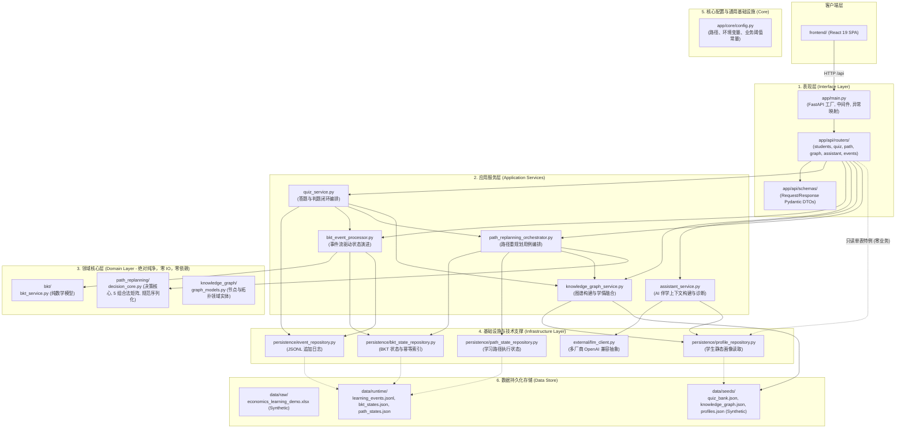

# 学海智导（Xuehai Zhidao）V2
# Target Architecture Design Specification (Phase 2.1 Finalized)
# 目标架构设计规范书 · 模块化单体演进方案 (终审修订版)

**编制时间**：2026-09-05  
**架构状态**：Phase 2.1 Architecture Review Finalized (待人工批准，严禁提前编码实施)  
**设计基准**：基于 Phase 1 架构审计及 Phase 2.1 架构一致性终审意见  
**核心目标**：从扁平脚本堆叠（Flat Script Roots）平滑演进为高内聚、低耦合、易维护的**实用型分层模块化单体（Pragmatic Layered Modular Monolith）**。

---

## 1. Executive Summary (执行摘要)

学海智导（Xuehai Zhidao）V2 在经历 P0-1 至 P0-8 各里程碑的攻坚后，已成功建立起以贝叶斯知识追踪（BKT）数学引擎、1-hop 局部自适应路径重规划为核心的智能化学习闭环。

然而，Phase 1 架构审计暴露出系统面临的结构性技术债务：
- 17 个 Python 文件平铺根目录，缺乏包命名空间（Namespace）；
- `04_api.py` 膨胀为 733 行的“上帝控制器”（God Controller）；
- `knowledge_graph_service._raw_knowledge_points` 私有变量被外部服务越权穿透；
- 导入模块时同步解析 Excel 导致阻塞与文件锁定隐患；
- `output/` 离线计算与 `data/` 在线运行持久化双轨并存。

**本设计规范（Phase 2.1 终审版）为系统量身定制演进蓝图**：坚决摒弃微服务、消息队列（MQ/Kafka）、Redis、Docker/K8s、复杂数据库等与当前“大学生创新创业竞赛（国创）/ 概念验证（POC）”定位脱节的过度设计（No Over-Engineering）；以 **`app/` 为顶级命名空间的实用分层单体** 为推荐目标，确立严格的单向依赖规则与公有服务契约，保障未来继续推进 P0-9、P1、P2 时具备清晰的工程底座。

---

## 2. Design Principles (架构设计原则)

1. **反架构炫技（Anti-Overengineering）**：
   - 绝不引入无实际调用场景的抽象工厂（Abstract Factory）、十几个单实现接口（Interface with single implementation）或庞杂的设计模式；
   - 坚持“能用模块就不用服务，能用 JSON 文件就暂不引入重量级 SQL/NoSQL 数据库”；
   - 保持内存计算与单机并发安全优势（`RLock` + 原子替换）。
2. **前后端契约兼容性保障（API-Contract-Driven Boundary）**：
   - 以现有 API Contract 为兼容边界，**目标实现前端零修改**，并通过 API Contract Test、Backend Regression Test 与 Frontend Build/E2E 严格验证兼容性。
3. **测试金字塔与安全网第一（Safety-Net First）**：
   - 现有的 98 个后端回归测试与 37 个前端测试（共 135 项测试）是重构的最高底气；
   - 重构过程中每一阶段的目录变动与 import 迁移，必须在测试套件 100% 绿灯的前提下推进。
4. **严格纯净的单向依赖（Strict Unidirectional Dependency）**：
   - 明确定义 API $\to$ Application $\to$ Domain，Infrastructure 仅为 Application 提供被动技术实现的单向拓扑；
   - **Domain 层绝对纯净**：严禁 import infrastructure/repository，严禁发起 IO 或依赖框架。
5. **明确数据 Source of Truth 与生命周期分界**：
   - 物理隔离“不可变种子数据”、“可重放行为流水”、“派生运行时快照”与“离线批处理中间件”。

---

## 3. Architecture Options (项目顶层布局方案评估)

针对顶层目录布局，我们系统对比了以下三种方案：

### 方案 A：标准 Python `src` 布局 (`src/xuehai_zhidao/...`)
```
xuehai-zhidao-poc/
├── pyproject.toml
├── src/
│   └── xuehai_zhidao/
│       ├── api/
│       ├── domain/
│       └── ...
└── tests/
```
- **优点**：符合 Python 打包分发标准，有效防止测试时无意引用未安装的源码。
- **缺点**：
  - 需要执行 `pip install -e .` 安装可编辑包才能平滑运行；
  - 团队成员直接执行 `python path/to/script.py` 会因为 `sys.path` 缺失报 `ModuleNotFoundError`；
  - Uvicorn 启动命令变长（`uvicorn xuehai_zhidao.api.main:app`）；
  - 对大学生竞赛项目及快速迭代产生不必要的环境配置摩擦。

### 方案 B：平铺模块分组（轻量归拢，保持根目录）
```
xuehai-zhidao-poc/
├── api_04.py
├── core_bkt.py
├── ...
```
- **优点**：迁移成本极低。
- **缺点**：治标不治本，未解决根目录平铺、命名空间缺失和数字前缀脚本问题，后续扩展仍会持续恶化。

### 方案 C（推荐）：实用型应用单体布局 (`app/...`)
```
xuehai-zhidao-poc/
├── app/
│   ├── main.py                     # FastAPI 统一应用装配入口
│   ├── core/                       # 核心配置与全局常量
│   ├── domain/                     # 纯业务逻辑 (BKT, Path Replanning)
│   ├── services/                   # 应用用例编排 (Quiz, Assistant, Graph, Replanning App)
│   ├── infrastructure/             # 持久化与外部客户端 (Repositories, LLM)
│   └── api/                        # HTTP 路由与请求响应 DTO
├── scripts/                        # 离线批处理与工具脚本
├── data/                           # 统一数据分层存储
├── tests/                          # 结构化自动化测试
├── docs/                           # 技术文档与规范
└── frontend/                       # 独立前端项目
```
- **综合对比矩阵**：

| 评估维度 | 方案 A (`src/xuehai_zhidao/`) | 方案 B (平铺轻度整理) | 方案 C (`app/` 实用单体 - 推荐) |
| :--- | :---: | :---: | :---: |
| **Python Import 稳定性** | 极高 (依赖 editable 安装) | 差 (依赖执行路径) | **高 (标准 Python package，根目录原生友好)** |
| **开发与调试体验** | 较重 (须配 pip -e) | 混乱 | **极佳 (直接 import app.xxx，开箱即用)** |
| **FastAPI 运行直观度** | `uvicorn xuehai_zhidao...` | 零散 | **标准 `uvicorn app.main:app --reload`** |
| **AI Agent 后续开发便利性** | 路径过深 | 上下文混乱 | **极佳 (清晰的模块边界与简短直观路径)** |
| **迁移改造风险与成本** | 中高 | 低 | **中 (平稳可控，135 项测试即时防护)** |
| **国创竞赛项目适配度** | 略显过度包装 | 不足 | **完美匹配 (整洁、规范、易答辩展示)** |

---

## 4. Recommended Architecture (推荐目标架构全景)

**选定方案 C：Pragmatic Layered Modular Monolith (`app/`)**。

系统的核心逻辑被清晰组织在 `app/` 顶级包下，划分五个正交层次：



---

## 5. Target Directory Tree (目标完整目录树)

```
xuehai-zhidao-poc/
├── .env.example                                # 环境变量配置模板
├── .gitignore                                  # Git 排除规则 (排除 data/runtime/, node_modules/ 等)
├── pyproject.toml                              # 项目基础元数据、核心依赖与 pytest 配置 (统一配置中心)
├── requirements.txt                            # 兼容性依赖锁定文件
├── README.md                                   # 项目全景说明
│
├── app/                                        # 【后端主包】顶级模块命名空间
│   ├── __init__.py
│   ├── main.py                                 # FastAPI 应用初始化、CORS、全局异常与 Router 挂载
│   │
│   ├── core/                                   # 全局核心配置与常量定义
│   │   ├── __init__.py
│   │   ├── config.py                           # 统一路径配置 (DATA_DIR, SEEDS_DIR 等) 与 Settings
│   │   └── constants.py                        # BKT 超参数、路径状态、认知等级枚举与阈值常量
│   │
│   ├── api/                                    # 表现层 (Interface / Presentation)
│   │   ├── __init__.py
│   │   ├── routers/                            # 按业务领域拆分的轻量路由控制器
│   │   │   ├── __init__.py
│   │   │   ├── system.py                       # /, /api/health, /api/overview
│   │   │   ├── students.py                     # /api/students, /api/students/{id}/profile, /reports, /dashboard
│   │   │   ├── quiz.py                         # /api/quiz/{kid}, /api/quiz/submit
│   │   │   ├── learning_state.py               # /api/students/{id}/knowledge-state/{kid}, /learning-state/update
│   │   │   ├── path.py                         # /api/students/{id}/path-states, /learning-path, /learning-paths
│   │   │   ├── knowledge_graph.py              # /api/students/{id}/knowledge-graph
│   │   │   ├── assistant.py                    # /api/students/{id}/assistant, /assistant/greeting
│   │   │   └── events.py                       # /api/events (行为事件上报)
│   │   └── schemas/                            # HTTP 请求与响应 Pydantic DTO 模型 (各路由按需共享)
│   │       ├── __init__.py
│   │       ├── common.py                       # 通用返回、分页或健康检查 Schema
│   │       ├── student.py                      # 学生画像、仪表盘、报告 Schema
│   │       ├── quiz.py                         # 测验题目、选项、作答请求与响应 Schema
│   │       ├── bkt.py                          # BKT 认知状态查询与更新 Schema
│   │       └── path.py                         # 路径执行状态查询与响应 Schema
│   │
│   ├── domain/                                 # 领域核心层 (纯粹业务逻辑，绝不依赖 FastAPI 与 IO)
│   │   ├── __init__.py
│   │   ├── bkt/                                # 贝叶斯知识追踪领域核心
│   │   │   ├── __init__.py
│   │   │   ├── models.py                       # BKTState, BKTParameters, BKTUpdateResult
│   │   │   └── service.py                      # 纯数学计算 calculate_bkt_update, apply_attempt
│   │   ├── path_replanning/                    # 局部自适应路径重规划领域核心 (零 IO)
│   │   │   ├── __init__.py
│   │   │   ├── models.py                       # PathAction, ReplanningReasonCode, CanonicalBusinessPayload
│   │   │   └── core.py                         # 纯决策逻辑 evaluate_decision_core, 5 组合法矩阵, 规范序列化
│   │   └── knowledge_graph/                    # 知识图谱领域模型与公有接口定义
│   │       ├── __init__.py
│   │       └── models.py                       # KnowledgePoint, DependencyEdge 纯领域实体
│   │
│   ├── services/                               # 应用服务层 (Use Case 业务编排与用例调度)
│   │   ├── __init__.py
│   │   ├── quiz_service.py                     # 测验业务编排 (判题 -> 记录事件 -> BKT 演进 -> 路径重规划)
│   │   ├── bkt_event_processor.py              # 学习行为事件驱动的 BKT 消费服务与事件回放
│   │   ├── knowledge_graph_service.py          # 知识图谱构建与学情融合服务 (实现公有查询方法)
│   │   ├── assistant_service.py                # AI 伴学助手上下文装配、LLM 驱动与规则兜底服务
│   │   └── path_replanning_service.py          # 路径重规划应用编排 (读 Repo -> 调 Domain Core -> 写 Repo)
│   │
│   └── infrastructure/                         # 基础设施与技术实现层
│       ├── __init__.py
│       ├── persistence/                        # 本地文件与 JSON 存储仓储实现 (带锁与原子保护)
│       │   ├── __init__.py
│       │   ├── event_repository.py             # learning_events.jsonl 追加日志仓储
│       │   ├── bkt_state_repository.py         # bkt_states.json 与 bkt_processed_events.json 仓储
│       │   ├── path_state_repository.py        # learning_path_states.json 独立仓储
│       │   └── profile_repository.py           # student_profiles, reports, paths 静态数据读取仓储
│       └── external/                           # 外部服务适配器
│           ├── __init__.py
│           └── llm_client.py                   # OpenAI 规范兼容的多模型客户端适配器
│
├── data/                                       # 【数据根目录】物理生命周期完全清晰化
│   ├── raw/                                    # 原始参考数据 (人工编辑输入，Demo/Synthetic，Git 跟踪)
│   │   └── economics_learning_demo.xlsx
│   ├── seeds/                                  # 核心静态业务种子数据 (Demo/Synthetic，Git 跟踪)
│   │   ├── quiz_bank.json                      # 30 个考点微测验题库
│   │   ├── knowledge_graph.json                # 从 Excel 提取的 30 知识点 + 42 边结构元数据 (消除运行时 Excel)
│   │   ├── student_profiles.json               # 基准学生画像数据 (原 output/ 迁移)
│   │   ├── learning_paths.json                 # 基准学习路径规划数据 (原 output/ 迁移)
│   │   └── student_reports.json                # 基准综合学情报告数据 (原 output/ 迁移)
│   └── runtime/                                # 在线运行时动态持久化 (由应用写入，.gitignore 排除)
│       ├── learning_events.jsonl               # 权威学习行为事实流水
│       ├── bkt_states.json                     # 当前 BKT 认知状态持久化
│       ├── bkt_processed_events.json           # 事件消费幂等索引
│       └── learning_path_states.json           # 当前动态路径执行状态
│
├── scripts/                                    # 【脚本工具库】从根目录彻底移出
│   ├── data_pipeline/                          # 离线数据生成流水线
│   │   ├── prepare_data.py                     # (原 01_prepare_data.py: 解析 Excel 生成 student_profiles.json)
│   │   ├── recommend_path.py                   # (原 02_recommend_path.py: 拓扑排序生成 learning_paths.json)
│   │   ├── generate_report.py                  # (原 03_generate_report.py: 规则诊断生成 student_reports.json)
│   │   ├── export_graph_seed.py                # (新增: 从 Excel 抽取结构生成 seeds/knowledge_graph.json)
│   │   └── run_pipeline.py                     # (新增: 一键执行 01->02->03->导出种子数据)
│   └── verify/                                 # 独立开发验证工具 (脱离 pytest 的手工调试脚本)
│       ├── verify_assistant.py                 # (原 verify_assistant_v2.py)
│       └── verify_knowledge_graph.py           # (原 verify_knowledge_graph.py)
│
├── tests/                                      # 【自动化测试套件】98 个用例按层级结构化归类
│   ├── __init__.py
│   ├── conftest.py                             # 全局测试配置与隔离 Fixture (自动重定向所有运行时数据路径)
│   ├── unit/                                   # 纯单元测试 (零 IO，毫秒级断言)
│   │   ├── test_bkt_service.py
│   │   ├── test_path_replanning_core.py
│   │   └── test_path_state.py
│   ├── component/                              # 组件与领域流转测试 (包含临时持久化与 DAG 隔离)
│   │   ├── test_bkt_processor.py
│   │   ├── test_bkt_state.py
│   │   ├── test_event_logger.py
│   │   └── test_path_replanning_dag.py
│   ├── golden/                                 # 黄金业务时序与确定性哈希测试
│   │   └── test_path_replanning_golden_e2e.py
│   └── api/                                    # REST API 契约与全流程集成测试
│       ├── test_bkt_api.py
│       ├── test_quiz_api.py
│       ├── test_quiz_bkt_integration.py
│       └── test_quiz_replanning_integration.py
│
├── docs/                                       # 【架构与产品文档库】
│   ├── architecture/                           # 架构全景与规范
│   │   ├── PHASE-1-CURRENT-STATE.md            # (现有的 docs/ARCHITECTURE_AUDIT_PHASE1.md 迁移归档)
│   │   └── PHASE-2-TARGET-ARCHITECTURE.md      # 本设计规范书
│   ├── contracts/                              # 正式冻结的业务契约
│   │   ├── api_contract.md                     # 最新全量 API 契约 (补充 path-states 端点)
│   │   ├── BKT.md                              # BKT 动力学方程与数学模型契约
│   │   └── state_machine_contract.md           # 统一修正过时参数后的状态机规范
│   └── superpowers/                            # 实施记录与历史计划
│
├── frontend/                                   # 【前端客户端 - 保持独立，零破坏】
│   ├── src/
│   ├── test/
│   └── package.json
│
└── external_reference/                         # 【外部参考项目 - 保持原样隔离】
    ├── OATutor-main/
    └── OpenTutor-main/
```

---

## 6. Backend Layering (后端分层详细规划)

### 彻底消除 Domain $\to$ Infrastructure 违规依赖
在 Phase 2.1 审查中，发现此前设计草案中 `ReplanningDomain` 直接调用 `BKTRepo` 和 `PathRepo`，违背了分层隔离原则。**现已彻底重构修正**：

```
[Application Service] (e.g. path_replanning_service.py)
       ├── 1. 调用 Infrastructure (BKTRepo / PathRepo / GraphService) 获取内存数据
       ├── 2. 传递纯数据结构进入 Domain Core (decision_core.py)
       ├── 3. Domain Core 执行纯逻辑判断并返回 DecisionAuditEnvelope
       └── 4. Application Service 调度 PathRepo 执行原子落盘
```

- **Domain 层必须 100% 保持纯净**：
  - `app/domain/bkt/`：纯数学状态更新公式计算，零 IO、零外部依赖；
  - `app/domain/path_replanning/`：纯决策核心逻辑（5 组合法矩阵校验、单入口原因裁决、1-hop 节点变动集合计算、Canonical 规范序列化），零 IO、零仓储依赖；
  - `app/domain/knowledge_graph/`：纯节点与拓扑关系领域实体模型。

---

## 7. API Architecture (04_api.py 拆解与 Router 依赖收紧)

### 严格收紧 Router 依赖边界
在 Phase 2.1 审查中，进一步确立：**默认禁止 Router 直接访问 Repository**，防止 Router 重新退化为小型 God Controller。

$$\text{API Router} \stackrel{\text{Default: 必须通过}}{\longrightarrow} \text{Application Service} \longrightarrow \text{Domain / Infrastructure}$$

- **默认规则（Default Rule）**：API Router 必须通过 Application Service 编排业务，Router 仅承担参数校验、HTTP 状态映射及调用 Service。
- **允许的例外场景（Strict Exceptions）**：
  - 仅限于**纯静态、单表、只读、零业务逻辑编排**的极端基础查询（如获取系统常量、无逻辑的简单静态配置获取）；
  - **任何涉及数据多源拼接、学生档案聚合（如 `/api/students/{id}/dashboard`）或状态变更的接口，严禁直接访问 Repository，必须由 Application Service 聚合封装**。
- **绝对红线**：Router 内部绝对严禁出现 `open()` 文件读取、复杂字典拼装或业务计算。

---

## 8. Knowledge Graph Boundary (公有服务契约与 Excel 脱离)

### 方案落地：普通 Service Public Methods
为避免引入抽象工厂、多级接口或过度设计的依赖注入容器，Knowledge Graph 采用最直观、易懂且符合 Pythonic 哲学的**服务公有方法契约（Plain Service Public Methods）**：

1. **实现载体**：`app/services/knowledge_graph_service.py` 内部实例化单例（或标准服务类），提供公有方法：
   - `get_knowledge_point(knowledge_id: str) -> Optional[Dict[str, Any]]`
   - `get_prerequisites(knowledge_id: str) -> List[str]`
   - `get_successors(knowledge_id: str) -> List[str]`
   - `is_valid_knowledge_id(knowledge_id: str) -> bool`
   - `get_all_knowledge_point_ids() -> List[str]`
   - `get_student_knowledge_graph(student_id: str) -> Dict[str, Any]`
2. **种子数据加载**：
   - `KnowledgeGraphService` 在初始化时直接读取 `data/seeds/knowledge_graph.json`（轻量级 15KB JSON，启动解析耗时 <1ms）；
   - **完全消除运行时对 `openpyxl` 的依赖**。
3. **彻底封禁私有变量越权访问**：
   - 外部业务模块（如 `quiz_service` 与 `path_replanning_service`）严格通过公有方法 `get_prerequisites(...)` 与 `get_successors(...)` 查询图谱，**绝对禁止直接访问 `_raw_knowledge_points`**。

---

## 9. Data Architecture (数据生命周期与演示数据性质界定)

### 数据性质审查结论：Synthetic / Demo Data (虚拟构造演示数据)
经全面代码与数据审计核实：
- `economics_learning_demo.xlsx` 中的学生数据（S001~S005：张同学、李同学、王同学、赵同学、刘同学）及其答题明细，均为**国创竞赛与概念验证专门构造的合成演示数据（Synthetic / Demo Data）**；
- 原始数据与种子数据中**完全不含任何真实学生个人身份信息（Zero PII）**；
- 因此，将 `data/raw/` 与 `data/seeds/` 纳入 Git 版本控制完全合规且必要，能够保障开发环境一致性与测试结果的绝对可再现。

### 统一数据存储三级目录
- `data/raw/` (Commit into Git): 原始 Excel 输入；
- `data/seeds/` (Commit into Git): 题库 `quiz_bank.json`、图谱结构 `knowledge_graph.json`、基准画像 `student_profiles.json` 等；
- `data/runtime/` (.gitignore Excluded): 运行期动态追加的行为事件流水 `learning_events.jsonl`、动态快照 `bkt_states.json`、路径状态 `learning_path_states.json`。

---

## 10. Test Baseline & Architecture (真实测试基线与结构化规划)

### 真实测试基线核实记录 (Verified Actual Baseline)
经在当前仓库环境实际执行命令验证，真实测试基线如下：

1. **后端测试基线 (Backend Tests)**：
   - 执行命令：`pytest tests/ --collect-only -q`
   - **真实用例数：98 collected**（覆盖 12 个测试文件）；
   - 运行结果：`pytest tests/ -v` $\to$ **98 passed in 2.99s (100% PASS)**。
2. **前端测试基线 (Frontend Tests)**：
   - 执行命令：`node --experimental-strip-types --test test/router.test.ts test/mobile_nav.test.ts test/quiz_session.test.ts`
   - **真实用例数：37 passed**（覆盖 3 个测试套件，耗时约 250ms）；
   - 运行结果：**37 passed in 257ms (100% PASS)**。
3. **全栈测试总数 (Total Test Baseline)**：
   - **98 (Backend) + 37 (Frontend) = 135 Passed (0 Failed, 0 Error)**。
4. **前端生产构建基线 (Frontend Build)**：
   - 执行命令：`npm run build`
   - 运行结果：TypeScript 编译零错误，Vite 构建成功（耗时 698ms）。

> [!IMPORTANT]
> **关于全目录 `pytest --collect-only` 的发现**：在根目录下直接运行未限定路径的 `pytest --collect-only` 时，由于缺少配置，pytest 会递归搜寻外部参考项目 `OpenTutor-main/tests/`，导致报错。这进一步强化了必须引入 `pyproject.toml` 并配置 `testpaths = ["tests"]` 的工程必要性。

---

## 11. Configuration & pyproject.toml (依赖分类精准化)

### `openpyxl` 依赖重构界定
经真实 import 拓扑审查：
- 在目标架构中，常驻在线 API 与运行期图谱服务仅读取 `data/seeds/knowledge_graph.json`；
- `openpyxl` 仅在离线批处理脚本 `scripts/data_pipeline/` 中使用；
- 因此，**`openpyxl` 从核心运行时 `dependencies` 中移出**，归入可选离线管道依赖，减轻生产运行负载。

### 极简 `pyproject.toml` 规划
```toml
[project]
name = "xuehai-zhidao"
version = "0.2.0"
description = "学海智导——AI驱动的大学生个性化学习指导平台 V2"
readme = "README.md"
requires-python = ">=3.10"
dependencies = [
    "fastapi>=0.115.0",
    "uvicorn>=0.30.0",
    "pydantic>=2.0.0",
    "python-dotenv>=1.0.0",
    "requests>=2.31.0",
]

[project.optional-dependencies]
pipeline = [
    "openpyxl>=3.1.0",
]
dev = [
    "pytest>=8.0.0",
    "httpx>=0.27.0",
]

[tool.pytest.ini_options]
testpaths = ["tests"]
python_files = ["test_*.py"]
python_classes = ["Test*"]
python_functions = ["test_*"]
addopts = "-v"
```

---

## 12. Frontend Boundary (前端兼容性工程化界定)

- **表述调整**：以现有 API Contract 为兼容边界，**目标实现前端零修改**，并通过 API Contract Test、Backend Regression Test 与 Frontend Build/E2E 验证兼容性。
- 绝不因后端目录重组变更任何既有端点的 HTTP 路径（`/api/...`）或字段键名，确保前端 `frontend/src/api.ts` 零破坏。

---

## 13. Architecture Invariants (系统架构不变量 - 核心红线)

在未来任何阶段的重构与功能演进中，系统必须无条件坚守以下 12 条架构不变量：

1. **Domain 绝对纯净**：Domain 层绝对不依赖 API / FastAPI / Infrastructure / IO / 数据库 / 第三方重量级库。
2. **Router 绝无业务逻辑**：API Router 仅承担协议解析与调用，严禁包含状态计算或数据聚合逻辑。
3. **Application Service 负责 Use Case 编排**：跨领域、跨仓储的业务流程流转由 Application Service 统筹调度。
4. **Repository 独占持久化**：底层文件读写、并发锁与原子临时文件替换由 Repository 独立封装。
5. **严禁越权穿透私有变量**：任何模块严禁访问其他模块以 `_` 开头的内部私有变量（如 `_raw_knowledge_points`）。
6. **严禁 Router 直接 `open()` 数据文件**：所有物理数据访问必须通过 Repository 或 Service 交互。
7. **Excel 绝不进入在线 Runtime**：在线服务与测试主路径只读取 JSON 种子，`openpyxl` 仅限离线脚本使用。
8. **Learning Events 是行为流水唯一事实来源**：事件日志追加写持久化，绝不因下游计算异常丢弃事件。
9. **BKT State 是可重放重建的派生状态**：BKT 掌握度状态快照可完全根据事件流水进行幂等重放恢复。
10. **API Contract 是前后端兼容的唯一边界**：前端与后端严格通过文档化 REST API 解耦。
11. **拒绝无调用场景的过度抽象**：保持代码朴素实用，不引入单实现抽象接口或虚构设计模式。
12. **全流程回归测试守护**：Phase 3 实施过程中的每一步代码移动，必须以 98 项后端测试与 37 项前端测试全绿为通过前提。

---
*设计规范终审完毕。严格遵守只读纪律，未修改任何业务代码，等待人工批准。*
