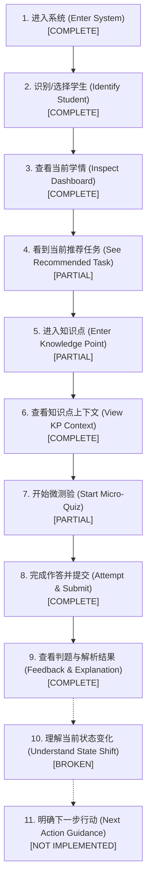

# Phase 2.2-B Task 01 Acceptance Report

> **任务性质**：Core Student Experience Consolidation — Student Journey Audit & Experience Contract  
> **审查基线**：Phase 2.1 Architecture `FROZEN` (`f0c0a0f`) | Phase 2.2-A Product Baseline (`a4025f5`)  
> **执行原则**：Evidence Before Claims, Scope Before Code, Product Journey Before Feature Count

---

## 1. Task Scope (任务范围)

本任务是 Phase 2.2-B（核心学生体验巩固）的启动与契约制定任务，主要职责为：
- 对当前学生端全链路实现进行系统性**只读旅程审计 (Read-Only Student Journey Audit)**；
- 梳理学生从进入系统到完成一次学习任务的 11 步最小闭环，如实评估各步骤的实现完整度；
- 制定正式的**学生端体验契约规范** [`docs/product/STUDENT-EXPERIENCE-CONTRACT.md`](STUDENT-EXPERIENCE-CONTRACT.md)；
- 在 `frontend/test/` 中沉淀 4 项核心体验契约测试，确保无 CSS 或微观实现依赖；
- 确立后续 Task 的 P0 / P1 / P2 实施待办清单，明确体验演进边界；
- **严格遵守 Phase 2.1 架构冻结纪律**：`app/` 零改动、`frontend/src/` 零改动、`data/` 零改动，零基础设施引入。

---

## 2. Files Inspected (审计覆盖文件清单)

本次审计对全仓库核心技术资产进行了深度源码与契约穿透：
1. **产品与架构规范**：
   - `README.md`, `docs/product/PRODUCT-VISION.md`, `docs/product/FEATURE-BASELINE.md`, `docs/product/ROADMAP.md`
   - `docs/architecture/ARCHITECTURE-CONSTITUTION.md`, `docs/architecture/ARCHITECTURE-FITNESS.md`, `docs/architecture/PHASE-2-TARGET-ARCHITECTURE.md`
2. **前端路由与上下文**：
   - `frontend/src/router.ts`, `frontend/src/App.tsx`, `frontend/src/api.ts`
   - `frontend/src/context/AppContext.tsx`, `frontend/src/context/useApp.ts`
3. **前端视图与核心组件**：
   - `frontend/src/layouts/StudentLayout.tsx`, `frontend/src/layouts/TeacherLayout.tsx`
   - `frontend/src/components/Header.tsx`, `HeroBanner.tsx`, `StatCards.tsx`, `LearningProfile.tsx`
   - `frontend/src/components/AIDiagnosis.tsx`, `AISummary.tsx`, `WeakKnowledgePoints.tsx`
   - `frontend/src/components/LearningPath.tsx`, `KnowledgeGraph.tsx`, `KnowledgeGraphDetailDrawer.tsx`, `AIAssistant.tsx`
   - `frontend/src/components/student/BottomNav.tsx`, `KnowledgePointQuiz.tsx`, `quizModel.ts`, `navConfig.ts`, `MobileContainer.tsx`
4. **后端应用与服务层**：
   - `app/api/routers/` (8 大路由控制器), `app/services/` (quiz, student, path, kg, replanning)
   - `app/domain/bkt/`, `app/domain/path_replanning/`, `app/domain/event/`
5. **测试套件**：
   - `tests/architecture/` (17 个 AST 适应度测试), `frontend/test/` (现有 3 个测试套件)

---

## 3. Student Golden Journey (学生黄金用户旅程)

基于当前系统实际代码交互链路，提炼出 11 步最小闭环旅程：



---

## 4. Journey Status Matrix (旅程完成度状态矩阵)

| 旅程步骤 | 对应代码位置 | API 交互 | 真实状态判定 | 现状客观评价与体验瓶颈 |
| :--- | :--- | :--- | :--- | :--- |
| **1. 进入系统** | `App.tsx`, `router.ts` | `GET /api/health` | **`[COMPLETE]`** | 默认由 `/` 重定向至 `/student/tasks`，加载初始数据平滑无空白。 |
| **2. 识别学生** | `Header.tsx`, `AppContext.tsx` | `GET /api/students` | **`[COMPLETE]`** | S001~S005 下拉切换灵活，学生身份全局透明。 |
| **3. 查看学情** | `StatCards`, `LearningProfile` | `GET /api/students/{id}/dashboard` | **`[COMPLETE]`** | 掌握率、耗时、多维能力雷达图与诊断文本完整呈现。 |
| **4. 推荐任务** | `LearningPath.tsx` | `GET /api/students/{id}/learning-path` | **`[PARTIAL]`** | 能展示阶段时间轴，但缺乏“当前聚焦任务 (IN_PROGRESS)”卡片与行动入口。 |
| **5. 进入考点** | `WeakKnowledgePoints.tsx` | 本地数据过滤 | **`[PARTIAL]`** | 只能从“需要重点关注”薄弱点点击打开抽屉，推荐路径与图谱无进入考点的主通道。 |
| **6. 考点详情** | `KnowledgeGraphDetailDrawer` | `GET /api/students/{id}/knowledge-graph` | **`[COMPLETE]`** | 完整呈现章节描述、前置依赖链 (`upstream_prerequisites`) 与后继考点。 |
| **7. 开启测验** | `KnowledgePointQuiz.tsx` | `GET /api/quiz/{knowledge_id}` | **`[PARTIAL]`** | 仅薄弱点抽屉有测验按钮，路径卡与图谱抽屉均缺失；非 8 考点无题目提示友好度待提升。 |
| **8. 作答提交** | `quizModel.ts` | `POST /api/quiz/submit` | **`[COMPLETE]`** | 动态计算 `time_spent_ms`，防连击拦截，服务端权威判题与事件追加落盘。 |
| **9. 查看反馈** | `KnowledgePointQuiz` 状态 E/G | API 响应载荷 | **`[COMPLETE]`** | 正确/错误红绿高亮、正确答案比对、名师解析展开与最终统计指标汇总卡完整。 |
| **10. 状态变化** | `QuizSubmitResponse.replanning` | 响应携带 `replanning` | **`[BROKEN]`** | **关键断裂**：后端返回了最新 BKT 掌握度与重规划信封，但前端完全未渲染；退出测验后原看板也未静默刷新。 |
| **11. 下一步指引**| `KnowledgePointQuiz` 结算卡 | 缺失专用推荐引导 | **`[NOT IMPLEMENTED]`** | **关键缺失**：测验结束后仅提供“重新测验”与“返回学习”，未能引导学生直接进入下一个推荐解锁考点。 |

---

## 5. Student Context Audit (学生上下文审计)

- **全局单一事实源**：`AppContext.tsx` 严格维护 `routerState.studentId`，初始值为 `S001`。
- **跨端切换保持性**：经由 `router.switchRole(state, targetRole)` 验证，学生在 `/student` 与 `/teacher` 之间往返切换时，选中的学生 ID（如 `S003`）**100% 锁定保持，零丢失**。
- **数据消费者审查**：
  - `Header.tsx` $\to$ 使用全局 `currentStudentId`；
  - `KnowledgeGraph.tsx` $\to$ 使用传入的 `currentStudentId`；
  - `AIAssistant.tsx` $\to$ 使用传入的 `currentStudentId` 并能触发特定问候语；
  - `KnowledgePointQuiz.tsx` $\to$ 测验提交载荷使用 `buildSubmitPayload(session, studentId)`，绑定当前上下文；
- **审计结论**：**`PASS`**（未发现跨学生状态污染）。

---

## 6. Navigation Audit (导航结构审计)

- **4-Tab 结构存在性**：[`frontend/src/components/student/navConfig.ts`](file:///c:/Users/XSL/Desktop/国创/xuehai-zhidao-poc/frontend/src/components/student/navConfig.ts) 规范定义了 `tasks`, `graph`, `profile`, `assistant` 四大 Tab，移动端由 `BottomNav` 完美承载。
- **当前路由渲染缺陷 (P1 Issue)**：
  - 在 [`frontend/src/layouts/StudentLayout.tsx`](file:///c:/Users/XSL/Desktop/国创/xuehai-zhidao-poc/frontend/src/layouts/StudentLayout.tsx) 中，当 `subRoute === 'tasks'` 时，系统一次性渲染了长达 8 个区块的巨型看板（包括了完整的知识图谱、学情雷达、AI 伴学长页面），导致“今日任务”定位失焦；
  - 契约确立：后续需将 `/student/tasks` 重新聚焦为“今日聚焦行动卡 + 学习路径流”。

---

## 7. Path State Presentation Audit (路径状态呈现审计)

- **后端能力**：`app/domain/path_replanning/models.py` 与 `app/services/path_state_service.py` 完整定义了 `LOCKED / AVAILABLE / IN_PROGRESS / COMPLETED` 四态并已独立原子持久化。
- **前端当前脱节 (P0 Issue)**：
  - 前端组件 [`frontend/src/components/LearningPath.tsx`](file:///c:/Users/XSL/Desktop/国创/xuehai-zhidao-poc/frontend/src/components/LearningPath.tsx) 中只有 `priority`（高/中/低）与 `source`（前置知识/薄弱知识），**根本没有展示 `LOCKED` / `AVAILABLE` / `IN_PROGRESS` / `COMPLETED` 状态徽章**；
  - 学生无法直观获知哪些节点前置未满足被锁定，哪些节点已经解锁可学。

---

## 8. Quiz Journey Audit (微测验旅程审计)

- **作答流程完整性**：从 `idle` 到 `loading`，再到单选题单选、计时 `time_spent_ms`、权威判题、展示解析及结算汇总，流程非常完整顺畅。
- **入口严重匮乏 (P0 Issue)**：
  - 目前全系统唯一的测验入口位于 `WeakKnowledgePoints.tsx`（重点关注卡片）点击后滑出的 BottomSheet 中；
  - 核心学习主线 `LearningPath.tsx` 和知识图谱详情抽屉 `KnowledgeGraphDetailDrawer.tsx` 中均**没有任何“做测验/去练习”按钮**，形成明显的交互死胡同。

---

## 9. AI Assistant Positioning Audit (AI 导学副驾定位审计)

- **角色定位审视**：当前 AI 助手在右侧抽屉或 `/student/assistant` 中独立提供问答，符合 `Learning Copilot` 的定位。
- **文案误导风险 (P1 Issue)**：
  - 当前主看板存在“AI 为你生成的学习路径”等文案，易使学生产生“学习路径是由黑盒大模型随心所欲生成”的误解；
  - 契约确立：统一规范文案为“基于知识图谱拓扑与认知追踪评估，AI 伴学助手为你解析推荐理由”，明确确定性算法主导地位。

---

## 10. Mobile Experience Audit (移动端体验审计)

- **触控靶点**：`BottomNav` 按钮、测验选项、提交按钮高度均保证在 $44\text{ px} \sim 48\text{ px}$，满足触控规范；
- **安全区域**：`BottomNav` 包含 `pb-safe` 适配，底部预留足够间距防遮挡；
- **无横向溢出**：全端采用 `max-w-md mx-auto` 配合响应式弹性栅格，视口无多余横向滚动条。

---

## 11. Error / Loading / Empty State Audit (异常状态审计)

- **Loading 状态**：仪表盘、微测验、AI 均有优雅骨架屏或转圈占位动画；
- **Error 状态**：网络中断时显示友好提示，支持一键“重试加载”；
- **无测验题库兜底 (P1 Issue)**：当对非 8 核心考点请求测验时，界面仅冷冰冰显示“微测验加载未就绪”，需优化为更有建设性的说明（如“该考点暂设为自主阅读考点，无微测验试题”）。

---

## 12. Student Experience Contract (体验契约正式交付)

正式契约文件已发布：[`docs/product/STUDENT-EXPERIENCE-CONTRACT.md`](STUDENT-EXPERIENCE-CONTRACT.md)，全面规范了导航、上下文、任务、图谱、微测验、学习结果、路径四态、AI 副驾边界、异常处理及无障碍底线。

---

## 13. Identified P0 / P1 / P2 Issues (缺陷与待办清单)

根据审计证据，提炼出 Phase 2.2-B 后续实施 Backlog：

### 🔴 P0（阻断核心闭环体验的关键缺陷）
1. **`LearningPath.tsx` 增加测验直达入口**：主线路径卡片增加“开始微测验”高对比度操作按钮；
2. **`KnowledgeGraphDetailDrawer.tsx` 增加测验入口**：图谱节点详情抽屉底部补齐测验跳转入口；
3. **测验完成后学情看板自动静默刷新**：测验提交成功关闭后，触发主看板拉取最新学情数据；
4. **路径卡片引入 `PathState` 状态呈现**：为推荐路径节点增加 `LOCKED / AVAILABLE / IN_PROGRESS / COMPLETED` 语义化标签与前置阻断提示。

### 🟡 P1（严重影响体验但未完全阻断主线）
1. **重构聚焦 `/student/tasks` 视图**：从 8 屏长看板中剥离冗余模块，聚焦“今日任务 + 推荐路径”；
2. **微测验反馈区呈现掌握度跨越**：在解析卡片与结算卡片中，展示 BKT 掌握度数值变化与解锁提示；
3. **测验结算卡增加“下一步行动”牵引按钮**；
4. **纠偏界面 AI 文案**：明确“确定性拓扑与追踪 + AI 导学解释”的双重定位。

### 🟢 P2（视觉与易用性优化）
1. 路径与图谱双向悬浮联动高亮；
2. 测验计时倒计时微动效；
3. 移动端抽屉手势顺滑度调优。

---

## 14. Code Changes (代码改动记录)

- 业务源码改动：**`0`**（严格遵守只读审计纪律，`app/` 零改动、`frontend/src/` 零改动、`data/` 零改动）。
- 新增规范与测试文件：
  - `docs/product/STUDENT-EXPERIENCE-CONTRACT.md`
  - `frontend/test/experience_contract.test.ts`

---

## 15. Tests Added (新增体验契约测试)

在 [`frontend/test/experience_contract.test.ts`](file:///c:/Users/XSL/Desktop/国创/xuehai-zhidao-poc/frontend/test/experience_contract.test.ts) 中沉淀了 4 项高阶体验契约测试：
1. `Contract 1: 学生端 4 个核心 Tab 完整定义且路由解析互通`
2. `Contract 2: 学生身份上下文在切换与双端穿梭中严格一致保持`
3. `Contract 3: 四大路径状态语义完整且映射明确`
4. `Contract 4: 微测验提交载荷携带动态时间与学生上下文，反馈完整保真`

---

## 16. Regression Verification (回归验证结果)

### 1. 前端测试套件 (41 passed)
```powershell
node --experimental-strip-types --test frontend/test/*.test.ts
# ℹ tests 41
# ℹ suites 4
# ℹ pass 41
# ℹ fail 0
# ℹ duration_ms 294.2435
```
原有 37 个测试 + 新增 4 个契约测试全部在 300ms 内绿色通过。

### 2. 前端生产打包构建 (PASS)
```powershell
cd frontend && npm run build
# ✓ 2556 modules transformed.
# dist/assets/index-MuNSBbCs.css   89.44 kB │ gzip:  13.82 kB
# dist/assets/index-Dy4MJHr6.js   817.63 kB │ gzip: 240.75 kB
# ✓ built in 510ms
```

### 3. 后端全量测试回归 (143 passed)
```powershell
pytest -q
# ============================= 143 passed in 3.98s =============================
```

### 4. Git 洁净度检查
```powershell
git diff --check
# (0 格式错误)
```

---

## 17. Architecture Freeze Verification (架构冻结自检)

```powershell
pytest tests/architecture/ -v
# ============================= 17 passed in 0.87s ==============================
```
- Invariant 01~12 全系架构适应度测试 17/17 保持 100% 通过；
- BKT 数学模型（0.20/0.10/0.20/0.10）、18 个 API 契约与分层单向流动 100% 封锁保持。

---

## 18. Recommended Next Task (下一阶段建议)

本代理在此处主动严格停止，绝不自行推进实现。

建议人工批准本次审计成果与契约，随后启动：
> **Phase 2.2-B / Task 02: P0 级核心闭环通路打通**  
> 集中攻坚 P0 清单：为 `LearningPath` 与 `KnowledgeGraphDetailDrawer` 补齐微测验直达入口，并实现测验结束后的学情主看板静默刷新机制。
