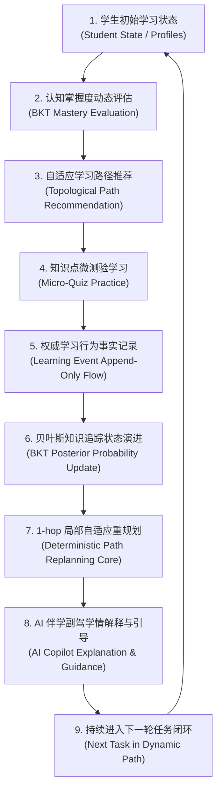

# 学海智导 (Xuehai Zhidao) 产品愿景与定位规范 (Product Vision)

> **版本**：Phase 2.2 Product Baseline  
> **更新时间**：2026-09-07  
> **文档定位**：学海智导产品方向、用户价值与功能边界的最高指导文件

---

## 一、产品是什么 (What It Is)

**「学海智导」** 是一个面向大学生的**个性化自适应智能导学平台**。

它以微观经济学等高校专业核心课程为真实教学实验场，深度融合**知识图谱拓扑依赖**、**经典贝叶斯知识追踪 (BKT, Bayesian Knowledge Tracing)** 以及**确定性局部路径重规划引擎 (Deterministic Path Replanning Engine)**，配合 **AI 伴学副驾 (Learning Copilot)**，为大学生提供“测-评-学-练-导”全链路自适应闭环指导。

---

## 二、目标用户与典型画像 (Target Users)

- **主要用户**：高校在读本科生 / 大专生，正在修读微观经济学、高等数学等知识密集、逻辑链条强、先修前置依赖严格的专业基础课。
- **辅助用户**：高校专业课教师 / 助教，需要全景俯瞰班级学生的知识盲区分布、学情薄弱点聚集度，以便开展针对性翻转课堂或分层教学。

### 典型痛点场景
1. **基础脱节**：学到后继高阶知识点（如“弹性与税收归宿”）时做题反复受挫，无法自主诊断是因为前置考点（如“需求价格弹性”、“供给弹性”）掌握薄弱。
2. **迷失路径**：面对数十个离散章节和考点，缺乏结构性引导，不知道“我当前应该学什么”、“学完这步下一步去哪里”。
3. **黑盒焦虑**：即使传统自适应系统给出了下一步推荐，学生依然困惑“为什么系统让我学这个”，缺乏透明可解释的教学理由。

---

## 三、传统学习工具痛点与核心解法 (Core Problem & Solution)

| 传统学习工具痛点 | 传统方案局限 | 学海智导核心解法 |
| :--- | :--- | :--- |
| **学习资源千人一面** | 所有人刷同一张试卷、看同序录播课，学习速度与基础被强制拉平 | **动态知识图谱拓扑**：根据学生个体掌握度，高亮薄弱点，提供差异化准入 |
| **路径规划静态僵化** | 按照教材目录线性推进，前置未懂即强推高阶内容，挫败感强 | **DAG 前置拓扑约束**：前置知识未达标严禁解锁后继，达标后自动解锁直接下游 |
| **练习缺乏持续反馈** | 做完题只有简单的对错统计，无法转化为认知掌握概率的演进 | **经典 BKT 动力学追踪**：将每次答题抽象为概率更新，量化真实潜认知掌握度 |
| **推荐逻辑不可解释** | 纯统计协同过滤或深度黑盒模型，学生无法理解推荐逻辑 | **确定性决策核心 + AI 导学解释**：5 组合法决策严格透明，AI 副驾清晰讲明“推荐理由” |

---

## 四、核心产品闭环 (Core Product Loop)

学海智导绝非“展示板 + 题库 + 聊天机器人”的拼凑体，其核心价值完全体现在以下**端到端动态自适应闭环**中：

---

## 五、AI 在系统中的角色定位 (Role of AI)

在学海智导系统中，**必须严格厘清大语言模型 (LLM) 与核心业务状态机的职责边界**：

> [!IMPORTANT]
> **红线原则：AI 不是学习状态与规划决策的最终裁决者！**
> - 认知掌握度 $P(L)$ 的更新，必须且只能由**严格的 BKT 动力学数学公式**计算；
> - 路径节点的解锁、锁定、降级，必须且只能由**确定性 Path Replanning 决策核心**裁决；
> - 严禁让 LLM 直接通过自然语言生成或篡改系统关键状态、图谱拓扑或数据库记录。

### AI 的核心角色是「智能导学副驾 (Learning Copilot)」：
1. **学情透明化解释**：用温暖易懂的人性化语言，向学生解释为何当前掌握度处于薄弱/发展中，消除焦虑。
2. **推荐决策说理**：解释“为什么下一步建议学习需求价格弹性”（例如：“因为这是理解后续弹性与税收归宿的核心基石”）。
3. **启发式疑难解答 (Socratic Tutoring)**：当学生在微测验做错或困惑时，不直接抛出答案，而是基于前置考点进行分步启发点拨。
4. **个性化温情伴学**：结合学生当前正在进行的任务、最近连错/连对状态，生成上下文相关的专属学习问候与行动建议。

---

## 六、什么不是本产品的目标 (Non-Goals)

为确保工程落地与资源聚焦，学海智导 V2 在当前及后续演进中**明确坚守以下不为原则**：

1. **不做通用无约束聊天机器人**：不追求通识知识问答，AI 伴学严格聚焦微观经济学专业教学上下文。
2. **不做纯题海练习库**：不追求海量题目爬取，坚持“核心考点少而精（精选题库）+ 严格考点映射 + 闭环认知诊断”。
3. **暂不做社交、排行榜与过度游戏化**：避免偏离“扎实专业课程学习与精准认知诊断”的学术与育人本质。
4. **不做商业化支付与多租户复杂权限系统**：作为国创大学生创新项目与教育科技实验平台，聚焦核心导学体验。
5. **坚决杜绝过度架构设计**：严禁引入微服务、消息队列（Kafka/RabbitMQ）、集中式缓存（Redis）、容器集群（K8s）等脱离当前规模的重型基础设施，坚持单机轻量化可复现运行。
