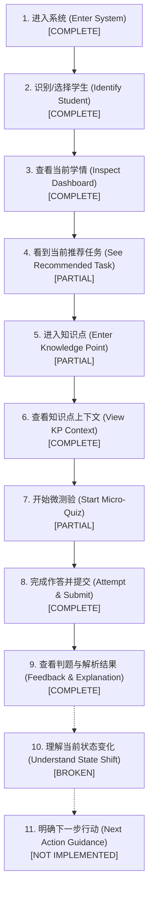

# 学海智导 (Xuehai Zhidao) V2 学生端体验契约规范 (Student Experience Contract)

> **版本**：Phase 2.2-B Experience Baseline  
> **制定时间**：2026-09-07  
> **执行依据**：基于对当前代码库 (`frontend/src/`, `app/api/`, `app/services/`, `app/domain/`) 的真实只读审计结果制定  
> **约束等级**：Phase 2.2-B 实施最高产品体验边界规范

---

## 一、学生黄金用户旅程 (Student Golden Journey)

学海智导学生端的核心价值主张是提供从学情认知到自适应能力跨越的完整学习闭环。基于当前代码真实实现的黄金用户旅程如下：

### 11 步旅程真实执行度评估：

| 旅程环节 | 当前代码对应组件/API | 真实能力现状 | 体验现状判定 | 核心差距说明 |
| :--- | :--- | :--- | :--- | :--- |
| **1. 进入系统** | `router.ts`, `App.tsx` | 自动重定向至 `/student/tasks`，自动加载 S001 学情 | **`[COMPLETE]`** | 路由和初始化加载顺畅，无异常空白 |
| **2. 识别学生** | `Header.tsx`, `AppContext.tsx` | 下拉框清晰展示 S001~S005 姓名学号，全局同步更新 | **`[COMPLETE]`** | 学生身份透明可控，多端上下文一致 |
| **3. 查看学情** | `StatCards`, `LearningProfile` | 准确呈现掌握率、均题耗时、薄弱考点与雷达图 | **`[COMPLETE]`** | 学情呈现丰富，诊断结论清晰 |
| **4. 推荐任务** | `LearningPath.tsx` | 按阶段显示推荐序列与优先级，但缺乏当前聚焦任务 | **`[PARTIAL]`** | 未突出“当前正在进行”的单一聚焦任务卡片 |
| **5. 进入知识点** | `WeakKnowledgePoints.tsx` | 只能从薄弱点卡片打开抽屉，路径卡与图谱无法直接进入 | **`[PARTIAL]`** | 入口通道割裂，未形成从推荐路径直接进入的主通道 |
| **6. 查看考点** | `KnowledgeGraphDetailDrawer` | 抽屉完整呈现考点描述、前置依赖链、学情与AI建议 | **`[COMPLETE]`** | 上下文与前置支撑信息丰富完整 |
| **7. 开始微测验** | `KnowledgePointQuiz.tsx` | 仅薄弱点抽屉有测验按钮，路径卡与图谱抽屉均缺失按钮 | **`[PARTIAL]`** | 测验触发点未贯穿核心导学界面；非8考点题库为空 |
| **8. 完成作答** | `quizModel.ts`, `api.submitQuizAnswer` | 动态计时、选项切换、防连击、服务端权威判题落盘 | **`[COMPLETE]`** | 作答状态机严密，事件自动落盘 |
| **9. 查看反馈** | `KnowledgePointQuiz` 状态 E/G | 正确/错误高亮、正确答案对照、解析详解与汇总卡 | **`[COMPLETE]`** | 判题反馈清晰，用时与正确率统计准确 |
| **10. 理解状态变化** | `QuizSubmitResponse.replanning` | 后端返回了 `bkt_state` 与 `replanning`，但前端完全未渲染 | **`[BROKEN]`** | 学生完全感知不到自己的掌握度从 0.45 跃迁到 0.81，也看不到后继解锁 |
| **11. 下一步行动** | `KnowledgePointQuiz` 结算卡 | 仅有“重新测验”与“返回学习”，无下一关推荐导向 | **`[NOT IMPLEMENTED]`** | 测验结束后体验停滞，未引导继续修读后继已解锁考点 |

---

## 二、导航契约规范 (Navigation Contract)

### 1. 结构契约：学生端标准 4-Tab
系统严格由 4 个相互独立、职责专一的子视图构成：
1. **今日任务 (`/student/tasks`)**：聚焦当前学习任务、自适应学习路径与核心待办；
2. **知识图谱 (`/student/graph`)**：微观经济学 30 个核心考点的前置依赖网络拓扑全景交互；
3. **学情档案 (`/student/profile`)**：多维学情画像、能力雷达图、薄弱考点列表与综合诊断报告；
4. **AI 伴学 (`/student/assistant`)**：个性化学情问候、苏格拉底式启发答疑与微课辅导。

### 2. 双端自适应响应契约：
- **移动端 (宽度 < 768px)**：隐藏顶部胶囊栏，由屏幕底部常驻的 [`BottomNav`](frontend/src/components/student/BottomNav.tsx) 承载；
- **平板与桌面端 (宽度 $\ge$ 768px)**：由 Header 下方的吸顶二级胶囊导航栏（Sub-route Navigation Pill Bar）承载。

### 3. 当前实现审计与优化契约：
- **现状缺陷**：在当前 `StudentLayout.tsx` 中，当处于 `subRoute === 'tasks'` 时，系统一次性渲染了长达 8 个区块的全量大看板（将图谱、档案、伴学全部堆砌在内），导致“今日任务”失去其“轻量、聚焦、可执行”的本质。
- **契约规范**：
  - `/student/tasks` 必须重构聚焦于：Hero 目标 + 核心任务进阶卡片 + 当前学习路径节点；
  - 知识图谱收敛于 `/student/graph`；
  - 学情画像与详细诊断收敛于 `/student/profile`；
  - 聊天式 AI 导师收敛于 `/student/assistant`（但允许在其他页面以抽屉/悬浮气泡方式即席呼出）。

---

## 三、学生上下文一致性契约 (Student Context Contract)

1. **全局单一事实源 (Single Source of Truth)**
   - 全局当前选中的学生 ID（`studentId`，取值范围严格为 `S001` ~ `S005`）由根上下文 [`AppContext`](frontend/src/context/AppContext.tsx) 统一持有。
2. **零跨学生数据污染 (Zero Cross-Student Pollution)**
   - 当学生身份发生切换时：
     - `Dashboard` 数据立即由 `getStudentDashboard(newId)` 重新拉取；
     - `KnowledgeGraph` 拓扑着色与详情数据立即同步；
     - `LearningPath` 推荐序列立即根据新学生学情刷新；
     - `AIAssistant` 的欢迎语立即调用 `getAssistantGreeting(newId)` 切换专属问候；
     - 微测验请求载荷中携带的 `student_id` 必须强制与当前全局上下文一致，严禁写死 `S001`。
3. **角色切换上下文保持**
   - 学生在学生端与教师端之间通过 `RoleSwitcher` 切换时，当前选中的学生上下文（例如 `S003`）必须 100% 保持，不得自动重置。

---

## 四、任务契约规范 (Task Contract)

1. **任务呈现三要素**：
   - **知识点标识与名称**（如 `K08 · 需求价格弹性`）；
   - **学习目标与预期掌握要求**（如“掌握弹性点斜式计算，目标掌握度 $\ge 0.80$”）；
   - **执行状态与直观行动入口**（如 `IN_PROGRESS` 状态显示“继续挑战微测验”，`LOCKED` 状态显示“需先完成前置 K07”）。
2. **行动性原则 (Actionability)**：
   - 任务卡片绝不能仅仅是纯展示文本。对于处于 `AVAILABLE` 或 `IN_PROGRESS` 状态的任务，必须提供明确的高对比度主要操作按钮（如“开始微测验”），点击直达测验交互。

---

## 五、知识图谱交互契约规范 (Knowledge Graph Interaction Contract)

1. **节点视觉语义与认知等级映射**：
   - **未掌握/高风险 (WEAK)**：掌握度 $P(L) < 0.60$，红色徽标与警示边框；
   - **发展中 (DEVELOPING)**：掌握度 $0.60 \le P(L) < 0.80$，黄色/琥珀色徽标；
   - **已掌握 (MASTERED)**：掌握度 $P(L) \ge 0.80$，绿色徽标与成功勾选；
   - **推荐学习 (RECOMMENDED)**：高亮脉冲光环与序号标牌。
2. **抽屉详情交互闭环**：
   - 点击任何图谱节点均右侧滑出 [`KnowledgeGraphDetailDrawer`](frontend/src/components/KnowledgeGraphDetailDrawer.tsx)；
   - 抽屉内必须清晰呈现：
     - 当前考点在微观经济学中的所属章节与核心考核点；
     - 上游先修前置知识链（`upstream_prerequisites`）及各自掌握状态；
     - 下游解锁后继考点（`downstream_knowledge`）；
     - **双向行动通道**：抽屉底部必须提供“开始此考点微测验”按钮，让图谱探查能即刻转化为学习行动。

---

## 六、微测验交互契约规范 (Quiz Interaction Contract)

1. **防作弊与权威性契约**：
   - 客户端拉取题目（`GET /api/quiz/{knowledge_id}`）时，服务端严格剔除正确答案与解析；
   - 判题（`POST /api/quiz/submit`）必须由服务端权威判定，客户端仅上传选中选项 `selected_option` 与真实答题耗时 `time_spent_ms`；
   - 严禁在客户端本地写死任何答案字典。
2. **交互状态机严格时序**：
   $$\text{idle} \longrightarrow \text{loading} \longrightarrow \text{answering} \longrightarrow \text{submitting} \longrightarrow \text{feedback} \longrightarrow (\text{next} \to \text{answering}) \longrightarrow \text{completed}$$
   - **选项未选**：提交按钮必须处于 `disabled` 状态；
   - **提交中**：提交按钮显示 Loading 动效，二次点击必须被安全幂等拦截；
   - **答题耗时**：`time_spent_ms` 必须基于进入题目至点击提交的高精度动态时间差计算，严禁伪造固定死值。

---

## 七、学习结果与反馈契约 (Learning Result Contract)

每次答题完成及测验全部结束时，必须向学生完整呈现以下三层反馈：
1. **即时试题层反馈**：
   - 判定对错（对标红/绿）；
   - 正确答案明晰展示；
   - 深度名师解析详解。
2. **认知追踪层反馈 (BKT Shift)**：
   - 展示学生在该考点的掌握度变化（例如：“认知掌握概率：$0.4566 \to 0.8118$”）；
   - 掌握度跨越提示（如从“薄弱”跨越至“已掌握”）。
3. **拓扑重规划层反馈 (Replanning Result)**：
   - 当 `replanning.canonical_payload.action === 'UNLOCK_DOWNSTREAM'` 时，弹出显式提示：“恭喜达标！已成功解锁直接后继知识点：K09”；
   - 当返回学习时，前端必须触发学情与路径数据的实时静默刷新，确保主看板与图谱节点颜色即刻同步。

---

## 八、路径状态语义与呈现契约 (Path State Presentation Contract)

平台 4 种路径执行状态必须与后端领域模型保持严格语义对齐：

| 状态枚举 | 后端业务语义 | UI 视觉规范 | 交互行为规范 | 典型触发条件 |
| :--- | :--- | :--- | :--- | :--- |
| **`LOCKED`** | 前置依赖未全部掌握，暂未开放学习 | 浅灰背景、低透明度、带挂锁图标 `Lock` | 点击弹出提示：“前置知识点（如 K07）尚未掌握，暂不可学习” | 初始状态，或存在未满足的前置依赖 |
| **`AVAILABLE`** | 前置条件已全部满足，准入可学 | 白色背景、彩色边框、带开锁图标 `Unlock` | 高亮显示“开始学习/测验”按钮，可直接点击进入 | 初始根节点，或前置考点全部达成 $\ge 0.80$ |
| **`IN_PROGRESS`** | 学生当前正在进行或推荐主线聚焦 | 品牌紫/蓝背景、光环脉冲动效、带靶心图标 `Target` | 突出显示“继续攻坚”，置于今日任务首位 | 当前正在修读或最近练习的考点 |
| **`COMPLETED`** | 掌握度已达标且已完成当前阶段任务 | 浅绿背景、绿色对勾图标 `CheckCircle` | 显示“已掌握”，提供“复习”按钮 | 掌握度 $P(L) \ge 0.80$ 且完成测验 |

---

## 九、AI 导学副驾定位契约 (AI Assistant Positioning Contract)

1. **定位红线**：
   - AI 是且仅是 **Learning Copilot（伴学副驾）**；
   - 核心认知追踪状态更新必须由 BKT 数学方程计算；
   - 学习路径的锁定与解锁必须由确定性 Decision Core 裁决；
   - 严禁文案宣称“AI 决定了你的路径”，统一规范表述为“基于你的认知追踪掌握度，AI 伴学助手为你分析推荐理由”。
2. **上下文感知能力**：
   - 助手必须知道当前学生的姓名、整体薄弱点、当前正在学习的任务；
   - 提供开箱即用的快捷追问气泡（如“为什么建议我先学弹性？”、“这道题错在哪里？”）。
3. **苏格拉底式启发教学 (Socratic Tutoring)**：
   - 遇到错题时不直接粗暴告知最终选项，而是指出其可能混淆的概念或前置考点。
4. **离线高可用保底**：
   - 无外网 LLM Key 时，纯本地启发式规则模板库 100% 承接问答，确保学生端永不出现“服务崩溃”或白屏。

---

## 十、异常、加载与空状态契约 (Error, Loading & Empty States)

| 场景 | Loading 规范 | Error 规范 | Empty / Retry 规范 |
| :--- | :--- | :--- | :--- |
| **今日任务** | 骨架屏占位动画 (Skeleton) | 红色温和提示框，指出网络或后端问题 | 具备“重试加载”按钮，无白屏 |
| **知识图谱** | 居中脉冲 Loading 指示器 | 给出“图谱拓扑暂时无法绘制”提示 | 支持一键刷新图谱数据 |
| **微测验题目** | 测验弹窗居中优雅转圈 | 明确提示“当前考点题目暂未上线或加载失败” | 提供“返回学情详情”安全退出通道 |
| **提交判题** | 提交按钮内嵌转圈，禁止重复点击 | 拦截异常并保持用户选中项，允许立即重试 | 提交失败绝不丢失用户作答时间与记录 |
| **AI 伴学** | “AI 导师正在深入思考中...”动画 | 自动回退至本地规则引擎生成回答 | 始终有可阅读内容返回 |

---

## 十一、移动端交互规范 (Mobile Interaction Contract)

1. **触控尺寸底线**：所有核心交互元素（BottomNav 图标按钮、测验选项卡片、提交按钮、关闭按钮）有效触控热区必须 $\ge 44 \times 44\text{ px}$。
2. **严防横向溢出**：移动端视口宽度下，全局容器最大宽度约束为标准移动端宽度（如 `max-w-md mx-auto`），页面绝不允许出现横向滚动条。
3. **底部安全边距**：由于存在高度约 $56\text{ px}$ 的常驻底部导航栏，主体内容容器底部必须预留足够的内边距（如 `pb-20`），防止内容被导航遮挡。
4. **弹窗与抽屉移动端自适应**：BottomSheet 在移动端应具备向上滑出动效，并支持点击遮罩 (Backdrop) 或下滑手势顺畅关闭。

---

## 十二、无障碍访问底线 (Accessibility Minimum Contract)

1. **色彩对比度**：关键正文与背景对比度满足 WCAG AA 级标准（$\ge 4.5:1$）；
2. **状态语义不可仅依赖颜色**：对错与风险提示必须同时提供文字（如“回答正确”、“高风险”）与图标（勾号、叉号、感叹号），色盲用户可无障碍识别；
3. **键盘可访问性**：测验选项与导航按钮必须支持 `Tab` 聚焦与 `Enter` / `Space` 键盘触发；
4. **语义化标签**：使用 `<nav>` 承载导航，使用 `<button>` 承载可点击动作，关键状态提供 `aria-current` 与 `aria-label`。

---

## 十三、明确不为清单 (Explicit Non-Goals)

Phase 2.2-B 聚焦于**把已有能力串联成流畅的学生端体验**，明确不包含以下内容：
1. **不修改后端架构与 API**：严格保持 Phase 2.1 冻结基线，18 个 API 契约与分层职责零修改；
2. **不引入新底层存储或第三方重型框架**：不引入 Redux/Zustand 等重型状态库，保持现有的轻量 React Context；
3. **不做复杂社交与排行榜**：不增加好友互助、积分商场、全校排名等旁支功能；
4. **不提前实现复杂动效**：节点解锁连线流光、粒子庆祝等复杂视觉动效留待 2.2-C，本阶段聚焦状态数据与操作通畅。

---

## 十四、功能到旅程映射矩阵 (Feature-to-Journey Matrix)

| 旅程步骤 (Journey Step) | 对应功能模块 | 后端 API | 前端对应组件 | 状态表达 | E2E 闭环度 | 现状评估 |
| :--- | :--- | :--- | :--- | :--- | :--- | :--- |
| 1. 进入系统 | 路由分发 | `/api/health` | `App.tsx`, `router.ts` | Ready | 闭环 | **`[COMPLETE]`** |
| 2. 识别/切换学生 | 学生上下文 | `/api/students` | `Header.tsx`, `AppContext` | S001~S005 | 闭环 | **`[COMPLETE]`** |
| 3. 查看学情概览 | 学情看板 | `/api/students/{id}/dashboard` | `StatCards`, `LearningProfile` | 多维数值 | 闭环 | **`[COMPLETE]`** |
| 4. 查看推荐任务 | 学习路径 | `/api/students/{id}/learning-path` | `LearningPath.tsx` | 优先级 | 部分闭环 | **`[PARTIAL]`** (缺状态标签与直接操作按钮) |
| 5. 进入知识点 | 考点详情 | `/api/students/{id}/knowledge-graph` | `WeakKnowledgePoints` | 知识点详情 | 部分闭环 | **`[PARTIAL]`** (入口仅限薄弱点，主线缺失) |
| 6. 查看前置关系 | 拓扑图谱 | `/api/students/{id}/knowledge-graph` | `KnowledgeGraphDetailDrawer` | 拓扑关系 | 闭环 | **`[COMPLETE]`** |
| 7. 开启微测验 | 题库加载 | `/api/quiz/{knowledge_id}` | `KnowledgePointQuiz.tsx` | loading/answering | 部分闭环 | **`[PARTIAL]`** (仅从抽屉进入，非通用) |
| 8. 作答与提交 | 权威判题 | `/api/quiz/submit` | `KnowledgePointQuiz.tsx` | submitting | 闭环 | **`[COMPLETE]`** |
| 9. 查看解析报告 | 反馈展现 | API 响应载荷 | `KnowledgePointQuiz.tsx` | feedback/completed | 闭环 | **`[COMPLETE]`** |
| 10. 掌握度更新 | BKT演进与重规划 | `QuizSubmitResponse.replanning` | 暂无专门组件展示 | 掌握度跃迁 | 链路断裂 | **`[BROKEN]`** (数据到达但未渲染，无刷新) |
| 11. 下一步行动指引 | 自适应推进 | `/api/students/{id}/path-states` | 暂无专用推荐引导 | 状态晋升 | 未实现 | **`[NOT IMPLEMENTED]`** |

---

## 十五、Phase 2.2-B 开发待办清单 (Backlog)

根据本次全面审计发现的断裂点，建立后续开发任务优先级列表：

### 🔴 P0（阻断核心闭环体验的关键缺陷，必须在 Phase 2.2-B 解决）
1. **`LearningPath` 增加测验直达入口**：在学习路径卡片上增加“开始挑战/微测验”按钮，让主线路径可直接触发测验。
2. **`KnowledgeGraphDetailDrawer` 增加测验入口**：在知识图谱节点详情抽屉中补齐“开始微测验”按钮，打通图谱至测验的通道。
3. **测验完成后学情数据自动刷新**：测验提交成功后，关闭弹窗时触发 `App.tsx` 重新拉取学情 Dashboard，使主看板掌握度得分即时更新。
4. **路径卡片引入 `PathState` 状态标签**：为推荐路径卡片增加 `LOCKED / AVAILABLE / IN_PROGRESS / COMPLETED` 语义化徽标与禁用/启用逻辑。

### 🟡 P1（严重影响体验但未完全阻断核心主线的问题）
1. **`/student/tasks` 视图内容聚焦化**：优化 `StudentLayout.tsx`，将 `tasks` Tab 从长达 8 屏的巨型看板重构为精炼的“今日聚焦任务清单 + 推荐路径”。
2. **微测验反馈区增加掌握度跃迁展示**：在 `KnowledgePointQuiz` 反馈卡与结算卡中，利用已有的 `session.lastFeedback.replanning` 数据，展示“掌握度更新”小徽标。
3. **测验结算卡增加“下一步行动”按钮**：在测验完成结算卡上增加“前往下一个推荐考点”快捷跳转按钮。

### 🟢 P2（交互易用性与视觉细节打磨）
1. 图谱节点与推荐路径的高亮联动；
2. 测验倒计时微动效优化；
3. 移动端抽屉手势顺滑度微调。
