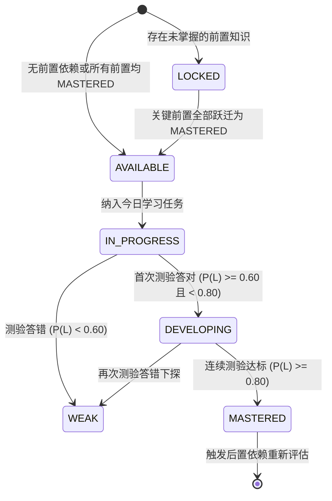

# 学海智导（Xuehai Zhidao）V2 状态机与算法契约规范

本文档定义知识掌握状态机、BKT 动力学方程与 DAG 动态依赖重规划算法规范。

---

## 一、三态知识掌握模型 (3-State Mastery Machine)

知识掌握度 $P(L) \in [0.0001, 0.9999]$ 映射到以下三个互斥状态：

| 状态标识 | 英文名 | 范围区间 | 视觉色彩 | 业务含义 | DAG/路径行为 |
| :--- | :--- | :--- | :--- | :--- | :--- |
| **薄弱待学** | `WEAK` | $P(L) < 0.60$ | 红色 (`#EF4444`) | 尚未掌握，存在概念漏洞 | 优先排入今日任务与学习路径待学队列；后置节点保持 `LOCKED` |
| **巩固提升** | `DEVELOPING` | $0.60 \le P(L) < 0.80$ | 琥珀黄 (`#F59E0B`) | 答对初步起效，认知尚不稳定 | 更新进度条与卡片掌握度数值；**保留在待学队列**；**后置依赖严禁解锁** |
| **达标掌握** | `MASTERED` | $P(L) \ge 0.80$ | 翠绿 (`#10B981`) | 经过多轮测验验证，认知稳定达标 | **移出待学队列**，标记完成；触发 DAG 前置依赖校验，解锁后置节点 |

---

## 二、BKT 动力学计算方程

### 1. 模型全局超参数
- **先验掌握概率 $P(L_0)$**: 初始化自学生画像薄弱数据（例如 S001 K08 为 0.42）。若无历史数据，默认 $0.20$。
- **知识转移率 $T$ (Transition)**: $0.15$
- **猜测率 $G$ (Guess)**: $0.25$
- **失误率 $S$ (Slip)**: $0.10$

### 2. 观测后验更新公式
- 当学生作答**正确** ($O_t = 1$):
  $$P(L_t | O_t = 1) = \frac{P(L_{t-1}) \cdot (1 - S)}{P(L_{t-1}) \cdot (1 - S) + (1 - P(L_{t-1})) \cdot G}$$
- 当学生作答**错误** ($O_t = 0$):
  $$P(L_t | O_t = 0) = \frac{P(L_{t-1}) \cdot S}{P(L_{t-1}) \cdot S + (1 - P(L_{t-1})) \cdot (1 - G)}$$

### 3. 学习发生状态转移更新
在观测更新后，考虑学生在该题目解析与做题过程中发生学习的概率转移：
$$P(L_t) = P(L_t | O_t) + (1 - P(L_t | O_t)) \cdot T$$

### 4. 边界防御与精度限制
- 数值截断区间：$[0.0001, 0.9999]$，防止数值溢出或对数异常。
- 最终输出统一四舍五入保留 4 位小数。

---

## 三、标准 Golden 计算推导链条 (S001 / K08 需求价格弹性)

### 阶段 1: 初始态
- 初始掌握度：$P(L_0) = 0.42$
- 初始状态：`WEAK`
- DAG 依赖状态：前置 K04/K07 已达标，K08 可学；后置 K09（依赖 K08）为 `LOCKED`。

### 阶段 2: 首次答题正确 ($O_1 = 1$)
1. 似然更新：
   $$P(L_1 | O_1 = 1) = \frac{0.42 \times (1 - 0.10)}{0.42 \times (1 - 0.10) + (1 - 0.42) \times 0.25} = \frac{0.378}{0.378 + 0.145} = \frac{0.378}{0.523} \approx 0.722753$$
2. 转移更新：
   $$P(L_1) = 0.722753 + (1 - 0.722753) \times 0.15 = 0.722753 + 0.041587 = 0.76434 \approx 0.7643$$
3. 状态判定：
   $$0.60 \le 0.7643 < 0.80 \implies \text{DEVELOPING}$$
4. 业务动作：
   - 掌握度提升，UI 进度条从 42% 动画升至 76.4%；
   - 状态为 `DEVELOPING`，未达 0.80 达标阈值；
   - **K08 依然留在待学路径中，后置 K09 维持 `LOCKED`**。

### 阶段 3: 再次答题正确 ($O_2 = 1$)
1. 似然更新（以 $P(L_1) = 0.76434$ 为先验）：
   $$P(L_2 | O_2 = 1) = \frac{0.76434 \times 0.90}{0.76434 \times 0.90 + (1 - 0.76434) \times 0.25} = \frac{0.687906}{0.687906 + 0.058915} = \frac{0.687906}{0.746821} \approx 0.921112$$
2. 转移更新：
   $$P(L_2) = 0.921112 + (1 - 0.921112) \times 0.15 = 0.921112 + 0.011833 = 0.932945 \approx 0.9329$$
3. 状态判定：
   $$0.9329 \ge 0.80 \implies \text{MASTERED}$$
4. 业务动作：
   - 状态正式跃迁为 `MASTERED`（翡翠绿）；
   - **K08 移出薄弱待学队列，标记已掌握**；
   - 触发重规划，检查 K09 前置：K08 已满足，K09 状态由 `LOCKED` 变为 `AVAILABLE`。

---

## 四、DAG 节点生命周期与动态重规划规则

每个知识节点在学生当前视角的生命周期状态如下：

---

## 五、确定性算法主权边界

1. **绝对禁止 LLM 裁决的内容**：
   - 是否判题正确；
   - BKT 状态与潜变量数值；
   - 节点是否解锁；
   - 学习路径顺序；
   - 学生风险等级评级。
2. **LLM 的合法边界**：
   - 错题解析生成；
   - 认知启发式伴学答疑；
   - 教师端诊断分析报告的文本润色与人文关怀建议。
