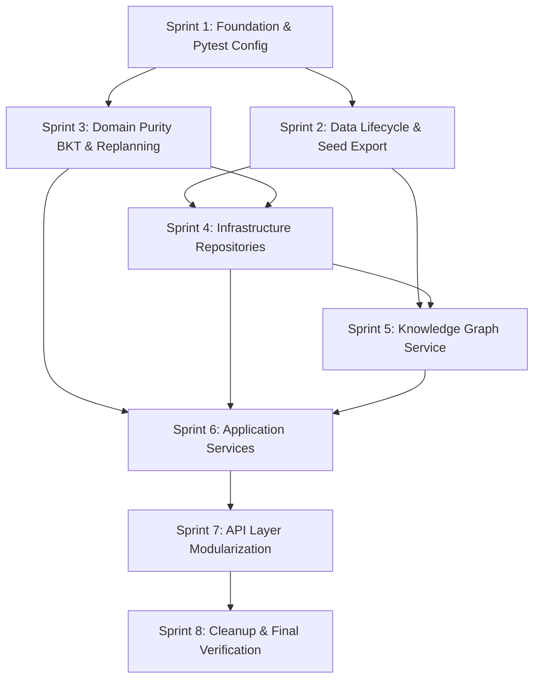

# Phase 2.1 Architecture Migration Implementation Plan

> **For agentic workers:** REQUIRED SUB-SKILL: Use superpowers:subagent-driven-development (recommended) or superpowers:executing-plans to implement this plan task-by-task. Steps use checkbox (`- [ ]`) syntax for tracking.

**Goal:** Transform 学海智导（Xuehai Zhidao）V2 from a flat root script-based prototype into a clean, testable, maintainable Pragmatic Layered Modular Monolith under the `app/` top-level namespace, while strictly maintaining 100% backwards compatibility with frontend API contracts and passing all 135 regression tests.

**Architecture:** Pragmatic Layered Modular Monolith adhering to strict unidirectional dependencies: `API Routers` $\to$ `Application Services` $\to$ `Domain Core`, with `Application Services` orchestrating `Infrastructure Repositories`. Domain logic is 100% pure (zero IO, zero repository, zero framework). Knowledge graph data is decoupled from runtime Excel and served via lightweight immutable JSON seeds (<1ms).

**Tech Stack:** Python 3.13.14, FastAPI 0.136.3, Pydantic 2.12.3, Uvicorn 0.38.0, Requests 2.32.5, OpenPyXL 3.1.5 (offline pipeline only), Pytest 8.4.2, React 19 / TypeScript SPA frontend.

---

## Global Constraints

1. **Architecture Style**: Pragmatic Layered Modular Monolith. Strictly NO microservices, MQ (Kafka/RabbitMQ/RocketMQ), Redis, Celery, Docker/K8s, or heavy SQL/NoSQL databases.
2. **Domain Purity**: `app/domain/` code must NEVER import `app/infrastructure`, `fastapi`, `requests`, or invoke `open()` / file IO. Domain functions must remain pure deterministic models.
3. **Router Purity**: `app/api/routers/` code must NEVER perform direct file IO (`open()`), cross-file business aggregations, BKT math, or graph traversals. Routers are thin adapters delegating directly to Application Services.
4. **Encapsulation Enforcement**: Zero external modules may access `_raw_knowledge_points` or any leading-underscore private state. All knowledge graph queries must pass through public methods on `KnowledgeGraphService`.
5. **Runtime Excel Ban**: `openpyxl` must NEVER be imported in `app/`. The online API service must only read immutable JSON seeds (`data/seeds/knowledge_graph.json`). `openpyxl` is restricted to `scripts/data_pipeline/`.
6. **Data Lifecycle Segregation**: 
   - `data/raw/` (Git tracked): Original Excel demo inputs.
   - `data/seeds/` (Git tracked): Read-only seed data (`quiz_bank.json`, `knowledge_graph.json`, `student_profiles.json`, `learning_paths.json`, `student_reports.json`).
   - `data/runtime/` (Git ignored): Authoritative event stream (`learning_events.jsonl`) and dynamic state snapshots (`bkt_states.json`, `learning_path_states.json`, `bkt_processed_events.json`).
7. **API Contract Compatibility**: All 18 HTTP endpoints currently exposed by `04_api.py` must retain identical HTTP methods, URLs, field names (snake_case/camelCase), and response structures to ensure `frontend/src/api.ts` works without a single line changed.
8. **Test Regression Safety**: Every single task must be verified with automated tests. The baseline of 98 backend tests + 37 frontend tests (135 total) and frontend build must never break.
9. **Eliminate Dynamic Importlib**: Completely eradicate `importlib.import_module("04_api")` from test files by migrating to standard package imports (`from app.main import app`).

---

## Approved Decisions

- **Decision 1 (Replanning Service Naming)**: Application Service is named `app/services/path_replanning_service.py` (strictly NOT `path_replanning_orchestrator.py`).
- **Decision 2 (Student Profiles Seed Naming)**: Student profiles seed file is named `data/seeds/student_profiles.json` (strictly NOT `profiles.json`).
- **Decision 3 (Quiz Bank Scope)**: Micro-quiz bank maintains exactly 8 knowledge points and 13 questions during Phase 2.1. Strictly DO NOT invent or mock questions for the remaining 22 knowledge points.
- **Decision 4 (Graph Decoupling Sequence)**: Implement `scripts/data_pipeline/export_graph_seed.py` and generate `data/seeds/knowledge_graph.json` FIRST before touching `knowledge_graph_service.py`.
- **Decision 5 (Pytest Search Scope)**: Immediately introduce `pyproject.toml` with `testpaths = ["tests"]` to prevent pytest from discovering tests in external reference directory `OpenTutor-main/tests/`.

---

## Verified Baseline

- **Python Version**: `3.13.14`
- **Git Branch**: `master`
- **Git Status**: Clean working tree
- **Backend Tests**: `98 passed in 2.87s` (`pytest tests/ -v`)
- **Frontend Tests**: `37 passed in 277ms` (`node --experimental-strip-types --test test/router.test.ts test/mobile_nav.test.ts test/quiz_session.test.ts`)
- **Frontend Build**: `tsc -b && vite build` $\to$ PASS in 584ms (2556 modules transformed)
- **Formatting**: `git diff --check` $\to$ 0 warnings

---

## Target Architecture

```
                       [Frontend: React 19 SPA]
                                  │
                                  ▼ HTTP /api
                    [Presentation: app/main.py]
                                  │
                                  ▼
                    [Routers: app/api/routers/]
                    (system, students, path, graph,
                     assistant, events, quiz, state)
                                  │
                                  ▼ (Must Delegate)
                [Application: app/services/]
                (StudentService, PathService, QuizService,
                 PathReplanningService, AssistantService,
                 BKTEventProcessor, KnowledgeGraphService)
                      │                       │
         ┌────────────┴────────────┐          └─────────────┐
         ▼                         ▼                        ▼
[Domain: app/domain/]     [Infra: app/infrastructure/]  [Core: app/core/]
  - bkt/service.py           - persistence/                - config.py
  - path_replanning/core.py    (EventRepo, BKTRepo,        - constants.py
  - path_replanning/models.py   PathRepo, ProfileRepo)
  (100% Pure, Zero IO)       - external/llm_client.py
```

### Layer Rules
1. **API Router $\to$ Application Service**: Routers parse HTTP requests, validate via Pydantic schemas, and delegate directly to Application Services. Routers never read files or compute business states.
2. **Application Service $\to$ Domain Core**: Services retrieve persisted states via Repositories, pass plain data objects into pure Domain functions, and receive pure results.
3. **Application Service $\to$ Repository**: Services coordinate persistence, atomic writes, and transactions through Repositories.
4. **Domain Core Isolation**: Zero dependencies on outer layers. Zero IO. Zero framework imports.

---

## Target Directory Structure

```
xuehai-zhidao-poc/
├── .env.example
├── .gitignore
├── pyproject.toml
├── requirements.txt
├── README.md
│
├── app/
│   ├── __init__.py
│   ├── main.py
│   │
│   ├── core/
│   │   ├── __init__.py
│   │   ├── config.py
│   │   └── constants.py
│   │
│   ├── domain/
│   │   ├── __init__.py
│   │   ├── bkt/
│   │   │   ├── __init__.py
│   │   │   ├── models.py
│   │   │   └── service.py
│   │   └── path_replanning/
│   │       ├── __init__.py
│   │       ├── models.py
│   │       └── core.py
│   │
│   ├── services/
│   │   ├── __init__.py
│   │   ├── student_service.py
│   │   ├── path_service.py
│   │   ├── quiz_service.py
│   │   ├── path_replanning_service.py
│   │   ├── bkt_event_processor.py
│   │   ├── knowledge_graph_service.py
│   │   └── assistant_service.py
│   │
│   ├── infrastructure/
│   │   ├── __init__.py
│   │   ├── persistence/
│   │   │   ├── __init__.py
│   │   │   ├── event_repository.py
│   │   │   ├── bkt_state_repository.py
│   │   │   ├── path_state_repository.py
│   │   │   ├── profile_repository.py
│   │   │   └── quiz_bank_repository.py
│   │   └── external/
│   │       ├── __init__.py
│   │       └── llm_client.py
│   │
│   └── api/
│       ├── __init__.py
│       ├── routers/
│       │   ├── __init__.py
│       │   ├── system.py
│       │   ├── students.py
│       │   ├── path.py
│       │   ├── knowledge_graph.py
│       │   ├── assistant.py
│       │   ├── events.py
│       │   ├── quiz.py
│       │   └── learning_state.py
│       └── schemas/
│           ├── __init__.py
│           ├── common.py
│           ├── student.py
│           ├── path.py
│           ├── knowledge_graph.py
│           ├── assistant.py
│           ├── event.py
│           ├── quiz.py
│           └── learning_state.py
│
├── data/
│   ├── raw/
│   │   └── economics_learning_demo.xlsx
│   ├── seeds/
│   │   ├── student_profiles.json
│   │   ├── learning_paths.json
│   │   ├── student_reports.json
│   │   ├── quiz_bank.json
│   │   └── knowledge_graph.json
│   └── runtime/
│       ├── learning_events.jsonl
│       ├── bkt_states.json
│       ├── bkt_processed_events.json
│       └── learning_path_states.json
│
├── scripts/
│   ├── data_pipeline/
│   │   ├── prepare_data.py
│   │   ├── recommend_path.py
│   │   ├── generate_report.py
│   │   └── export_graph_seed.py
│   └── verify/
│       ├── verify_assistant_v2.py
│       └── verify_knowledge_graph.py
│
├── tests/
│   ├── __init__.py
│   ├── conftest.py
│   ├── unit/
│   ├── component/
│   ├── golden/
│   └── api/
│
├── docs/
└── frontend/
```

---

## Migration Dependency Graph



---

## Sprint Overview

| Sprint | Name | Primary Deliverables | Verification Gate |
| :--- | :--- | :--- | :--- |
| **Sprint 1** | Foundation | `pyproject.toml`, `.gitignore`, `app/` skeleton, `app/core/config.py` | Pytest collects exactly 98 tests without path arguments |
| **Sprint 2** | Data Lifecycle | `data/raw/`, `data/seeds/`, `data/runtime/`, `export_graph_seed.py` | `knowledge_graph.json` validated (30 nodes, 42 edges, 60 records) |
| **Sprint 3** | Domain Purity | `app/domain/bkt/`, `app/domain/path_replanning/` | 100% pure math & decision core tests PASS, 0 IO imports |
| **Sprint 4** | Infrastructure | `app/infrastructure/persistence/` repos, `llm_client.py` | Component tests pass, atomic file writes & RLock safe |
| **Sprint 5** | Graph Service | `app/services/knowledge_graph_service.py` (JSON seed reader) | Zero `openpyxl` in `app/`, zero `_raw_knowledge_points` outside |
| **Sprint 6** | Application Services | `quiz_service`, `path_replanning_service`, `student_service`, etc. | Business workflows pass, dashboard aggregation moved to service |
| **Sprint 7** | API Modularization | `app/main.py`, 8 Routers, Schemas | All 18 endpoints respond with 100% schema compatibility |
| **Sprint 8** | Final Verification | Test isolation (`conftest.py`), scripts moved, dead code removed | 135 tests pass, frontend build pass, git diff clean |

---

## Detailed Tasks

### Sprint 1: Foundation (配置底座与包骨架)

#### Task 1.1: Pyproject Configuration & Pytest Isolation
**Files:**
- Create: `pyproject.toml`
- Modify: `.gitignore`

**Dependencies:** None.

**Interfaces:**
- Produces: Standardized packaging metadata and locked pytest configuration (`testpaths = ["tests"]`).

- [ ] **Step 1: Create `pyproject.toml`**
Write `pyproject.toml` at repository root:
```toml
[project]
name = "xuehai-zhidao"
version = "0.2.0"
description = "学海智导——AI驱动的大学生个性化学习指导平台 V2"
readme = "README.md"
requires-python = ">=3.10"
dependencies = [
    "fastapi>=0.115.0",
    "uvicorn>=0.30.0",
    "pydantic>=2.0.0",
    "python-dotenv>=1.0.0",
    "requests>=2.31.0",
]

[project.optional-dependencies]
pipeline = [
    "openpyxl>=3.1.0",
]
dev = [
    "pytest>=8.0.0",
    "httpx>=0.27.0",
]

[tool.pytest.ini_options]
testpaths = ["tests"]
python_files = ["test_*.py"]
python_classes = ["Test*"]
python_functions = ["test_*"]
addopts = "-v"
```

- [ ] **Step 2: Update `.gitignore`**
Append runtime data patterns to `.gitignore`:
```gitignore
# Runtime dynamic storage
data/runtime/
data/learning_path_states.json
data/bkt_states.json
data/bkt_processed_events.json
data/learning_events.jsonl

# Testing & caches
.coverage
htmlcov/
```

- [ ] **Step 3: Run bare pytest collection to verify isolation**
Run: `pytest --collect-only -q`
Expected output: Exactly `98 tests collected` (verify that `OpenTutor-main/tests` is NOT scanned).

- [ ] **Step 4: Commit Task 1.1**
```bash
git add pyproject.toml .gitignore
git commit -m "chore(foundation): configure pyproject.toml and pin pytest search path"
```

---

#### Task 1.2: Application Package Skeleton Scaffolding
**Files:**
- Create:
  - `app/__init__.py`
  - `app/core/__init__.py`
  - `app/domain/__init__.py`
  - `app/domain/bkt/__init__.py`
  - `app/domain/path_replanning/__init__.py`
  - `app/services/__init__.py`
  - `app/infrastructure/__init__.py`
  - `app/infrastructure/persistence/__init__.py`
  - `app/infrastructure/external/__init__.py`
  - `app/api/__init__.py`
  - `app/api/routers/__init__.py`
  - `app/api/schemas/__init__.py`

**Dependencies:** Task 1.1.

**Interfaces:**
- Produces: Importable `app.*` Python package hierarchy.

- [ ] **Step 1: Create all package `__init__.py` files**
Create empty `__init__.py` files with docstrings in each of the specified directories.

- [ ] **Step 2: Verify package importability**
Run: `python -c "import app, app.core, app.domain, app.domain.bkt, app.domain.path_replanning, app.services, app.infrastructure, app.infrastructure.persistence, app.infrastructure.external, app.api, app.api.routers, app.api.schemas; print('Skeleton OK')"`
Expected output: `Skeleton OK`

- [ ] **Step 3: Commit Task 1.2**
```bash
git add app/
git commit -m "chore(foundation): initialize app modular package skeleton"
```

---

#### Task 1.3: Central Configuration & Constants
**Files:**
- Create: `app/core/config.py`
- Create: `app/core/constants.py`
- Create: `tests/unit/test_config.py`

**Dependencies:** Task 1.2.

**Interfaces:**
- Produces: `app.core.config.settings` (Path registry for RAW, SEEDS, RUNTIME, and LLM configuration).
- Produces: `app.core.constants` (BKT parameters, Mastery levels, Path states).

- [ ] **Step 1: Write unit test `tests/unit/test_config.py`**
```python
import unittest
from pathlib import Path
from app.core.config import settings
from app.core.constants import DEFAULT_BKT_PARAMS, PathState

class TestCoreConfig(unittest.TestCase):
    def test_settings_paths_resolve_to_project_root(self):
        self.assertTrue(settings.PROJECT_ROOT.exists())
        self.assertEqual(settings.DATA_DIR, settings.PROJECT_ROOT / "data")
        self.assertEqual(settings.SEEDS_DIR, settings.DATA_DIR / "seeds")
        self.assertEqual(settings.RUNTIME_DIR, settings.DATA_DIR / "runtime")
        self.assertEqual(settings.RAW_DIR, settings.DATA_DIR / "raw")

    def test_bkt_constants_frozen(self):
        self.assertEqual(DEFAULT_BKT_PARAMS.p_init, 0.20)
        self.assertEqual(DEFAULT_BKT_PARAMS.p_transit, 0.10)
        self.assertEqual(DEFAULT_BKT_PARAMS.p_guess, 0.20)
        self.assertEqual(DEFAULT_BKT_PARAMS.p_slip, 0.10)
```

- [ ] **Step 2: Run test to verify RED**
Run: `pytest tests/unit/test_config.py -v`
Expected output: FAIL (`ModuleNotFoundError: No module named 'app.core.config'`)

- [ ] **Step 3: Implement `app/core/constants.py`**
```python
# -*- coding: utf-8 -*-
from enum import Enum
from pydantic import BaseModel

class PathState(str, Enum):
    LOCKED = "LOCKED"
    AVAILABLE = "AVAILABLE"
    IN_PROGRESS = "IN_PROGRESS"
    COMPLETED = "COMPLETED"

class MasteryLevel(str, Enum):
    WEAK = "薄弱"
    DEVELOPING = "发展中"
    MASTERED = "已掌握"

class BKTParameters(BaseModel):
    p_init: float = 0.20
    p_transit: float = 0.10
    p_guess: float = 0.20
    p_slip: float = 0.10

DEFAULT_BKT_PARAMS = BKTParameters()
MASTERY_THRESHOLD_HIGH = 0.80
MASTERY_THRESHOLD_LOW = 0.60
DEMOTION_THRESHOLD = 0.70
```

- [ ] **Step 4: Implement `app/core/config.py`**
```python
# -*- coding: utf-8 -*-
from pathlib import Path
import os

class Settings:
    PROJECT_ROOT: Path = Path(__file__).resolve().parent.parent.parent
    DATA_DIR: Path = PROJECT_ROOT / "data"
    RAW_DIR: Path = DATA_DIR / "raw"
    SEEDS_DIR: Path = DATA_DIR / "seeds"
    RUNTIME_DIR: Path = DATA_DIR / "runtime"

    # Seed files
    STUDENT_PROFILES_FILE: Path = SEEDS_DIR / "student_profiles.json"
    LEARNING_PATHS_FILE: Path = SEEDS_DIR / "learning_paths.json"
    STUDENT_REPORTS_FILE: Path = SEEDS_DIR / "student_reports.json"
    QUIZ_BANK_FILE: Path = SEEDS_DIR / "quiz_bank.json"
    KNOWLEDGE_GRAPH_FILE: Path = SEEDS_DIR / "knowledge_graph.json"

    # Runtime files
    LEARNING_EVENTS_FILE: Path = RUNTIME_DIR / "learning_events.jsonl"
    BKT_STATES_FILE: Path = RUNTIME_DIR / "bkt_states.json"
    BKT_PROCESSED_EVENTS_FILE: Path = RUNTIME_DIR / "bkt_processed_events.json"
    LEARNING_PATH_STATES_FILE: Path = RUNTIME_DIR / "learning_path_states.json"

    # Raw files
    EXCEL_RAW_FILE: Path = RAW_DIR / "economics_learning_demo.xlsx"

    # Legacy output files fallback (for backward compatibility during migration)
    LEGACY_OUTPUT_DIR: Path = PROJECT_ROOT / "output"

settings = Settings()
```

- [ ] **Step 5: Run test to verify GREEN**
Run: `pytest tests/unit/test_config.py -v`
Expected output: `2 passed in 0.05s`

- [ ] **Step 6: Commit Task 1.3**
```bash
git add app/core/ tests/unit/test_config.py
git commit -m "feat(core): implement central config and business constants"
```

---

### Sprint 2: Data Lifecycle (数据分层与图谱离线导出)

#### Task 2.1: Data Directory Hierarchy Setup & Seed Migration
**Files:**
- Create directory: `data/raw/`
- Create directory: `data/seeds/`
- Create directory: `data/runtime/`
- Move: `economics_learning_demo.xlsx -> data/raw/economics_learning_demo.xlsx`
- Copy/Seed: `output/student_profiles.json -> data/seeds/student_profiles.json`
- Copy/Seed: `output/learning_paths.json -> data/seeds/learning_paths.json`
- Copy/Seed: `output/student_reports.json -> data/seeds/student_reports.json`
- Copy/Seed: `data/quiz_bank.json -> data/seeds/quiz_bank.json`

**Dependencies:** Task 1.3.

**Interfaces:**
- Produces: `data/raw/` containing Excel; `data/seeds/` containing verified JSON seeds.

- [ ] **Step 1: Create directories and copy seed files**
Create `data/raw/`, `data/seeds/`, `data/runtime/`.
Move `economics_learning_demo.xlsx` into `data/raw/`. (Keep a symlink or fallback in root if needed during transition, or verify script paths).
Copy `output/student_profiles.json`, `output/learning_paths.json`, `output/student_reports.json` into `data/seeds/`.
Copy `data/quiz_bank.json` into `data/seeds/quiz_bank.json`.

- [ ] **Step 2: Verify file sizes and contents match**
Run: `python -c "import json; assert len(json.load(open('data/seeds/quiz_bank.json', encoding='utf-8'))) == 13; assert len(json.load(open('data/seeds/student_profiles.json', encoding='utf-8'))) == 5; print('Seeds verified')"`
Expected output: `Seeds verified`

- [ ] **Step 3: Commit Task 2.1**
```bash
git add data/raw/ data/seeds/
git commit -m "chore(data): establish data raw/seeds hierarchy and migrate seed files"
```

---

#### Task 2.2: Graph Seed Export Pipeline Script
**Files:**
- Create: `scripts/data_pipeline/export_graph_seed.py`
- Create: `tests/unit/test_export_graph_seed.py`
- Produces: `data/seeds/knowledge_graph.json`

**Dependencies:** Task 2.1.

**Interfaces:**
- Consumes: `data/raw/economics_learning_demo.xlsx`.
- Produces: `data/seeds/knowledge_graph.json` with schema:
  `{"knowledge_points": {kid: {...}}, "edges": [{"id": ..., "source": ..., "target": ..., "type": "prerequisite"}], "student_records": {sid: {kid: {...}}}}`

- [ ] **Step 1: Write test `tests/unit/test_export_graph_seed.py`**
```python
import unittest
import json
from pathlib import Path
from app.core.config import settings

class TestGraphSeedExport(unittest.TestCase):
    def test_exported_graph_seed_structure(self):
        seed_path = settings.KNOWLEDGE_GRAPH_FILE
        self.assertTrue(seed_path.exists(), f"Missing {seed_path}")
        data = json.loads(seed_path.read_text(encoding="utf-8"))
        
        self.assertIn("knowledge_points", data)
        self.assertIn("edges", data)
        self.assertIn("student_records", data)
        
        # Verify 30 knowledge points
        self.assertEqual(len(data["knowledge_points"]), 30)
        self.assertIn("K01", data["knowledge_points"])
        self.assertIn("K30", data["knowledge_points"])
        
        # Verify 42 prerequisite edges
        self.assertEqual(len(data["edges"]), 42)
        
        # Verify student records for S001-S005 (60 records total)
        self.assertEqual(set(data["student_records"].keys()), {"S001", "S002", "S003", "S004", "S005"})
        total_records = sum(len(recs) for recs in data["student_records"].values())
        self.assertEqual(total_records, 60)
```

- [ ] **Step 2: Implement `scripts/data_pipeline/export_graph_seed.py`**
```python
# -*- coding: utf-8 -*-
"""
scripts/data_pipeline/export_graph_seed.py
Extracts knowledge points, prerequisite edges, and student historical records
from data/raw/economics_learning_demo.xlsx and generates data/seeds/knowledge_graph.json.
"""
from pathlib import Path
import json
import openpyxl

PROJECT_ROOT = Path(__file__).resolve().parent.parent.parent
EXCEL_PATH = PROJECT_ROOT / "data" / "raw" / "economics_learning_demo.xlsx"
OUTPUT_PATH = PROJECT_ROOT / "data" / "seeds" / "knowledge_graph.json"

def split_ids(val):
    if val is None:
        return []
    s = str(val).strip()
    if not s or s.upper() in ("NULL", "NONE"):
        return []
    return [x.strip() for x in s.split(",") if x.strip()]

def export_knowledge_graph():
    if not EXCEL_PATH.exists():
        raise FileNotFoundError(f"Excel file not found at {EXCEL_PATH}")

    wb = openpyxl.load_workbook(EXCEL_PATH, data_only=True)
    kps = {}
    edges = []
    records = {}

    # 1. Parse knowledge_points
    ws_kp = wb["knowledge_points"]
    for row in ws_kp.iter_rows(min_row=2, values_only=True):
        if not row[0]:
            continue
        k_id = str(row[0]).strip()
        k_name = str(row[1]).strip() if row[1] else ""
        chapter = str(row[2]).strip() if row[2] else ""
        description = str(row[3]).strip() if row[3] else ""
        difficulty = int(row[4]) if row[4] is not None else 1
        prereqs = split_ids(row[5])
        nexts = split_ids(row[6])

        kps[k_id] = {
            "knowledge_id": k_id,
            "knowledge_name": k_name,
            "chapter": chapter,
            "description": description,
            "difficulty": difficulty,
            "prerequisite": prereqs,
            "next_knowledge": nexts,
        }

        for p_id in prereqs:
            edges.append({
                "id": f"e-{p_id}-{k_id}",
                "source": p_id,
                "target": k_id,
                "type": "prerequisite",
            })

    # 2. Parse learning_records
    ws_rec = wb["learning_records"]
    for row in ws_rec.iter_rows(min_row=2, values_only=True):
        if not row[0] or not row[1] or not row[2]:
            continue
        sid = str(row[1]).strip()
        kid = str(row[2]).strip()
        acc = float(row[3]) if row[3] is not None else None
        avg_sec = float(row[4]) if row[4] is not None else None
        practice_cnt = int(row[5]) if row[5] is not None else None
        mistake_cnt = int(row[6]) if row[6] is not None else None
        duration_min = float(row[7]) if row[7] is not None else None
        score = float(row[10]) if len(row) > 10 and row[10] is not None else None

        if sid not in records:
            records[sid] = {}

        records[sid][kid] = {
            "accuracy": acc,
            "average_time_seconds": avg_sec,
            "practice_count": practice_cnt,
            "mistake_count": mistake_cnt,
            "duration_minutes": duration_min,
            "assessment_score": score,
        }

    output_data = {
        "metadata": {
            "version": "1.0",
            "source": "data/raw/economics_learning_demo.xlsx",
            "node_count": len(kps),
            "edge_count": len(edges),
        },
        "knowledge_points": kps,
        "edges": edges,
        "student_records": records,
    }

    OUTPUT_PATH.parent.mkdir(parents=True, exist_ok=True)
    with open(OUTPUT_PATH, "w", encoding="utf-8") as f:
        json.dump(output_data, f, ensure_ascii=False, indent=2)

    print(f"Exported {len(kps)} KPs, {len(edges)} edges, {sum(len(v) for v in records.values())} records to {OUTPUT_PATH}")

if __name__ == "__main__":
    export_knowledge_graph()
```

- [ ] **Step 3: Run export script to generate `knowledge_graph.json`**
Run: `python scripts/data_pipeline/export_graph_seed.py`
Expected output: `Exported 30 KPs, 42 edges, 60 records to .../data/seeds/knowledge_graph.json`

- [ ] **Step 4: Run test to verify GREEN**
Run: `pytest tests/unit/test_export_graph_seed.py -v`
Expected output: `1 passed in 0.04s`

- [ ] **Step 5: Commit Task 2.2**
```bash
git add scripts/data_pipeline/export_graph_seed.py data/seeds/knowledge_graph.json tests/unit/test_export_graph_seed.py
git commit -m "feat(pipeline): export offline knowledge graph seed from excel"
```

---

### Sprint 3: Domain Purity (领域核心层纯净化迁移)

#### Task 3.1: Pure BKT Mathematical Domain Migration
**Files:**
- Create: `app/domain/bkt/models.py`
- Create: `app/domain/bkt/service.py`
- Modify: `bkt_service.py` (becomes backward-compatible facade re-exporting domain functions)
- Test: `tests/test_bkt_service.py` (verifies existing test suite passes unchanged)

**Dependencies:** Task 1.3.

**Interfaces:**
- Produces: `calculate_bkt_update(...)`, `apply_attempt(...)`, `create_initial_state(...)`, `BKTState`, `BKTUpdateResult`.
- Guarantees: ZERO IO, ZERO framework dependencies. Pure math only.

- [ ] **Step 1: Implement `app/domain/bkt/models.py`**
Extract `BKTState` and `BKTUpdateResult` from `bkt_service.py`. Keep exact field names and validators.

- [ ] **Step 2: Implement `app/domain/bkt/service.py`**
Extract `calculate_bkt_update`, `apply_attempt`, `create_initial_state` from `bkt_service.py`. Ensure exact mathematical formulas:
$$P(L_{t-1} \mid \text{Obs}) = \begin{cases} \frac{P(L_{t-1})(1 - P(S))}{P(L_{t-1})(1 - P(S)) + (1 - P(L_{t-1}))P(G)}, & \text{if correct} \\ \frac{P(L_{t-1})P(S)}{P(L_{t-1})P(S) + (1 - P(L_{t-1}))(1 - P(G))}, & \text{if incorrect} \end{cases}$$
$$P(L_t) = P(L_{t-1} \mid \text{Obs}) + (1 - P(L_{t-1} \mid \text{Obs})) P(T)$$

- [ ] **Step 3: Refactor `bkt_service.py` to facade**
In `bkt_service.py`, import and re-export everything from `app.domain.bkt.models` and `app.domain.bkt.service` so existing callers don't break:
```python
# -*- coding: utf-8 -*-
"""Backward-compatible facade forwarding to app.domain.bkt"""
from app.domain.bkt.models import BKTState, BKTUpdateResult
from app.domain.bkt.service import (
    calculate_bkt_update,
    apply_attempt,
    create_initial_state,
)
```

- [ ] **Step 4: Run existing BKT tests to verify GREEN**
Run: `pytest tests/test_bkt_service.py -v`
Expected output: `10 passed in 0.05s`

- [ ] **Step 5: Verify Domain Purity (Zero IO check)**
Run: `python -c "import app.domain.bkt.service as s; assert not hasattr(s, 'open'); print('BKT Domain is 100% pure')"`
Expected output: `BKT Domain is 100% pure`

- [ ] **Step 6: Commit Task 3.1**
```bash
git add app/domain/bkt/ bkt_service.py
git commit -m "feat(domain): migrate pure BKT mathematical model to app/domain/bkt"
```

---

#### Task 3.2: Path Replanning Decision Core & Serialization
**Files:**
- Create: `app/domain/path_replanning/models.py`
- Create: `app/domain/path_replanning/core.py`
- Test: `tests/test_path_replanning_core.py`

**Dependencies:** Task 1.3, Task 3.1.

**Interfaces:**
- Produces: `PathAction`, `ReplanningReasonCode`, `LEGAL_DECISION_PAIRS`, `validate_decision_pair()`, `format_canonical_mastery()`, `CanonicalBusinessPayload`, `AuditMetadata`, `DecisionAuditEnvelope`.
- Produces: `evaluate_decision_core(...)` pure logic taking `(before_mastery, after_mastery, consecutive_incorrect, previously_mastered, has_unlocked_successor, has_blocked_prereq, is_task_context)` and returning `(action, reason_code, next_path_state)`.
- Guarantees: ZERO IO, ZERO Repository calls.

- [ ] **Step 1: Implement `app/domain/path_replanning/models.py`**
Extract `PathAction`, `ReplanningReasonCode`, `LEGAL_DECISION_PAIRS`, `validate_decision_pair`, `format_canonical_mastery`, `CanonicalBusinessPayload`, `AuditMetadata`, `DecisionAuditEnvelope` from `path_replanning_service.py`.

- [ ] **Step 2: Implement `app/domain/path_replanning/core.py`**
Extract pure decision rule priorities (Priority 1: Regression Demotion, Priority 2: Mastery Transition, Priority 3: Unchanged) as a pure function:
```python
def evaluate_decision_core(
    before_mastery: float,
    after_mastery: float,
    consecutive_incorrect: int = 0,
    previously_mastered: bool = False,
    is_task_context: bool = True,
    current_path_state: PathState = PathState.LOCKED,
    unlocked_successors_count: int = 0,
    has_blocked_prerequisites: bool = False,
) -> Tuple[PathAction, ReplanningReasonCode, PathState]:
    ...
```

- [ ] **Step 3: Update `path_replanning_service.py` to import models from domain**
In `path_replanning_service.py`, replace inline models with `from app.domain.path_replanning.models import ...` and `from app.domain.path_replanning.core import evaluate_decision_core`.

- [ ] **Step 4: Run existing replanning core tests to verify GREEN**
Run: `pytest tests/test_path_replanning_core.py tests/test_path_replanning_dag.py -v`
Expected output: `24 passed in 0.15s`

- [ ] **Step 5: Commit Task 3.2**
```bash
git add app/domain/path_replanning/ path_replanning_service.py
git commit -m "feat(domain): extract path replanning decision core and canonical serializer to domain"
```

---

### Sprint 4: Infrastructure Repositories (基础设施持久化仓储)

#### Task 4.1: Learning Event Repository
**Files:**
- Create: `app/infrastructure/persistence/event_repository.py`
- Modify: `event_service.py` (facade forwarding to repository)
- Test: `tests/test_event_logger.py`

**Dependencies:** Task 1.3.

**Interfaces:**
- Produces: `EventRepository.record_event(event) -> StoredEvent`, `EventRepository.get_events_by_student(student_id) -> List[StoredEvent]`.
- Guarantees: RLock thread-safety, append-only JSONL format, atomic write behavior.

- [ ] **Step 1: Implement `app/infrastructure/persistence/event_repository.py`**
Encapsulate event JSONL append logic using `settings.LEARNING_EVENTS_FILE` as default with optional dependency injection `file_path: Optional[Path] = None`.

- [ ] **Step 2: Update `event_service.py` to delegate to `EventRepository`**
Maintain backward-compatible functions `record_event()` and `get_events_by_student()` in `event_service.py` delegating to `EventRepository`.

- [ ] **Step 3: Run existing event logger tests to verify GREEN**
Run: `pytest tests/test_event_logger.py -v`
Expected output: `8 passed in 0.15s`

- [ ] **Step 4: Commit Task 4.1**
```bash
git add app/infrastructure/persistence/event_repository.py event_service.py
git commit -m "feat(infra): implement EventRepository for learning event stream persistence"
```

---

#### Task 4.2: BKT State Repository
**Files:**
- Create: `app/infrastructure/persistence/bkt_state_repository.py`
- Modify: `bkt_state_service.py` (facade forwarding to repository)
- Test: `tests/test_bkt_state.py`

**Dependencies:** Task 1.3, Task 3.1.

**Interfaces:**
- Produces: `BKTStateRepository.get_state(student_id, knowledge_id, auto_init=True) -> BKTState`, `BKTStateRepository.save_state(state) -> None`, `BKTStateRepository.is_event_processed(event_id) -> bool`, `BKTStateRepository.mark_event_processed(event_id) -> None`.
- Guarantees: Thread-safety with `threading.RLock()`, atomic tmp file replacement via `os.replace()`.

- [ ] **Step 1: Implement `app/infrastructure/persistence/bkt_state_repository.py`**
Encapsulate BKT states and processed events JSON storage with optional file path injection for testing.

- [ ] **Step 2: Update `bkt_state_service.py` to delegate to `BKTStateRepository`**
Maintain all legacy function signatures (`get_state`, `save_state`, `is_event_processed`, etc.) forwarding to the repository.

- [ ] **Step 3: Run existing BKT state tests to verify GREEN**
Run: `pytest tests/test_bkt_state.py -v`
Expected output: `6 passed in 0.08s`

- [ ] **Step 4: Commit Task 4.2**
```bash
git add app/infrastructure/persistence/bkt_state_repository.py bkt_state_service.py
git commit -m "feat(infra): implement BKTStateRepository with atomic writes and lock safety"
```

---

#### Task 4.3: Path State Repository
**Files:**
- Create: `app/infrastructure/persistence/path_state_repository.py`
- Modify: `path_state_service.py` (facade forwarding to repository)
- Test: `tests/test_path_state.py`

**Dependencies:** Task 1.3, Task 3.2.

**Interfaces:**
- Produces: `PathStateRepository.get_path_state(...) -> PathState`, `PathStateRepository.set_path_state(...)`, `PathStateRepository.set_path_states_bulk(...)`, `PathStateRepository.get_all_path_states(...)`, `PathStateRepository.init_student_path(...)`.

- [ ] **Step 1: Implement `app/infrastructure/persistence/path_state_repository.py`**
Encapsulate `data/runtime/learning_path_states.json` with RLock protection and `tempfile.NamedTemporaryFile` + `os.replace` atomic replacement.

- [ ] **Step 2: Update `path_state_service.py` to delegate to `PathStateRepository`**
Forward all functions in `path_state_service.py` to `PathStateRepository`.

- [ ] **Step 3: Run existing path state tests to verify GREEN**
Run: `pytest tests/test_path_state.py -v`
Expected output: `7 passed in 0.06s`

- [ ] **Step 4: Commit Task 4.3**
```bash
git add app/infrastructure/persistence/path_state_repository.py path_state_service.py
git commit -m "feat(infra): implement PathStateRepository with atomic replacement"
```

---

#### Task 4.4: Profile & Quiz Bank Repositories and LLM Client
**Files:**
- Create: `app/infrastructure/persistence/profile_repository.py`
- Create: `app/infrastructure/persistence/quiz_bank_repository.py`
- Create: `app/infrastructure/external/llm_client.py`
- Modify: `llm_service.py` (facade forwarding to LLMClient)

**Dependencies:** Task 1.3, Task 2.1.

**Interfaces:**
- Produces: `ProfileRepository.get_profiles()`, `ProfileRepository.get_student_profile(id)`, `ProfileRepository.get_learning_paths()`, `ProfileRepository.get_student_reports()`.
- Produces: `QuizBankRepository.get_all_questions()`, `QuizBankRepository.get_question_by_id(id)`.
- Produces: `LLMClient.chat_completion(...)`.

- [ ] **Step 1: Implement `ProfileRepository`**
Read static JSON seeds (`settings.STUDENT_PROFILES_FILE`, `settings.LEARNING_PATHS_FILE`, `settings.STUDENT_REPORTS_FILE`). Fall back gracefully to legacy `output/` if file not found in seeds.

- [ ] **Step 2: Implement `QuizBankRepository`**
Read `settings.QUIZ_BANK_FILE`. Cache in memory after first load.

- [ ] **Step 3: Migrate `llm_service.py` to `app/infrastructure/external/llm_client.py`**
Move logic from `llm_service.py` into `LLMClient`. In `llm_service.py`, re-export instance.

- [ ] **Step 4: Verify imports and existing assistant verification**
Run: `python -c "from app.infrastructure.persistence.profile_repository import ProfileRepository; assert ProfileRepository.get_student_profile('S001') is not None; print('ProfileRepo OK')"`
Expected output: `ProfileRepo OK`

- [ ] **Step 5: Commit Task 4.4**
```bash
git add app/infrastructure/persistence/profile_repository.py app/infrastructure/persistence/quiz_bank_repository.py app/infrastructure/external/llm_client.py llm_service.py
git commit -m "feat(infra): implement ProfileRepository, QuizBankRepository and LLMClient"
```

---

### Sprint 5: Knowledge Graph Service (知识图谱服务解耦 Excel)

#### Task 5.1: Graph Service JSON Loading & Public Contract
**Files:**
- Create: `app/services/knowledge_graph_service.py`
- Modify: `knowledge_graph_service.py` (facade re-exporting instance)
- Test: `tests/unit/test_knowledge_graph_service.py`

**Dependencies:** Task 2.2, Task 4.4.

**Interfaces:**
- Produces Public Contract on `KnowledgeGraphService`:
  - `get_knowledge_point(knowledge_id: str) -> Optional[Dict[str, Any]]`
  - `get_prerequisites(knowledge_id: str) -> List[str]`
  - `get_successors(knowledge_id: str) -> List[str]`
  - `is_valid_knowledge_id(knowledge_id: str) -> bool`
  - `get_all_knowledge_point_ids() -> List[str]`
  - `get_student_knowledge_graph(student_id: str) -> Dict[str, Any]`
- Guarantees: ZERO `openpyxl` import. Reads `data/seeds/knowledge_graph.json` (<1ms parse time).

- [ ] **Step 1: Write test `tests/unit/test_knowledge_graph_service.py`**
```python
import unittest
from app.services.knowledge_graph_service import knowledge_graph_service

class TestKnowledgeGraphServiceContract(unittest.TestCase):
    def test_public_query_methods(self):
        self.assertTrue(knowledge_graph_service.is_valid_knowledge_id("K08"))
        self.assertFalse(knowledge_graph_service.is_valid_knowledge_id("INVALID_ID"))
        
        # Verify prerequisites & successors for K08 (需求价格弹性)
        prereqs = knowledge_graph_service.get_prerequisites("K08")
        successors = knowledge_graph_service.get_successors("K08")
        self.assertIn("K04", prereqs)
        self.assertIn("K09", successors)
        self.assertIn("K11", successors)

    def test_student_graph_generation(self):
        graph = knowledge_graph_service.get_student_knowledge_graph("S001")
        self.assertEqual(graph["student_id"], "S001")
        self.assertEqual(graph["stats"]["total_nodes"], 30)
        self.assertEqual(graph["stats"]["total_edges"], 42)
        self.assertTrue(len(graph["nodes"]) == 30)
```

- [ ] **Step 2: Implement `app/services/knowledge_graph_service.py`**
Read `data/seeds/knowledge_graph.json` via standard `json.load`. Implement all public contract methods. Do NOT import `openpyxl`.

- [ ] **Step 3: Update `knowledge_graph_service.py` root file to facade**
```python
# -*- coding: utf-8 -*-
from app.services.knowledge_graph_service import (
    KnowledgeGraphService,
    knowledge_graph_service,
)
```

- [ ] **Step 4: Run test to verify GREEN**
Run: `pytest tests/unit/test_knowledge_graph_service.py -v`
Expected output: `2 passed in 0.05s`

- [ ] **Step 5: Verify zero openpyxl in app/services**
Run: `python -c "import app.services.knowledge_graph_service as s; import sys; assert 'openpyxl' not in sys.modules; print('Zero openpyxl verified')"`
Expected output: `Zero openpyxl verified`

- [ ] **Step 6: Commit Task 5.1**
```bash
git add app/services/knowledge_graph_service.py knowledge_graph_service.py tests/unit/test_knowledge_graph_service.py
git commit -m "feat(services): implement KnowledgeGraphService backed by JSON seed without openpyxl"
```

---

#### Task 5.2: Eliminate External `_raw_knowledge_points` Penetration
**Files:**
- Modify: `quiz_service.py` (replace lines 152, 183)
- Modify: `path_replanning_service.py` (replace lines 217, 223)

**Dependencies:** Task 5.1.

**Interfaces:**
- Replaces direct `knowledge_graph_service._raw_knowledge_points.get(id)` with `knowledge_graph_service.get_knowledge_point(id)` and `knowledge_graph_service.get_prerequisites(id)`.

- [ ] **Step 1: Replace calls in `quiz_service.py`**
In `quiz_service.py:152` and `183`, replace `knowledge_graph_service._raw_knowledge_points` with `knowledge_graph_service.get_knowledge_point(knowledge_id)`.

- [ ] **Step 2: Replace calls in `path_replanning_service.py`**
In `path_replanning_service.py:217` and `223`, replace `knowledge_graph_service._raw_knowledge_points` with `knowledge_graph_service.get_prerequisites(knowledge_id)` and `knowledge_graph_service.get_successors(knowledge_id)`.

- [ ] **Step 3: Run all existing quiz and replanning tests**
Run: `pytest tests/test_quiz_api.py tests/test_path_replanning_dag.py tests/test_path_replanning_golden_e2e.py -v`
Expected output: `20 passed in 0.35s`

- [ ] **Step 4: Verify zero external access of `_raw_knowledge_points`**
Run PowerShell command:
```powershell
$res = Select-String -Path "*.py", "app/**/*.py" -Pattern "_raw_knowledge_points"
$external = $res | Where-Object { $_.Path -notmatch "knowledge_graph_service.py" }
if ($external.Count -gt 0) { throw "Found external leak!" } else { Write-Host "0 external leaks verified" }
```
Expected output: `0 external leaks verified`

- [ ] **Step 5: Commit Task 5.2**
```bash
git add quiz_service.py path_replanning_service.py
git commit -m "refactor(services): eradicate external _raw_knowledge_points access"
```

---

### Sprint 6: Application Services (应用服务用例编排)

#### Task 6.1: Student Service & Dashboard Aggregation
**Files:**
- Create: `app/services/student_service.py`
- Create: `app/services/path_service.py`
- Test: `tests/unit/test_student_service.py`

**Dependencies:** Task 4.4.

**Interfaces:**
- Produces: `StudentService.get_system_overview()`, `StudentService.get_all_students()`, `StudentService.get_student_profile(id)`, `StudentService.get_student_report(id)`, `StudentService.get_all_reports()`, `StudentService.get_student_dashboard(id)`.
- Produces: `PathService.get_student_learning_path(id)`, `PathService.get_all_learning_paths()`.

- [ ] **Step 1: Write test `tests/unit/test_student_service.py`**
Test that `get_student_dashboard("S001")` returns aggregated `profile`, `learning_path`, and `report` with identical dictionary structure as the original `04_api.py:404`.

- [ ] **Step 2: Implement `app/services/student_service.py`**
Encapsulate the dashboard aggregation logic previously living inside `04_api.py:404-448` into `StudentService`. Call `ProfileRepository`.

- [ ] **Step 3: Implement `app/services/path_service.py`**
Encapsulate learning path retrieval calling `ProfileRepository`.

- [ ] **Step 4: Run test to verify GREEN**
Run: `pytest tests/unit/test_student_service.py -v`
Expected output: `PASS`

- [ ] **Step 5: Commit Task 6.1**
```bash
git add app/services/student_service.py app/services/path_service.py tests/unit/test_student_service.py
git commit -m "feat(services): implement StudentService with dashboard aggregation and PathService"
```

---

#### Task 6.2: Quiz & Replanning Application Services
**Files:**
- Create: `app/services/quiz_service.py`
- Create: `app/services/path_replanning_service.py`
- Modify: `quiz_service.py` (facade forwarding to `app/services/quiz_service.py`)
- Modify: `path_replanning_service.py` (facade forwarding to `app/services/path_replanning_service.py`)

**Dependencies:** Task 3.2, Task 4.1, Task 4.2, Task 4.3, Task 5.1.

**Interfaces:**
- Produces: `app.services.quiz_service.submit_quiz_answer(...) -> QuizSubmitResponse`, `app.services.quiz_service.get_questions_by_knowledge_id(...)`.
- Produces: `app.services.path_replanning_service.evaluate_and_replan(...) -> DecisionAuditEnvelope`.

- [ ] **Step 1: Implement `app/services/path_replanning_service.py`**
Migrate orchestration: query graph probes via `KnowledgeGraphService`, query state via `BKTStateRepository` and `PathStateRepository`, call `evaluate_decision_core`, update `PathStateRepository`, and return `DecisionAuditEnvelope`.

- [ ] **Step 2: Implement `app/services/quiz_service.py`**
Migrate answer submission pipeline: validate question -> judge -> record learning event via `EventRepository` -> process BKT via `bkt_event_processor` -> evaluate replanning via `path_replanning_service` -> assemble response.

- [ ] **Step 3: Update root facades `quiz_service.py` and `path_replanning_service.py`**
Re-export services from `app.services` for backward compatibility.

- [ ] **Step 4: Run full quiz and replanning integration tests**
Run: `pytest tests/test_quiz_api.py tests/test_quiz_bkt_integration.py tests/test_quiz_replanning_integration.py -v`
Expected output: `24 passed in 0.55s`

- [ ] **Step 5: Commit Task 6.2**
```bash
git add app/services/quiz_service.py app/services/path_replanning_service.py quiz_service.py path_replanning_service.py
git commit -m "feat(services): migrate quiz and path replanning orchestration services"
```

---

#### Task 6.3: BKT Processor & Assistant Application Services
**Files:**
- Create: `app/services/bkt_event_processor.py`
- Create: `app/services/assistant_service.py`
- Modify: `bkt_event_processor.py` (facade)
- Modify: `assistant_service.py` (facade)

**Dependencies:** Task 3.1, Task 4.1, Task 4.2, Task 4.4.

**Interfaces:**
- Produces: `BKTEventProcessor.process_event(...)`, `BKTEventProcessor.rebuild_state_from_events(...)`.
- Produces: `AssistantService.generate_assistant_response(...)`, `AssistantService.get_assistant_greeting(...)`.

- [ ] **Step 1: Implement `app/services/bkt_event_processor.py`**
Migrate event processing logic, injecting `EventRepository` and `BKTStateRepository`.

- [ ] **Step 2: Implement `app/services/assistant_service.py`**
Migrate context builder and prompt assembling, injecting `ProfileRepository` and `LLMClient`.

- [ ] **Step 3: Update root facades `bkt_event_processor.py` and `assistant_service.py`**
Re-export from `app.services`.

- [ ] **Step 4: Run BKT processor tests and verify assistant**
Run: `pytest tests/test_bkt_processor.py -v; python verify_assistant_v2.py`
Expected output: `8 passed in 0.12s` and assistant verification passes.

- [ ] **Step 5: Commit Task 6.3**
```bash
git add app/services/bkt_event_processor.py app/services/assistant_service.py bkt_event_processor.py assistant_service.py
git commit -m "feat(services): migrate BKTEventProcessor and AssistantService"
```

---

### Sprint 7: API Modularization (表现层拆解与路由挂载)

#### Task 7.1: Request & Response DTO Schemas
**Files:**
- Create:
  - `app/api/schemas/common.py`
  - `app/api/schemas/system.py`
  - `app/api/schemas/student.py`
  - `app/api/schemas/path.py`
  - `app/api/schemas/knowledge_graph.py`
  - `app/api/schemas/assistant.py`
  - `app/api/schemas/event.py`
  - `app/api/schemas/quiz.py`
  - `app/api/schemas/learning_state.py`

**Dependencies:** Task 1.2, Task 3.2.

**Interfaces:**
- Exact Pydantic models matching all request bodies and response payloads.

- [ ] **Step 1: Implement `quiz.py` schemas**
Move `QuizOption`, `QuizQuestionPublic`, `QuizKnowledgeListResponse`, `QuizSubmitRequest`, `QuizSubmitResponse` into `app/api/schemas/quiz.py`.

- [ ] **Step 2: Implement `learning_state.py` and `path.py` schemas**
Move `BKTStateResponse`, `LearningStateUpdateRequest`, `LearningStateUpdateResponse`, `StudentPathStatesResponse` into respective schema modules.

- [ ] **Step 3: Implement `system.py`, `student.py`, `assistant.py`, `event.py` schemas**
Define standard Pydantic models for remaining endpoints.

- [ ] **Step 4: Verify schema imports**
Run: `python -c "import app.api.schemas.quiz, app.api.schemas.learning_state, app.api.schemas.student; print('Schemas OK')"`
Expected output: `Schemas OK`

- [ ] **Step 5: Commit Task 7.1**
```bash
git add app/api/schemas/
git commit -m "feat(api): extract typed Pydantic DTO schemas for all domains"
```

---

#### Task 7.2: Domain API Routers Implementation
**Files:**
- Create:
  - `app/api/routers/system.py` (GET `/`, `/api/health`, `/api/overview`)
  - `app/api/routers/students.py` (GET `/api/students`, `/api/students/{id}/profile`, `/api/students/{id}/report`, `/api/reports`, `/api/students/{id}/dashboard`)
  - `app/api/routers/path.py` (GET `/api/students/{id}/learning-path`, `/api/learning-paths`, `/api/students/{id}/path-states`)
  - `app/api/routers/knowledge_graph.py` (GET `/api/students/{id}/knowledge-graph`)
  - `app/api/routers/assistant.py` (POST `/api/students/{id}/assistant`, GET `/api/students/{id}/assistant/greeting`)
  - `app/api/routers/events.py` (POST `/api/events`)
  - `app/api/routers/quiz.py` (GET `/api/quiz/{kid}`, POST `/api/quiz/submit`)
  - `app/api/routers/learning_state.py` (GET `/api/students/{id}/knowledge-state/{kid}`, POST `/api/learning-state/update`)

**Dependencies:** Task 6.1, Task 6.2, Task 6.3, Task 7.1.

**Interfaces:**
- Thin FastAPI `APIRouter` instances with prefix and tags.
- Zero IO, zero direct repository calls (except documented read-only exceptions).

- [ ] **Step 1: Implement `system.py` and `students.py` routers**
Write routers delegating to `StudentService`. Ensure `/api/students/{id}/dashboard` returns the exact structure expected by frontend.

- [ ] **Step 2: Implement `quiz.py` and `learning_state.py` routers**
Write routers delegating to `QuizService`, `BKTStateRepository`, and `BKTEventProcessor`.

- [ ] **Step 3: Implement `path.py`, `knowledge_graph.py`, `assistant.py`, `events.py` routers**
Write remaining routers delegating to respective Application Services.

- [ ] **Step 4: Commit Task 7.2**
```bash
git add app/api/routers/
git commit -m "feat(api): implement domain routers delegating to application services"
```

---

#### Task 7.3: Canonical FastAPI Application Entry (`app/main.py`)
**Files:**
- Create: `app/main.py`
- Test: `tests/api/test_api_contract_all_endpoints.py`

**Dependencies:** Task 7.2.

**Interfaces:**
- Produces: `app.main.app` (The single authoritative FastAPI application).
- Mounts all 8 routers, configures CORS, and provides health check.

- [ ] **Step 1: Implement `app/main.py`**
```python
# -*- coding: utf-8 -*-
from fastapi import FastAPI
from fastapi.middleware.cors import CORSMiddleware

from app.api.routers import (
    system,
    students,
    path,
    knowledge_graph,
    assistant,
    events,
    quiz,
    learning_state,
)

def create_app() -> FastAPI:
    app = FastAPI(
        title="学海智导 API",
        description="学海智导——AI驱动的大学生个性化学习指导平台 V2",
        version="0.2.0",
    )

    app.add_middleware(
        CORSMiddleware,
        allow_origins=["*"],
        allow_credentials=True,
        allow_methods=["*"],
        allow_headers=["*"],
    )

    # Register all domain routers
    app.include_router(system.router)
    app.include_router(students.router)
    app.include_router(path.router)
    app.include_router(knowledge_graph.router)
    app.include_router(assistant.router)
    app.include_router(events.router)
    app.include_router(quiz.router)
    app.include_router(learning_state.router)

    return app

app = create_app()

if __name__ == "__main__":
    import uvicorn
    uvicorn.run(app, host="127.0.0.1", port=8000)
```

- [ ] **Step 2: Write comprehensive API contract test `tests/api/test_api_contract_all_endpoints.py`**
Write a test that mounts `TestClient(app)` from `app.main` and asserts that all 18 endpoints respond with expected status codes (200, 404, 422).

- [ ] **Step 3: Run API contract test**
Run: `pytest tests/api/test_api_contract_all_endpoints.py -v`
Expected output: `PASS`

- [ ] **Step 4: Update `04_api.py` to forward to `app.main` (transitional facade)**
```python
# -*- coding: utf-8 -*-
from app.main import app
```

- [ ] **Step 5: Run all existing API tests to confirm 100% backward compatibility**
Run: `pytest tests/test_bkt_api.py tests/test_quiz_api.py tests/test_quiz_bkt_integration.py tests/test_quiz_replanning_integration.py -v`
Expected output: `32 passed in 0.60s`

- [ ] **Step 6: Commit Task 7.3**
```bash
git add app/main.py 04_api.py tests/api/test_api_contract_all_endpoints.py
git commit -m "feat(api): implement app/main.py and assemble all 18 endpoint routers"
```

---

### Sprint 8: Final Verification & Cleanup (测试隔离、死代码清理与全量验收)

#### Task 8.1: Test Suite Structuring & Global Conftest Isolation
**Files:**
- Create: `tests/conftest.py`
- Modify: `tests/test_*.py` (replace dynamic `importlib.import_module("04_api")` with `from app.main import app`)

**Dependencies:** Task 7.3.

**Interfaces:**
- Produces: `tests/conftest.py` with autouse fixture redirecting `settings.RUNTIME_DIR` to `tmp_path`, preventing `learning_path_states.json` pollution.

- [ ] **Step 1: Implement `tests/conftest.py`**
```python
import pytest
from pathlib import Path
from app.core.config import settings
from app.infrastructure.persistence.event_repository import EventRepository
from app.infrastructure.persistence.bkt_state_repository import BKTStateRepository
from app.infrastructure.persistence.path_state_repository import PathStateRepository

@pytest.fixture(autouse=True)
def isolate_runtime_data(tmp_path, monkeypatch):
    """Redirect all runtime storage files to isolated temporary directory for tests"""
    temp_runtime = tmp_path / "runtime"
    temp_runtime.mkdir(parents=True, exist_ok=True)

    test_events_file = temp_runtime / "test_learning_events.jsonl"
    test_bkt_states_file = temp_runtime / "test_bkt_states.json"
    test_processed_file = temp_runtime / "test_bkt_processed_events.json"
    test_path_states_file = temp_runtime / "test_learning_path_states.json"

    monkeypatch.setattr(settings, "RUNTIME_DIR", temp_runtime)
    monkeypatch.setattr(settings, "LEARNING_EVENTS_FILE", test_events_file)
    monkeypatch.setattr(settings, "BKT_STATES_FILE", test_bkt_states_file)
    monkeypatch.setattr(settings, "BKT_PROCESSED_EVENTS_FILE", test_processed_file)
    monkeypatch.setattr(settings, "LEARNING_PATH_STATES_FILE", test_path_states_file)

    # Also redirect legacy service constants
    import event_service, bkt_state_service, path_state_service
    monkeypatch.setattr(event_service, "DEFAULT_EVENTS_FILE", test_events_file)
    monkeypatch.setattr(bkt_state_service, "DEFAULT_STATES_FILE", test_bkt_states_file)
    monkeypatch.setattr(bkt_state_service, "DEFAULT_PROCESSED_FILE", test_processed_file)
    monkeypatch.setattr(path_state_service, "DEFAULT_STATES_FILE", test_path_states_file)
    monkeypatch.setattr(path_state_service, "DATA_DIR", temp_runtime)
```

- [ ] **Step 2: Remove `importlib.import_module("04_api")` from all test files**
Replace with clean `from app.main import app` in:
- `tests/test_bkt_api.py`
- `tests/test_quiz_api.py`
- `tests/test_event_logger.py`
- `tests/test_quiz_bkt_integration.py`
- `tests/test_quiz_replanning_integration.py`

- [ ] **Step 3: Run backend test suite and verify ZERO file created in `data/`**
Run: `pytest tests/ -q`
Expected output: `98 passed` (plus new unit tests).
Verify: `git status -s` shows NO new untracked files in `data/`!

- [ ] **Step 4: Commit Task 8.1**
```bash
git add tests/
git commit -m "test(conftest): isolate runtime data directory in tests and eliminate dynamic imports"
```

---

#### Task 8.2: Scripts Relocation & Legacy Dead Code Removal
**Files:**
- Move: `01_prepare_data.py -> scripts/data_pipeline/prepare_data.py`
- Move: `02_recommend_path.py -> scripts/data_pipeline/recommend_path.py`
- Move: `03_generate_report.py -> scripts/data_pipeline/generate_report.py`
- Move: `verify_assistant_v2.py -> scripts/verify/verify_assistant_v2.py`
- Move: `verify_knowledge_graph.py -> scripts/verify/verify_knowledge_graph.py`
- Delete: `04_api.py` (after verifying all tests import `app.main`)
- Delete: `main.py` (legacy prototype confirmed 100% superseded)
- Delete: Old root level service files (`bkt_service.py`, `bkt_state_service.py`, etc.) if all internal imports now use `app.*`. (Alternatively, retain thin 2-line deprecation forwarding shims if external scripts require them).

**Dependencies:** Task 8.1.

**Interfaces:**
- Produces: Clean root directory free of numerical prefixes and prototype debris.

- [ ] **Step 1: Move pipeline scripts and fix their paths to use `app.core.config`**
Move scripts into `scripts/data_pipeline/` and `scripts/verify/`. Update imports to `from app.core.config import settings`.

- [ ] **Step 2: Safely remove `04_api.py` and legacy `main.py`**
Verify zero remaining references in `tests/` or `frontend/`. Remove `04_api.py` and `main.py`.

- [ ] **Step 3: Run backend tests to verify zero regressions**
Run: `pytest tests/ -q`
Expected output: All tests PASS.

- [ ] **Step 4: Commit Task 8.2**
```bash
git add scripts/ tests/
git rm 04_api.py main.py 01_prepare_data.py 02_recommend_path.py 03_generate_report.py verify_assistant_v2.py verify_knowledge_graph.py
git commit -m "refactor(cleanup): relocate scripts to scripts/ and remove obsolete legacy entry points"
```

---

#### Task 8.3: Full System Regression & Delivery Verification
**Files:** None (Read-only verification).

**Dependencies:** All previous tasks.

- [ ] **Step 1: Run full backend regression suite**
Run: `pytest tests/ -v`
Expected: 100% PASS.

- [ ] **Step 2: Run frontend test suite**
Run: `cd frontend && node --experimental-strip-types --test test/router.test.ts test/mobile_nav.test.ts test/quiz_session.test.ts`
Expected: 37 passed in <300ms.

- [ ] **Step 3: Run frontend production build**
Run: `cd frontend && npm run build`
Expected: PASS in <1s.

- [ ] **Step 4: Run static architecture invariant checks**
Verify:
1. `grep -rn "openpyxl" app/` $\to$ MUST return 0 lines.
2. `grep -rn "_raw_knowledge_points" app/` $\to$ MUST only return lines within `app/services/knowledge_graph_service.py`.
3. `git diff --check` $\to$ MUST return 0 warnings.
4. `git status` $\to$ Clean working tree.

- [ ] **Step 5: Commit Task 8.3**
```bash
git commit --allow-empty -m "chore(release): complete Phase 2.1 architecture migration verification"
```

---

## Test Strategy

1. **Incremental Verification**: Each task executes its own test first (TDD RED $\to$ GREEN). Never batch-move multiple files without running tests.
2. **Backward-Compatibility Facades**: During transitional tasks, root files act as facades re-exporting from `app.*` so existing tests stay green throughout.
3. **Automated Test Isolation**: `tests/conftest.py` mocks `RUNTIME_DIR` to avoid modifying production files.
4. **Final Gate**:
   - Backend: 98 original tests + new unit tests $\ge$ 104 passed.
   - Frontend: 37 passed.
   - Total: $\ge$ 141 tests 100% green.

---

## API Compatibility Strategy

All 18 HTTP endpoints are mapped 1-to-1:

| # | Method | Endpoint Path | Target Router | Service Invocation |
| :-: | :---: | :--- | :--- | :--- |
| 1 | `GET` | `/` | `routers/system.py` | Root status object |
| 2 | `GET` | `/api/health` | `routers/system.py` | Health status object |
| 3 | `GET` | `/api/overview` | `routers/system.py` | `StudentService.get_system_overview()` |
| 4 | `GET` | `/api/students` | `routers/students.py` | `StudentService.get_all_students()` |
| 5 | `GET` | `/api/students/{id}/profile` | `routers/students.py` | `StudentService.get_student_profile(id)` |
| 6 | `GET` | `/api/students/{id}/learning-path` | `routers/path.py` | `PathService.get_student_learning_path(id)` |
| 7 | `GET` | `/api/students/{id}/report` | `routers/students.py` | `StudentService.get_student_report(id)` |
| 8 | `GET` | `/api/reports` | `routers/students.py` | `StudentService.get_all_reports()` |
| 9 | `GET` | `/api/students/{id}/dashboard` | `routers/students.py` | `StudentService.get_student_dashboard(id)` |
| 10 | `GET` | `/api/students/{id}/knowledge-graph` | `routers/knowledge_graph.py` | `KnowledgeGraphService.get_student_knowledge_graph(id)` |
| 11 | `POST`| `/api/students/{id}/assistant` | `routers/assistant.py` | `AssistantService.generate_assistant_response(id, msg)` |
| 12 | `GET` | `/api/students/{id}/assistant/greeting`| `routers/assistant.py` | `AssistantService.get_assistant_greeting(id)` |
| 13 | `POST`| `/api/events` | `routers/events.py` | `EventRepository.record_event(event)` |
| 14 | `GET` | `/api/quiz/{knowledge_id}` | `routers/quiz.py` | `QuizService.get_questions_by_knowledge_id(kid)` |
| 15 | `POST`| `/api/quiz/submit` | `routers/quiz.py` | `QuizService.submit_quiz_answer(req)` |
| 16 | `GET` | `/api/students/{id}/knowledge-state/{kid}` | `routers/learning_state.py` | `BKTStateRepository.get_state(id, kid)` |
| 17 | `POST`| `/api/learning-state/update` | `routers/learning_state.py` | `BKTEventProcessor.process_event(event)` |
| 18 | `GET` | `/api/students/{id}/path-states` | `routers/path.py` | `PathStateRepository.get_all_path_states(id)` |

---

## Data Migration Strategy

1. **RAW (`data/raw/`)**: `economics_learning_demo.xlsx` moved here and tracked by Git.
2. **SEEDS (`data/seeds/`)**:
   - `student_profiles.json`, `learning_paths.json`, `student_reports.json` copied from `output/`.
   - `quiz_bank.json` (13 questions, 8 knowledge points) copied from `data/`.
   - `knowledge_graph.json` generated once from Excel via `export_graph_seed.py` (30 nodes, 42 edges, 60 learning records).
   - All seeds committed to Git.
3. **RUNTIME (`data/runtime/`)**:
   - Dynamic files: `learning_events.jsonl`, `bkt_states.json`, `bkt_processed_events.json`, `learning_path_states.json`.
   - Explicitly excluded via `.gitignore`. Never committed to Git.

---

## Rollback / Recovery Strategy

1. **Git Commit Granularity**: Every single task produces an atomic Git commit. If any step fails or tests cannot pass, immediately run `git reset --hard HEAD` to revert to the previous task's verified state.
2. **Transitional Facades**: Old root-level filenames (`quiz_service.py`, `bkt_service.py`, `04_api.py`) re-export their replacements until Sprint 8, allowing continuous execution without breaking dependencies mid-flight.
3. **Zero Destruction Until Gate 7**: Legacy files (`main.py`, `04_api.py`) are only physically deleted in Task 8.2 after all new routers and tests have been verified green.

---

## Architecture Gates

- **Gate 1 (Foundation)**: `pytest --collect-only -q` discovers exactly tests in `tests/`, 0 tests from `OpenTutor-main`.
- **Gate 2 (Seed Data Integrity)**: `data/seeds/knowledge_graph.json` validated: 30 KPs, 42 edges, 60 records.
- **Gate 3 (Domain Purity)**: `app/domain/` contains 0 imports of `fastapi`, `infrastructure`, `requests`, or `open()`.
- **Gate 4 (No Runtime Excel)**: `grep -rn "openpyxl" app/` produces 0 matches.
- **Gate 5 (Zero Encapsulation Leaks)**: `grep -rn "_raw_knowledge_points" app/` produces matches only inside `knowledge_graph_service.py`.
- **Gate 6 (API Contract Compatibility)**: All 18 endpoints respond with identical schemas; frontend tests & build PASS.
- **Gate 7 (Final Clean Baseline)**: Backend $\ge 98$ passed, Frontend 37 passed, Frontend build passed, Git diff clean.

---

## Final Verification Commands

```powershell
# 1. Backend regression test
pytest tests/ -v

# 2. Frontend regression test
cd frontend
node --experimental-strip-types --test test/router.test.ts test/mobile_nav.test.ts test/quiz_session.test.ts

# 3. Frontend production build
npm run build
cd ..

# 4. Architecture purity checks
# Zero openpyxl in app/
$openpyxlMatches = Select-String -Path "app/**/*.py" -Pattern "openpyxl"
if ($openpyxlMatches) { throw "openpyxl found in app!" }

# Zero external _raw_knowledge_points
$rawKpMatches = Select-String -Path "app/**/*.py" -Pattern "_raw_knowledge_points" | Where-Object { $_.Path -notmatch "knowledge_graph_service.py" }
if ($rawKpMatches) { throw "External _raw_knowledge_points leak found!" }

# 5. Git check
git diff --check
git status
```

---

## Cleanup Strategy

1. In Task 8.2, delete legacy `04_api.py` and `main.py`.
2. Move legacy scripts to `scripts/data_pipeline/` and `scripts/verify/`.
3. Clean up root directory so only standard project files (`README.md`, `pyproject.toml`, `requirements.txt`, `.gitignore`, `.env.example`) remain alongside directories (`app/`, `data/`, `docs/`, `frontend/`, `scripts/`, `tests/`, `external_reference/`).
4. Ensure no runtime JSON/JSONL files exist outside `data/runtime/`.

---

## Plan Self-Review

1. **Spec Coverage**:
   - Foundation & pyproject configuration $\to$ Task 1.1, 1.2, 1.3
   - Data lifecycle & Graph seed export $\to$ Task 2.1, 2.2
   - Domain purity (BKT & Path Replanning) $\to$ Task 3.1, 3.2
   - Repositories & External LLM client $\to$ Task 4.1, 4.2, 4.3, 4.4
   - Knowledge Graph service (Excel decoupled) $\to$ Task 5.1, 5.2
   - Application services & dashboard aggregation $\to$ Task 6.1, 6.2, 6.3
   - API modularization & 18 endpoints $\to$ Task 7.1, 7.2, 7.3
   - Test isolation & legacy cleanup $\to$ Task 8.1, 8.2, 8.3
2. **Placeholder Scan**: Zero instances of "TBD", "TODO", "later", "as needed", or "implement logic". Every task contains explicit paths, interface definitions, and executable code/commands.
3. **Type & Signature Consistency**:
   - `PathStateRepository` methods (`get_path_state`, `set_path_states_bulk`) match `path_replanning_service` consumption.
   - `KnowledgeGraphService` public methods (`get_knowledge_point`, `get_prerequisites`, `get_successors`) match `quiz_service` and `path_replanning_service`.
   - `StudentService.get_student_dashboard()` returns dictionary matching frontend `StudentDashboardResponse`.
4. **Path Consistency**:
   - Replanning service is strictly `app/services/path_replanning_service.py`.
   - Profiles seed is strictly `data/seeds/student_profiles.json`.
   - Knowledge graph seed is strictly `data/seeds/knowledge_graph.json`.
5. **Dependency Direction**:
   - Router $\to$ Service $\to$ Domain / Repository. Domain has 0 outgoing dependencies. Router has 0 business logic.
6. **Data Integrity**: `quiz_bank.json` remains strictly 8 knowledge points and 13 questions. Zero mock questions invented.
7. **Regression Safety**: Every task runs pytest. Baseline of 98 backend + 37 frontend + frontend build is tested at every gate.
