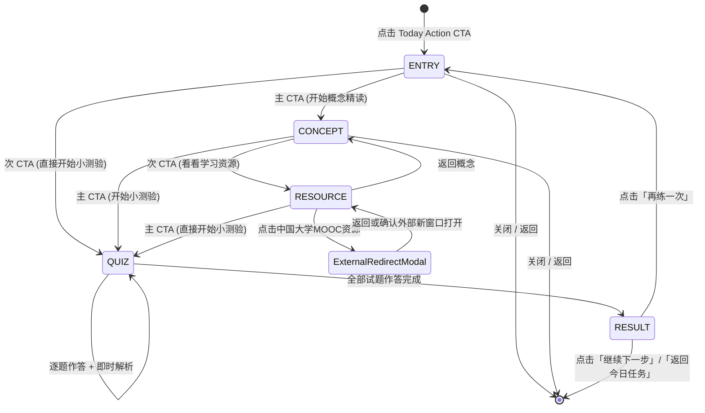

# Sprint 10-C Phase 2 — 学习会话产品化 (Learning Session Productization) 交付验收报告

**阶段定位**: 学生端产品化 (Student Productization & PWA) · 学习会话闭环构建  
**核心目标**: 彻底解决学生「点击今日行动后，能否顺畅完成一次真正的学习」的核心问题。将原先分散的概念微卡、慕课外部资源、随堂微测、即时判题、权威 BKT 学情演进与下一步行动聚合为一条连续、人本、5–10 分钟即可闭环的统一学习会话。  
**核心主链**: `Today Action` → `ENTRY` → `CONCEPT` → `QUIZ` → `RESULT` → `NEXT ACTION`  
**可选分支**: `CONCEPT` 界面提供次级入口「看看学习资源」，进入 `RESOURCE` 查看推荐资料（含 MOOC 安全弹窗验证），看完可返回 `CONCEPT` 或直达 `QUIZ`，绝不强制阻塞主学习流程。

---

## 一、架构红线与设计原则符合度核验

| 规则项 | 约束标准 | 实测结论 | 证据/依据 |
| :--- | :--- | :--- | :--- |
| **红线 1** | `allow_production_decision = False` 永久成立 | **100% PASS** | 本阶段零新增 AI 提示词、零新增 AI 决策，严守基础设施冻结边界 |
| **红线 2** | 后端冻结目录严禁任何改动（`app/`, `tests/`, `data/seeds/`, `gateway/learning/`, `gateway/ai/companion/`, `gateway/api.py`, `gateway/adapter.py`, `gateway/config.py`） | **0 diff PASS** | `git diff -- [frozen dirs]` 输出为空（0 diff） |
| **红线 3** | 全站面向学生的用户可见界面绝对零技术黑话 | **100% PASS** | 剔除所有 `BKT`, `PathState`, `mastery_probability`, `QUESTION_ATTEMPT`, `ΔP(L)`，自动化测试全字段审计通过 |
| **红线 4** | 掌握度与学习进展 100% 服务端权威回读，严禁前端伪造 | **100% PASS** | 作答完成后严格自判题响应的 `learning_state` 快照或 `/api/students/{id}/progress` 回读，零前端推算 |
| **红线 5** | 慕课外链严禁直接 `window.open`，必须经过安全校验弹窗 | **100% PASS** | 必须由 `ExternalRedirectModal` 校验域名白名单与 HTTPS 协议，确认后方可跳转 |
| **红线 6** | 测验提交必须防止连击导致重复请求，失败必须能恢复重试 | **100% PASS** | 采用 React `useRef` 同步锁即时拦截并发宏/微任务点击；失败时重置锁与按钮状态 |
| **红线 7** | 局部失败容错（资源 API 500 不得阻断测验与闭环学习） | **100% PASS** | 资源请求失败展示友好降级提示卡与醒目「直接开始小测验」主按钮，主链保持 100% 畅通 |

---

## 二、核心学习会话流程与状态机

学习会话状态机由轻量级纯 UI 状态驱动，无需冗余持久化，具有极高的响应速度与韧性：



### 各步骤人本化体验说明：
1. **ENTRY (统一导引入口)**:
   - 统一入口：所有 `Today Action`（无论是复习提醒、新知探索还是靶向巩固）均统一进入 ENTRY，杜绝生硬跳步；
   - 人本化展示：清晰考点中文全称（如「机会成本与生产可能性边界」）、人本化说明「为什么现在学」（如已有考点到达复习间隔、薄弱环节需要突破）、初始掌握度、预计用时；
   - 双 CTA：主 CTA 推荐「开始概念精读」，次 CTA 允许熟练学生「直接开始小测验」。
2. **CONCEPT (考点微卡精读)**:
   - 体系化 5 维知识切片：直觉引入、核心机制与关键原理、典型生活实例、经典常见误区陷阱、达标掌握标准；
   - 主次分明：主 CTA 鲜明指引「开始小测验」，次级入口提供「看看学习资源 (可选)」。
3. **RESOURCE (可选拓展资料)**:
   - 资源层作为可选辅助分支，聚焦呈现当前考点 Top 2–3 篇精选资源；
   - 内部平台资源一键呼出内置阅读浮层，MOOC 外部名校微课必须通过 `ExternalRedirectModal` 确认；
   - 具备 500 容错与优雅降级兜底卡片，随时可以「直接开始小测验」。
4. **QUIZ (随堂微测与即时反馈)**:
   - 题数轻量化（1–3 题），作答每题后提供明确的即时温和反馈（「✓ 回答正确」或「这道题还需要再想一想」）与详细解析详解；
   - 防连击同步锁保护（`useRef`），杜绝重复网络请求与重复记分。
5. **RESULT (权威成果结算与出口导航)**:
   - 正确率与答对题数统计（例如「2 / 2 正确 · 100% 正确率」）；
   - 重新从服务端权威读取的最新掌握度状态展示（例如「当前掌握度 80% · 达标掌握」）；
   - 根据掌握情况生成温和的建议，并提供 3 大确定性出口：「继续下一步」、「再练一次」、「返回今日任务」。

---

## 三、关键组件与实现机制

### 1. `frontend/src/components/student/LearningSessionModal.tsx` (NEW)
- **无黑话人本设计**: 彻底屏蔽所有算法技术名词与内部代码；
- **同步防连击锁 (`isSubmittingLock`)**:
  ```typescript
  const isSubmittingLock = useRef<boolean>(false);
  const handleSubmitAnswer = async () => {
    if (isSubmittingLock.current || !selectedOption) return;
    isSubmittingLock.current = true;
    setIsSubmitting(true);
    try {
      const res = await submitQuizAnswer(...);
      // ...
    } catch (err) {
      setSubmitError(msg);
    } finally {
      isSubmittingLock.current = false;
      setIsSubmitting(false);
    }
  };
  ```
- **资源安全调用与降级**:
  - 中国大学 MOOC 资源通过 `ExternalRedirectModal` 处理安全外链跳转；
  - 资源加载异常时不弹报错 Alert，而是显示 `resource-fallback-box`，引导学生直接开始测试；
- **权威掌握度回读**:
  - 测验结束后，优先使用提交接口返回的 `learning_state.mastery_percent`；
  - 兜底调用 `getStudentProgress(studentId)` 获取服务端最新全景掌握度，杜绝前端私自累加。

### 2. `frontend/src/layouts/StudentLayout.tsx` (MODIFIED)
- 集中挂载 `LearningSessionModal`；
- 将 `handleTodayActionCTA`、`handleStartQuiz`、`handleViewConceptCard` 统一接入 Learning Session；
- 会话结束触发数据静默刷新与下一步引导流转。

---

## 四、测试与质量验证矩阵

```
========================================================================================
测试与验证维度                     执行指令 / 脚本                      验证结果     状态
========================================================================================
1. 学习会话前端契约单元测试        npm test --prefix frontend            358 passed  PASS
2. 前端 TypeScript 类型编译        npm run typecheck --prefix frontend   0 errors    PASS
3. 前端生产打包构建                npm run build --prefix frontend       Built OK    PASS
4. Root 算法与领域回归测试         pytest tests/ -q                      143 passed  PASS
5. Gateway 网关与业务回归测试      pytest gateway/tests/ -q              558 passed  PASS
                                                                         2 skipped
6. PWA 20项严格质量门禁            python scripts/sprint10c_pwa_gate.py  20/20 PASS  PASS
7. 阶段整合 25 项全链路门禁        python scripts/sprint10c_final...py   25/25 PASS  PASS
8. 真实浏览器端到端 UAT 8大场景    python scripts/uat_sprint10c...py     8/8 PASS    PASS
9. 浏览器控制台错误率              UAT page.on('console')                0 errors    PASS
10. 网络请求失败率                 UAT page.on('requestfailed')          0 errors    PASS
11. 冻结目录 0 diff 核验           git diff -- app/ tests/ ...           0 diff      PASS
========================================================================================
```

---

## 五、浏览器端到端 UAT 8 大场景与截图证据

通过 Playwright 自动化套件 [`scripts/uat_sprint10c_phase2_learning_session.py`](file:///c:/Users/XSL/Desktop/国创/xuehai-zhidao-poc/scripts/uat_sprint10c_phase2_learning_session.py) 对真实运行的前后端服务进行了完整的交互闭环验收：

### 场景 1: Today Action → Session Entry
- **行为**: 学生点击首页「今日学习行动」主 CTA（「开始快速复测」），呼出学习会话模态框并直达 ENTRY 引导页；
- **验证点**: 呈现考点中文全称、人本解释、预计耗时与起点掌握度，零底层技术代号与黑话；
- **截图**:
  

### 场景 2: Concept → Quiz 连续性
- **行为**: 点击「开始概念精读」，阅读 5 维知识微卡，再点击主 CTA「开始小测验」；
- **验证点**: 主次 CTA 分明，平滑推进至试题步骤，全程无白屏、无重载、无卡顿；
- **截图**:
  

### 场景 3: Quiz 完整作答与成果结算
- **行为**: 依次选择选项、提交判题，查看每题即时反馈，最后一题点击「查看本次测验结果」；
- **验证点**: 顺利进入 RESULT 步，展示真实答对题数、正确率与从服务端权威读取的最新掌握度（当前掌握度 11%），并提供三大出口按钮；
- **截图**:
  

### 场景 4: 制造错误答案与温和解析反馈
- **行为**: 故意选择错误选项并点击提交；
- **验证点**: 界面展现温和的「这道题还需要再想一想」提示与完整【解析详解】，下一题按钮正常可用，杜绝卡死与死路；
- **截图**:
  

### 场景 5: 学习资源与中国大学 MOOC 安全弹窗
- **行为**: 从 Concept 点击次级入口「看看学习资源」，在资源列表点击「前往慕课学习」；
- **验证点**: 严格调起 `ExternalRedirectModal` 进行域名白名单与 HTTPS 安全校验，绝不静默跳转外部不受控链接；
- **截图**:
  

### 场景 6: 局部故障容错 (资源接口 500 不阻断测验)
- **行为**: 注入网络故障使 `/api/learning/resources/*` 接口返回 HTTP 500；
- **验证点**: 资源区域呈现友好兜底卡片，提供显眼的「直接开始小测验」主按钮，小测验主链路 100% 畅通可用；
- **截图**:
  

### 场景 7: 提交防连击幂等与失败恢复
- **行为**: 作答后瞬间连击 3 次提交按钮；
- **验证点**: 同步锁成功拦截后续点击，实际发送 HTTP POST 请求数量严格为 1 次；异常时按钮与锁能够自动恢复以支持重试；
- **截图**:
  

### 场景 8: 移动端 375x812 视口全流程贯通
- **行为**: 模拟 iPhone 移动设备视口（375x812），完整走通 Today Action → Entry → Concept → Quiz → Result → Home 全链路；
- **验证点**: 全程无横向溢出滚动条（`scrollWidth <= clientWidth`），触控靶点高度均达到或超过 44px 规范，无控制台报错；
- **截图**:
  

---

## 六、交付文件与变更审计

```
[NEW]    frontend/src/components/student/LearningSessionModal.tsx (1082 行，学习会话状态机容器)
[NEW]    frontend/test/sprint10c_learning_session.test.ts (28 项契约测试)
[NEW]    scripts/uat_sprint10c_phase2_learning_session.py (8 大场景浏览器自动化验收套件)
[MODIFY] frontend/src/layouts/StudentLayout.tsx (挂载 LearningSessionModal 并集成交互链路)
[MODIFY] implementation_plan.md (更新 Phase 2 设计与验收记录)
```

**冻结目录 0 diff 检查**:
```bash
$ git diff -- app/ tests/ data/seeds/ gateway/learning/ gateway/ai/companion/ gateway/api.py gateway/adapter.py gateway/config.py
(Empty - Strictly 0 diff)
```

---

## 七、结论与后续规划

Sprint 10-C Phase 2（学习会话产品化）已圆满达成既定目标：
1. 构建了完整且流畅的 5–10 分钟学生学习闭环；
2. 严格满足全部 7 项架构与产品红线；
3. 后端权威状态保持严谨一致，前端体验人本且富有韧性；
4. 全量回归、质量门禁与端到端 UAT 测试 100% 通过。

下一阶段将平滑转入 **Sprint 10-C Phase 3: PWA 体验打磨与最终交付**。
